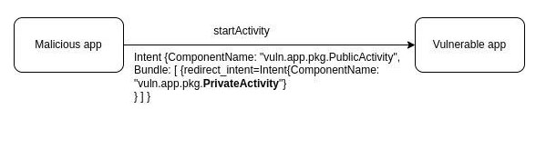

# Possibility to run private Activity indirectly

<table class='noborder'>
    <colgroup>
      <col/>
      <col/>
    </colgroup>
    <tbody>
      <tr>
        <td rowspan="2"></td>
        <td>Severity:<strong> СРЕДНЯЯ</strong></td>
      </tr>
      <tr>
        <td>Detection method:<strong> IAST</strong></td>
      </tr>
    </tbody>
</table>
## Description

This vulnerability allows to start an internal **non-exportable Activity** of an application. This can cause quite a wide range of problems, from authentication bypass to compromising user data.

The vulnerability is present in applications that use **Intent** from an untrusted source (for example, obtained from a third-party application using `getIntent`, `getParcelableExtra` or `onActivityResult` methods) to start (`startActivity`, `startActivityForResult`) their internal Activity. Hereinafter the "**to-be-redirected Intent**" term will be used, i.e. Intent obtained from an untrusted source and further used to start an **Activity**.

For example, a malicious application can use such code:

    Intent intent = new Intent("vuln.app.pkg.LOGIN");
    Intent redirIntent = new Intent();
    redirIntent.setComponent(new ComponentName("vuln.app.pkg", "vuln.app.pkg.PrivateActivity"));
    intent.putExtra("redirect_intent", redirIntent);
    startActivity(intent);

**Targeted application:**

    Intent redirectIntent = getIntent().getParcelableExtra("redirect_intent");
    if(redirectIntent != null) {
        startActivity(redirectIntent);
        }
        else {
        startActivity(new Intent(this, MainActivity.class));
        }
        finish();

Calling such code from a malicious application will launch the vulnerable application's internal Activity (**vuln.app.pkg.PrivateActivity**)

<figure markdown>

</figure>
## Recommendations

To avoid such problems in the application, you need to make sure to follow a few rules:

1. Implement private/in-house visibility for components that accept "**to-be-redirected Intent**" and use it to later run **private/in-house Activity**.
   
   For example, declaration of **Activity** internal - no `intent-filter` or `exported` flag is set to `false`:
   
        <?xml version="1.0" encoding="utf-8"?>
        <manifest xmlns:android="http://schemas.android.com/apk/res/android"
                package="com.swordfishsecurity.appsec.android.activity.privateactivity" >
                <application
                    android:allowBackup="false"
                    android:icon="@drawable/ic_launcher"
                    android:label="@string/app_name" >
                    <!-- Private activity -->
                    <!-- *** 1 *** Не используйте taskAffinity -->
                    <!-- *** 2 *** Не используйте launchMode -->
                    <!-- *** 3 *** Явно указывайте атрибут exported="false" -->
                    <activity
                        android:name=".PrivateActivity"
                        android:label="@string/app_name"
                        android:exported="false" />
                    <!-- Public activity запускаемая по умолчанию -->
                    <activity
                        android:name=".PrivateUserActivity"
                        android:label="@string/app_name"
                        android:exported="true" >
                        <intent-filter>
                            <action android:name="android.intent.action.MAIN" />
                            <category android:name="android.intent.category.LAUNCHER" />
                        </intent-filter>
                    </activity>
                </application>
        </manifest>

2. Validate "**to-be-redirected Intent**" for maliciousness - it should not be sent to **private/in-house Activity**:
   
        Intent intent = getIntent();
        Intent redirectIntent = (Intent) intent.getParcelableExtra(“redirect_intent”);
        ComponentName name = redirectIntent.resolveActivity(getPackageManager());
        // проверяем целевое имя пакета и класса
        if(name.getPackageName().equals(“safe_package”) && name.getClassName().equals(“safe_class”)) {
            startActivity(redirectIntent);
        }

### Partner Activity

Another way is to work with partner applications. They are applications that are used by collaborating companies that want to share information and functionality securely.

Within this exchange, the concept of **Partner Activity** is introduced. This is an **Activity** that can only be shared from applications that are developed by partner companies.

There is a risk that a third-party application will read contents of Intent used to start an **Activity**. So you need to make sure that if the **Intent** used to start an **Activity** includes sensitive information, protective measures are in place to prevent a malicious application from accessing it.

#### Creating a Partner Activity

There are several rules to follow when creating a **Partner Activity**:

1. Do not use `taskAffinity`.
2. Do not use `launchMode`.
3. Do not declare `intent-filter` and explicitly specify the `exported="true"` attribute.
4. Make sure that a certificate of the calling application is included in the list of trusted application certificates.
5. Verify and securely process received **Intent**, even though it was received from the same partner application.
6. Return only information that the partner application has the right to access.

To implement item 4, it is necessary to organize receipt of a fingerprint of certificates of trusted applications and their registration in our application. To do this, you can use the following code examples with detailed comments.

**AndroidManifest.xml**

    <?xml version="1.0" encoding="utf-8"?>
    <manifest xmlns:android="http://schemas.android.com/apk/res/android"
        package="com.swordfishsecurity.appsec.android.activity.partneractivity" >
        
        <application
                android:allowBackup="false"
                android:icon="@drawable/ic_launcher"
                android:label="@string/app_name" >
                <!-- Partner activity -->
                <!-- *** 1 *** Не используйте taskAffinity -->
                <!-- *** 2 *** Не используйте launchMode -->
                <!-- *** 3 *** Не обьявляйте intent фильтры и явно указывайте атрибут exported="true" -->
                <activity
                    android:name=".PartnerActivity"
                    android:exported="true" />
        </application>
    </manifest>

**PartnerActivity.java**

    package com.swordfishsecurity.appsec.android.activity.partneractivity;
    import com.swordfishsecurity.appsec.android.shared.PkgCertWhitelists;
    import com.swordfishsecurity.appsec.android.shared.Utils;
    import android.app.Activity;
    import android.content.Context;
    import android.content.Intent;
    import android.os.Bundle;
    import android.view.View;
    import android.widget.Toast;
    public class PartnerActivity extends Activity {
        // *** 4 *** Проверяйте, что сертификат вызывающего приложения содержится в списке сертификатов доверенных приложений
        private static PkgCertWhitelists sWhitelists = null;
        private static void buildWhitelists(Context context) {
            boolean isdebug = Utils.isDebuggable(context);
            sWhitelists = new PkgCertWhitelists();
            
            // Регистрация хеша сертификата приложения-партнёра com.swordfishsecurity.appsec.android.activity.partneruser
            sWhitelists.add("com.swordfishsecurity.appsec.android.activity.partneruser", isdebug ?
                    // Хеш сертификата ключа "androiddebugkey" из debug.keystore.
                    "0EFB7236 328348A9 89718BAD DF57F544 D5CCB4AE B9DB34BC 1E29DD26 F77C8255" :
                    // Хеш сертификата ключа приложения-партнёра com.swordfishsecurity.appsec.android.activity.partneruser
                    "1F039BB5 7861C27A 3916C778 8E78CE00 690B3974 3EB8259F E2627B8D 4C0EC35A");
        
            // Регистрация других приложений-партнёров осуществляется аналогично
        }
        private static boolean checkPartner(Context context, String pkgname) {
            if (sWhitelists == null) buildWhitelists(context);
            return sWhitelists.test(context, pkgname);
        }
        
        @Override
        public void onCreate(Bundle savedInstanceState) {
            super.onCreate(savedInstanceState);
            setContentView(R.layout.main);
                
            // *** 4 *** Проверяйте, что сертификат вызывающего приложения содержится в списке сертификатов доверенных приложений
            if (!checkPartner(this, getCallingActivity().getPackageName())) {
                Toast.makeText(this,
                        "Вызывающее приложение не является партнёром",
                        Toast.LENGTH_LONG).show();
                finish();
                return;
            }
            
            // *** 5 *** Проводите проверку и безопасную обработку полученного Intent, несмотря на то, что он был получен из того же приложения-партнёра
            // См.п. "Безопасная обработка входных данных"
            
            Toast.makeText(this, "Запущено из приложения-партнёра", Toast.LENGTH_LONG).show();
        }
        public void onReturnResultClick(View view) {
            // *** 6 *** Возвращайте только ту информацию, к которой приложение-партнёр имеет право получить доступ, не больше
            Intent intent = new Intent();
            intent.putExtra("RESULT", "Информация для приложения-партнёра");
            setResult(RESULT_OK, intent);
            finish();
        }
    }

**PkgCertWhitelist.java**

    package com.swordfishsecurity.appsec.android.shared;
    import java.util.HashMap;
    import java.util.Map;
    import android.content.Context;
    public class PkgCertWhitelists {
            private Map<String, String> mWhitelists = new HashMap<String, String>();
            
            public boolean add(String pkgname, String sha256) {
                if (pkgname == null) return false;
                if (sha256 == null) return false;
                
                sha256 = sha256.replaceAll(" ", "");
                if (sha256.length() != 64) return false;    // SHA-256 -> 32 bytes -> 64 chars
                sha256 = sha256.toUpperCase();
                if (sha256.replaceAll("[0-9A-F]+", "").length() != 0) return false;    // found non hex char
                
                mWhitelists.put(pkgname, sha256);
                return true;
            }
            public boolean test(Context ctx, String pkgname) {
                // Получение хеша сертификата приложения pkgname из белого списка
                String correctHash = mWhitelists.get(pkgname);
                
                // Сравнение реального хеша сертификата приложения pkgname с хешем сертификата приложения из белого списка
                return PkgCert.test(ctx, pkgname, correctHash);
            }
    }

**PkgCert.java**

    package com.swordfishsecurity.appsec.android.shared;
    import java.security.MessageDigest;
    import java.security.NoSuchAlgorithmException;
    import android.content.Context;
    import android.content.pm.PackageInfo;
    import android.content.pm.PackageManager;
    import android.content.pm.PackageManager.NameNotFoundException;
    import android.content.pm.Signature;
    public class PkgCert {
    public static boolean test(Context ctx, String pkgname, String correctHash) {
            if (correctHash == null) return false;
            correctHash = correctHash.replaceAll(" ", "");
            return correctHash.equals(hash(ctx, pkgname));
    }
    public static String hash(Context ctx, String pkgname) {
            if (pkgname == null) return null;
            try {
                PackageManager pm = ctx.getPackageManager();
                PackageInfo pkginfo = pm.getPackageInfo(pkgname, PackageManager.GET_SIGNATURES);
                if (pkginfo.signatures.length != 1) return null;
                Signature sig = pkginfo.signatures[0];
                byte[] cert = sig.toByteArray();
                byte[] sha256 = computeSha256(cert);
                return byte2hex(sha256);
            } catch (NameNotFoundException e) {
                return null;
            }
    }
    private static byte[] computeSha256(byte[] data) {
            try {
                return MessageDigest.getInstance("SHA-256").digest(data);
            } catch (NoSuchAlgorithmException e) {
                return null;
            }
    }
    private static String byte2hex(byte[] data) {
            if (data == null) return null;
            final StringBuilder hexadecimal = new StringBuilder();
            for (final byte b : data) {
                hexadecimal.append(String.format("%02X", b));
            }
            return hexadecimal.toString();
        }
    }

#### Using Partner Activity

If you are going to use an **Activity** from a partner application, the following rules need to be followed:

1. Verify that a target application's certificate is on the "white list".
2. Do not set the `FLAG_ACTIVITY_NEW_TASK` flag in the **Intent** that will be used to start an **Activity**.
3. Send ( using `putExtra`) only information that the partner application has the right to access, no more.
4. Use explicit **Intent** to start a **Partner Activity**.
5. Use `startActivityForResult()` to start a **Partner Activity**.
6. Verify the result data and process it securely, even though it was obtained from a partner application.
7. To implement the first item, you can use the following code examples:

**AndroidManifest.xml**

    <?xml version="1.0" encoding="utf-8"?>
    <manifest xmlns:android="http://schemas.android.com/apk/res/android"
        package="com.swordfishsecurity.appsec.android.activity.partneruser" >
        <application
                android:allowBackup="false"
                android:icon="@drawable/ic_launcher"
                android:label="@string/app_name" >
                
                <activity
                    android:name="com.swordfishsecurity.appsec.android.activity.partneruser.PartnerUserActivity"
                    android:label="@string/app_name"
                    android:exported="true" >
                    <intent-filter>
                        <action android:name="android.intent.action.MAIN" />
                        <category android:name="android.intent.category.LAUNCHER" />
                    </intent-filter>
                </activity>
        </application>
    </manifest>

**PartnerUserActivity.java**

    package com.swordfishsecurity.appsec.android.activity.partneruser;
    import com.swordfishsecurity.appsec.android.shared.PkgCertWhitelists;
    import com.swordfishsecurity.appsec.android.shared.Utils;
    import android.app.Activity;
    import android.content.ActivityNotFoundException;
    import android.content.Context;
    import android.content.Intent;
    import android.os.Bundle;
    import android.view.View;
    import android.widget.Toast;
    public class PartnerUserActivity extends Activity {
        // *** 1 *** Проверяйте, что сертификат целевого приложения присутствует в "белом списке"
        private static PkgCertWhitelists sWhitelists = null;
        private static void buildWhitelists(Context context) {
            boolean isdebug = Utils.isDebuggable(context);
            sWhitelists = new PkgCertWhitelists();
            
            // Регистрация хеша сертификата приложения-партнёра com.swordfishsecurity.appsec.android.activity.partneractivity
            sWhitelists.add("com.swordfishsecurity.appsec.android.activity.partneractivity", isdebug ?
                    // Хеш сертификата ключа "androiddebugkey" из debug.keystore.
                    "0EFB7236 328348A9 89718BAD DF57F544 D5CCB4AE B9DB34BC 1E29DD26 F77C8255" :
                    // Хеш сертификата ключа приложения-партнёра com.swordfishsecurity.appsec.android.activity.partneractivity
                    "D397D343 A5CBC10F 4EDDEB7C A10062DE 5690984F 1FB9E88B D7B3A7C2 42E142CA");
            
            // Регистрация других приложений-партнёров осуществляется аналогично
        }
        private static boolean checkPartner(Context context, String pkgname) {
            if (sWhitelists == null) buildWhitelists(context);
            return sWhitelists.test(context, pkgname);
        }
        
        private static final int REQUEST_CODE = 1;
        // Информация о целевой partner Activity
    
        private static final String TARGET_PACKAGE =  "com.swordfishsecurity.appsec.android.activity.partneractivity";
        private static final String TARGET_ACTIVITY = "com.swordfishsecurity.appsec.android.activity.partneractivity.PartnerActivity";
        @Override
        public void onCreate(Bundle savedInstanceState) {
            super.onCreate(savedInstanceState);
            setContentView(R.layout.main);
        }
        
        public void onUseActivityClick(View view) {
        // *** 1 *** Проверяйте, что сертификат целевого приложения присутствует в "белом списке"
            if (!checkPartner(this, TARGET_PACKAGE)) {
                Toast.makeText(this, "Целевое приложение не партнёрское", Toast.LENGTH_LONG).show();
                return;
            }
            
            try {
                // *** 2 *** Не устанавливайте флаг FLAG_ACTIVITY_NEW_TASK в Intent, который будет использоваться для запуска Activity
                Intent intent = new Intent();
                
                // *** 3 *** Отправляйте (с помощью `putExtra`) только ту информацию, к которой приложение-партнёр имеет право получить доступ, не больше
                intent.putExtra("PARAM", "Информация для приложения-партнёра");
                
                // *** 4 *** Используйте явный Intent для запуска partner Activity
                intent.setClassName(TARGET_PACKAGE, TARGET_ACTIVITY);
                
                // ***  5 *** Используйте startActivityForResult() для запуска partner Activity
                startActivityForResult(intent, REQUEST_CODE);
            }
            catch (ActivityNotFoundException e) {
                Toast.makeText(this, "Целевая Actvity не найдена", Toast.LENGTH_LONG).show();
            }
        }
        @Override
        public void onActivityResult(int requestCode, int resultCode, Intent data) {
            super.onActivityResult(requestCode, resultCode, data);
            if (resultCode != RESULT_OK) return;
            
            switch (requestCode) {
            case REQUEST_CODE:
                String result = data.getStringExtra("RESULT");
                
                // *** 6 *** Проводите проверку и безопасную обработку полученных данных результата, несмотря на то, что они были получены из Activity того же самого приложения
                // См.п. "Безопасная обработка входных данных"
                
                Toast.makeText(this,
                        String.format("Received result: \"%s\"", result), Toast.LENGTH_LONG).show();
                break;
            }
        }
    }

**PkgCertWhitelist.java**

    package com.swordfishsecurity.appsec.android.shared;
    import java.util.HashMap;
    import java.util.Map;
        
    import android.content.Context;
        
    public class PkgCertWhitelists {
            private Map<String, String> mWhitelists = new HashMap<String, String>();
            
            public boolean add(String pkgname, String sha256) {
                if (pkgname == null) return false;
                if (sha256 == null) return false;
                
                sha256 = sha256.replaceAll(" ", "");
                if (sha256.length() != 64) return false;    // SHA-256 -> 32 bytes -> 64 chars
                sha256 = sha256.toUpperCase();
                if (sha256.replaceAll("[0-9A-F]+", "").length() != 0) return false; // found non hex char
                
                mWhitelists.put(pkgname, sha256);
                return true;
            }
            
            public boolean test(Context ctx, String pkgname) {
                // Получение хеша сертификата приложения pkgname из белого списка
                String correctHash = mWhitelists.get(pkgname);
                
                // Сравнение реального хеша сертификата приложения pkgname с хешем сертификата приложения из белого списка
                return PkgCert.test(ctx, pkgname, correctHash);
            }
    }

**PkgCert.java**

    package com.swordfishsecurity.appsec.android.shared;
        
    import java.security.MessageDigest;
    import java.security.NoSuchAlgorithmException;
        
    import android.content.Context;
    import android.content.pm.PackageInfo;
    import android.content.pm.PackageManager;
    import android.content.pm.PackageManager.NameNotFoundException;
    import android.content.pm.Signature;
        
    public class PkgCert {
        
            public static boolean test(Context ctx, String pkgname, String correctHash) {
                if (correctHash == null) return false;
                correctHash = correctHash.replaceAll(" ", "");
                return correctHash.equals(hash(ctx, pkgname));
            }
        
            public static String hash(Context ctx, String pkgname) {
                if (pkgname == null) return null;
                try {
                    PackageManager pm = ctx.getPackageManager();
                    PackageInfo pkginfo = pm.getPackageInfo(pkgname, PackageManager.GET_SIGNATURES);
                    if (pkginfo.signatures.length != 1) return null;
                    Signature sig = pkginfo.signatures[0];
                    byte[] cert = sig.toByteArray();
                    byte[] sha256 = computeSha256(cert);
                    return byte2hex(sha256);
                } catch (NameNotFoundException e) {
                    return null;
                }
            }
        
            private static byte[] computeSha256(byte[] data) {
                try {
                    return MessageDigest.getInstance("SHA-256").digest(data);
                } catch (NoSuchAlgorithmException e) {
                    return null;
                }
            }
        
            private static String byte2hex(byte[] data) {
                if (data == null) return null;
                final StringBuilder hexadecimal = new StringBuilder();
                for (final byte b : data) {
                    hexadecimal.append(String.format("%02X", b));
                }
                return hexadecimal.toString();
            }
    }

## Links

1. [https://developer.android.com/guide/topics/manifest/activity-element#exported](https://developer.android.com/guide/topics/manifest/activity-element#exported)

2. [https://blog.oversecured.com/Android-Access-to-app-protected-components/](https://blog.oversecured.com/Android-Access-to-app-protected-components/)