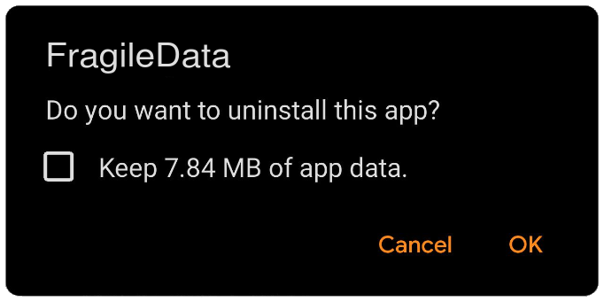

# Insecure settings in AndroidManifest.xml. The android:hasFragileUserData flag

<table class='noborder'>
    <colgroup>
      <col/>
      <col/>
    </colgroup>
    <tbody>
      <tr>
        <td rowspan="2"></td>
        <td>Severity:<strong> LOW</strong></td>
      </tr>
      <tr>
        <td>Detection method:<strong> SAST, APK</strong></td>
      </tr>
    </tbody>
</table>
## Description

The `android:hasFragileUserData` attribute determines whether to show the user a request to save the application data when the user deletes it. The default value is `false`. Works with `android>=10` (sdk version: `sdk: compileSdkVersion>=29`).

An application built without the explicitly defined `android:hasFragileUserData` flag in ***AndroidManifest.xml*** does not make it clear if it handles important user data or not. If the flag is set to `true`, but the application stores important data, there is a risk that it will be left on the device after deletion. To do this, the user must turn on the `Keep app data` toggle switch when uninstalling the application.

<figure markdown>

</figure>
As a result, the data in both the internal storage (`/data/data/<package_name>`) and the external storage (in general case `/storage/sdcard0/Android/data/<package_name>/`) will not be deleted.

It is convenient to use the `android:hasFragileUserData` flag if you want to temporarily remove an application from the device and then install it back later and get the same state.

However, a malefactor who installed a re-signed apk file with the same package name will have access to this data.

## Recommendations

It is recommended to explicitly specify this value to clearly determine whether the application processes important user data or not.

**An example of secure code (the AndroidManifest.xml file)**

    <?xml version="1.0" encoding="utf-8"?>
    <manifest xmlns:android="http://schemas.android.com/apk/res/android"
        package="com.appsec.android.activity.privateactivity" >
    
        <application
            android:icon="@drawable/ic_launcher"
            android:label="@string/app_name"
            android:hasFragileUserData="false" >        
        </application>
    </manifest>

## Links

1. [https://developer.android.com/guide/topics/manifest/application-element](https://developer.android.com/guide/topics/manifest/application-element)

2. [https://gist.github.com/agnostic-apollo/58def38fdb1c90563454974108ae52df](https://gist.github.com/agnostic-apollo/58def38fdb1c90563454974108ae52df)

3. [https://www.xda-developers.com/android-10-manifest-flag-developers-retain-app-data-before-uninstalling/](https://www.xda-developers.com/android-10-manifest-flag-developers-retain-app-data-before-uninstalling/)