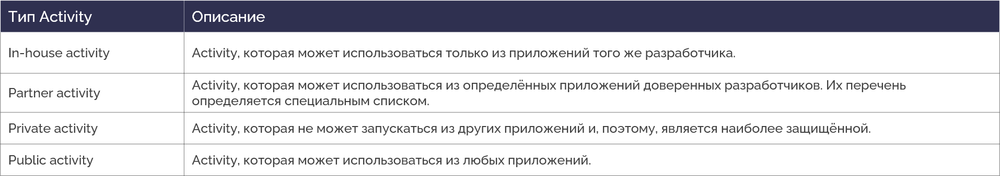

# Insecure transmission of sensitive information in external Activity

<table class='noborder'>
    <colgroup>
      <col/>
      <col/>
    </colgroup>
    <tbody>
      <tr>
        <td rowspan="2"></td>
        <td>Severity:<strong> HIGH</strong></td>
      </tr>
      <tr>
        <td>Detection method:<strong> DAST, SENSITIVE INFO</strong></td>
      </tr>
    </tbody>
</table>
## Description

An application puts sensitive information into an **Intent**to launch an external **Activity**. This can lead to interception of information by external applications.

Interprocess communication (IPC) on Android is performed using a special object — **Intent**. Parameters of **Intent** handlers are set in the main file of the application manifest - ***AndroidManifest.xml*** or, in case of dynamic **BroadcastReceivers**, in the application's code. If an implicit **Intent** is used, i.e. an Intent that does not specify a component; instead, it generally defines an action to be conducted, and lets the system determine which of the available components is best to run for that Intent. For example, if there is a need to display a place on a map, the implicit **Intent** object can request another application, which has such feature, to provide this information. Data in such messages could be compromised. Moreover, malicious applications could use mechanisms of delegation of process control, such as implicit calls to application components or objects like **PendingIntent**, for interception of control and fishing attacks.

The following object types are dangerous: **Activity**, **Service**, **BroadcastReceiver** and **ContentProvider**, because they are open to communication with other applications and don't belong to system Android calls (such as `android.intent.action.MAIN`). **BroadcastReceiver** is, by default, open to interaction with other applications, so the interception of control or of an **Intent** with confidential information is possible.

## Recommendations

When calling external (not related to the application under development) **Activity, do not** include sensitive information in the parameters. This can compromise such information.

Risks from using an **Activity** and corresponding countermeasures vary depending on the ways this **Activity** is used. We have classified 4 types of **Activities** based on how the Activity is used. To find out which type of **Activity** you are supposed to create, follow through the table and chart below.

<figure markdown>

</figure>
<figure markdown>

</figure>
**Creating and using a public Activity**

As an example we will follow the process of creation of a **public Activity** and its usage.

**Public Activity** is an **Activity** that can be used by any external application. It is worth mentioning that:

* **Public Activity** can receive an **Intent** from a malicious application.
* A malicious application can receive an **Intent** sent to a **public Activity** and/or read its data.

**Rules (creating a public Activity)**

1. Explicitly set the "exported" attribute to "true":**exported="true"**.
2. Verify the received **Intent** and handle it in a secure manner.
3. Do not include sensitive information into the resulting **Intent**.

**AndroidManifest.xml**

    <?xml version="1.0" encoding="utf-8"?>
    <manifest xmlns:android="http://schemas.android.com/apk/res/android"
    package="com.appsec.android.activity.publicactivity" >
    <application
    android:allowBackup="false"
    android:icon="@drawable/ic_launcher"
    android:label="@string/app_name" >
    <!-- Public Activity -->
    <!-- *** 1 *** Явно указывайте атрибут exported="true" -->
    <activity
    android:name=".PublicActivity"
    android:label="@string/app_name"
    android:exported="true">
    <!-- Обьявление intent фильтра для получения неявных Intent'ов с определённым Action -->
    <intent-filter>
    <action android:name="com.appsec.android.activity.MY_ACTION" />
    <category android:name="android.intent.category.DEFAULT" />
    </intent-filter>
    </activity>
    </application>
    </manifest>

**PublicActivity.java**

    package com.appsec.android.activity.publicactivity;
    import android.app.Activity;
    import android.content.Intent;
    import android.os.Bundle;
    import android.view.View;
    import android.widget.Toast;
    public class PublicActivity extends Activity {
      @Override
        public void onCreate(Bundle savedInstanceState) {
            super.onCreate(savedInstanceState);
            setContentView(R.layout.main);
            
            // *** 2 *** Проводите проверку и безопасную обработку полученного Intent
            // Т.к. это Public Activity, то возможно что отправителем Intent'a является вредоносное приложение
            // См.п. "Безопасная обработка входных данных"
        
        String param = getIntent().getStringExtra("PARAM");
          Toast.makeText(this, String.format("Received param: \"%s\"", param), Toast.LENGTH_LONG).show();
      }
      public void onReturnResultClick(View view) {
        
        // *** 3 *** Не включайте в Intent результата чувствительную информацию
        // Т.к. это Public Activity, то возможно что получателем Intent'a будет вредоносное приложение
        Intent intent = new Intent();
        intent.putExtra("RESULT", "Not Sensitive Info");
        setResult(RESULT_OK, intent);
        finish();
      }
    }

**Rules (using a public Activity):**

1. Do not include sensitive information into the **Intent** used for launching an **Activity**.
2. Verify the received resulting data and handle it in a secure manner.

**PublicUserActivity.java**

    package com.appsec.android.activity.publicuser;
    import android.app.Activity;
    import android.content.ActivityNotFoundException;
    import android.content.Intent;
    import android.os.Bundle;
    import android.view.View;
    import android.widget.Toast;
    public class PublicUserActivity extends Activity {
        private static final int REQUEST_CODE = 1;
        @Override
        public void onCreate(Bundle savedInstanceState) {
            super.onCreate(savedInstanceState);
            setContentView(R.layout.main);
        }
        
        public void onUseActivityClick(View view) {
          
          try {
            // *** 1 *** Не включайте конфиденциальную информацию в Intent, используемый для запуска Activity
              Intent intent = new Intent("org.jssec.android.activity.MY_ACTION");
              intent.putExtra("PARAM", "Not Sensitive Info");
              startActivityForResult(intent, REQUEST_CODE);
          } catch (ActivityNotFoundException e) {
              Toast.makeText(this, "Target activity not found.", Toast.LENGTH_LONG).show();
          }
        }
        @Override
        public void onActivityResult(int requestCode, int resultCode, Intent data) {
            super.onActivityResult(requestCode, resultCode, data);
            // *** 2 *** Проводите проверку и безопасную обработку полученных данных результата
            // См.п. "Безопасная обработка входных данных"
            
        if (resultCode != RESULT_OK) return;
        switch (requestCode) {
        case REQUEST_CODE:
          String result = data.getStringExtra("RESULT");
              Toast.makeText(this, String.format("Received result: \"%s\"", result), Toast.LENGTH_LONG).show();
          break;
        }
      }
    }

## Links

1. [https://developer.android.com/guide/components/intents-filters?hl=ru](https://developer.android.com/guide/components/intents-filters?hl=ru)

2. [https://github.com/OWASP/owasp-mstg/blob/master/Document/0x05h-Testing-Platform-Interaction.md](https://github.com/OWASP/owasp-mstg/blob/master/Document/0x05h-Testing-Platform-Interaction.md)

3. [https://developer.android.com/training/basics/intents/index.html](https://developer.android.com/training/basics/intents/index.html)