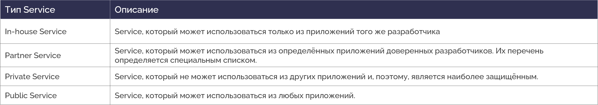
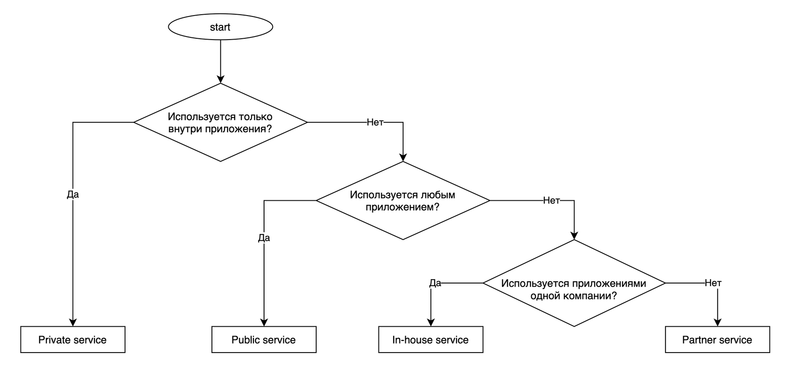
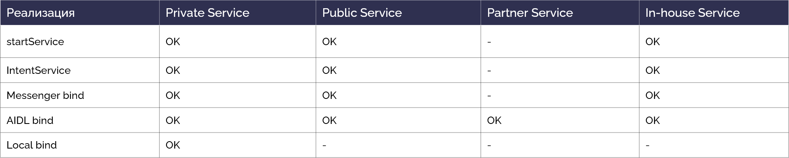

# Insecure transmission of sensitive information in external Service

<table class='noborder'>
    <colgroup>
      <col/>
      <col/>
    </colgroup>
    <tbody>
      <tr>
        <td rowspan="2"></td>
        <td>Severity:<strong> HIGH</strong></td>
      </tr>
      <tr>
        <td>Detection method:<strong> DAST, SENSITIVE INFO</strong></td>
      </tr>
    </tbody>
</table>
## Description

An application puts sensitive information into **Intent** to launch an external **Service**. This can lead to interception of information by external applications.

Interprocess communication (IPC) on Android is performed using a special object — **Intent**. Parameters of **Intent** handlers are set in the main file of the application manifest - ***AndroidManifest.xml*** or, in case of dynamic **BroadcastReceivers**, in the application's code. If an implicit **Intent** is used, i.e. an Intent that does not specify a component; instead, it generally defines an action to be conducted, and lets the system determine which of the available components is best to run for that Intent. For example, if there is a need to display a place on a map, the implicit **Intent** object can request another application, which has such feature, to provide this information. Data in such messages could be compromised. Moreover, malicious applications could use mechanisms of delegation of process control, such as implicit calls to application components or objects like **PendingIntent**, for interception of control and fishing attacks.

The following object types are dangerous: **Activity**, **Service**, **BroadcastReceiver** and **ContentProvider**, because they are open to communication with other applications and don't belong to system Android calls (such as `android.intent.action.MAIN`). **BroadcastReceiver** is, by default, open to interaction with other applications, so the interception of control or of an **Intent** with confidential information is possible.

## Recommendations

When calling external public **Service**, **do not** include sensitive information in **Intent**.

Risks from using a **Service** and corresponding countermeasures vary depending on the ways this **Service** is used. To find out what type of a **Service** you are supposed to create, follow the table and chart below.

<figure markdown>

</figure>
<figure markdown>

</figure>
There are various implementations of a **Service**. Possible combinations of an implementation method and a service type are shown in the table below. OK stands for possible combination. A circle means impossible combination.

<figure markdown>

</figure>
The example below shows how to properly create and use an external service. It is important to remember that sensitive information **must not** be sent when using external public **Service**.

!!! note "Note!" To ensure security of your application, always use an explicit **Intent** object for starting a **Service**, and don't declare **Intent** filters for your services. Starting a service using an implicit **Intent** bears security risks, because there is no certainty in what service will react to the **Intent**, and a user doesn't see what service launches. Starting from Android 5.0 (API level 21) the system throws an exception by calling the **bindService()** method using an implicit **Intent** object.

**Creating and using a public Service**

**Public Service** is a **Service** that can be used by any external application. It is worth mentioning that:

* **Public Service** can receive an **Intent** from a malicious application.
* A malicious application can receive an **Intent** sent to a **Public Service** and/or read its data.

**Rules (creating a Public Service):**

1. Explicitly set the "exported" attribute to "true":**exported="true"**.
2. Verify the received **Intent** and handle it in a secure manner.
3. Do not include sensitive information into the resulting **Intent**.

**AndroidManifest.xml**

    <?xml version="1.0" encoding="utf-8"?>
    <manifest xmlns:android="http://schemas.android.com/apk/res/android"
    package="com.appsec.android.activity.publicactivity" >
    <application
    android:allowBackup="false"
    android:icon="@drawable/ic_launcher"
    android:label="@string/app_name" >
    <!-- Public Activity -->
    <!-- *** 1 *** Явно указывайте атрибут exported="true" -->
    <activity
    android:name=".PublicActivity"
    android:label="@string/app_name"
    android:exported="true">
    <!-- Обьявление intent фильтра для получения неявных Intent'ов с определённым Action -->
    <intent-filter>
    <action android:name="com.appsec.android.activity.MY_ACTION" />
    <category android:name="android.intent.category.DEFAULT" />
    </intent-filter>
    </activity>
    </application>
    </manifest>

**PublicClientService.java**

    package com.appsec.android.service.publicservice;
    import android.app.IntentService;
    import android.content.Intent;
    import android.widget.Toast;
    public class PublicIntentService extends IntentService{
        /**
        * Когда наследуется класс IntentService, должен быть реализован конструктор по умолчанию, иначе возникнет ошибка
        */
        public PublicIntentService() {
            super("CreatingService");
        }
        @Override
        public void onCreate() {
            super.onCreate();
            
            Toast.makeText(this, this.getClass().getSimpleName() + " - onCreate()", Toast.LENGTH_SHORT).show();
        }
        
        @Override
        protected void onHandleIntent(Intent intent) {        
            // *** 2 *** Проводите проверку и безопасную обработку полученного Intent
            // См.п. "Безопасная обработка входных данных"
            String param = intent.getStringExtra("PARAM");
            Toast.makeText(this, String.format("Recieved parameter \"%s\"", param), Toast.LENGTH_LONG).show();
        }
        @Override
        public void onDestroy() {
            Toast.makeText(this, this.getClass().getSimpleName() + " - onDestroy()", Toast.LENGTH_SHORT).show();
        }
        
    }

**Rules (using a public Service):**

!!! note "Note!" To avoid an accidental launch of another application's **Service** always use explicit **Intent** objects for starting your own services and don't declare **Intent** filters for them.

1. Use an explicit **Intent**.

2. Do not include sensitive information into the data to be sent.
   
        package com.appsec.android.service.publicserviceuser;
        import android.app.Activity;
        import android.content.Intent;
        import android.os.Bundle;
        import android.view.View;
        public class PublicUserActivity extends Activity {
            // Информация о целевом сервисе
            private static final String TARGET_PACKAGE = "com.appsec.android.service.publicservice";
            private static final String TARGET_START_CLASS = "com.appsec.android.service.publicservice.PublicStartService";
            private static final String TARGET_INTENT_CLASS = "com.appsec.android.service.publicservice.PublicIntentService";
            @Override
            public void onCreate(Bundle savedInstanceState) {
                super.onCreate(savedInstanceState);
                setContentView(R.layout.publicservice_activity);
            }
       
            public void onStopServiceClick(View v) {
                doStopService();
            }
       
            // Запуск IntentService
            public void onIntentServiceClick(View v) {      
                Intent intent = new Intent("com.appsec.android.service.publicservice.action.intentservice");
                // *** 1 *** Используйте явный Intent
                intent.setClassName(TARGET_PACKAGE, TARGET_INTENT_CLASS);
                // *** 2 *** Не включайте конфиденциальную информацию в отправляемые данные
                intent.putExtra("PARAM", "Not sensitive information");
                startService(intent);
            }
       
            @Override
            public void onStop(){
                super.onStop();
                doStopService();
            }
       
            private void doStopService() {            
                Intent intent = new Intent("com.appsec.android.service.publicservice.action.startservice");
                // *** 1 *** Используйте явный Intent
                intent.setClassName(TARGET_PACKAGE, TARGET_START_CLASS);
                stopService(intent);    	
            }
        }

## Links

1. [https://developer.android.com/guide/components/intents-filters?hl=ru](https://developer.android.com/guide/components/intents-filters?hl=ru)

2. [https://github.com/OWASP/owasp-mstg/blob/master/Document/0x05h-Testing-Platform-Interaction.md](https://github.com/OWASP/owasp-mstg/blob/master/Document/0x05h-Testing-Platform-Interaction.md)

3. [https://developer.android.com/training/basics/intents/index.html](https://developer.android.com/training/basics/intents/index.html)