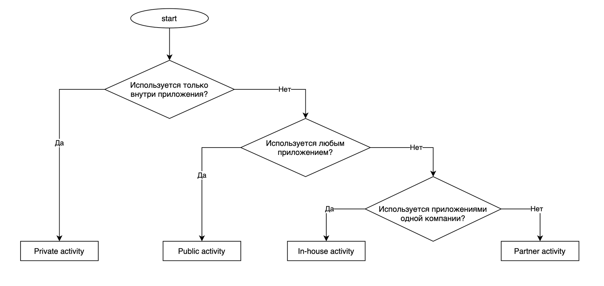

# Insecure transmission of sensitive information in private Activity

<table class='noborder'>
    <colgroup>
      <col/>
      <col/>
    </colgroup>
    <tbody>
      <tr>
        <td rowspan="2"></td>
        <td>Severity:<strong> INFO</strong></td>
      </tr>
      <tr>
        <td>Detection method:<strong> DAST, SENSITIVE INFO</strong></td>
      </tr>
    </tbody>
</table>
## Description

An application puts sensitive information into an **Intent** to launch a private **Activity**. Generally, this is not a vulnerability, but with root access on the device, this method of data transfer may be considered insecure.

Interprocess communication (IPC) on Android is performed using a special object — **Intent**. Parameters of **Intent** handlers are set in the main file of the application manifest - ***AndroidManifest.xml*** or, in case of dynamic **BroadcastReceivers**, in the application's code. If an implicit **Intent** is used, i.e. an Intent that does not specify a component; instead, it generally defines an action to be conducted, and lets the system determine which of the available components is best to run for that Intent. For example, if there is a need to display a place on a map, the implicit **Intent** object can request another application, which has such feature, to provide this information. Data in such messages could be compromised. Moreover, malicious applications could use mechanisms of delegation of process control, such as implicit calls to application components or objects like **PendingIntent**, for interception of control and fishing attacks.

The following object types are dangerous: **Activity**, **Service**, **BroadcastReceiver** and **ContentProvider**, because they are open to communication with other applications and don't belong to system Android calls (such as `android.intent.action.MAIN`). **BroadcastReceiver** is, by default, open to interaction with other applications, so the interception of control or of an **Intent** with confidential information is possible.

## Recommendations

**Don't** include sensitive information into parameters when using implicit **Intents** (when a user defines what application will handle a message).

Risks from using an **Activity** and corresponding countermeasures vary depending on the ways this **Activity** is used. We have classified 4 types of **Activities** based on how the Activity is used. To find out which type of **Activity** you are supposed to create, follow through the table and chart below.

<figure markdown>

</figure>
<figure markdown>

</figure>
**Creating and using a private Activity**

**Private Activity** cannot be launched by other applications and, therefore, is the most secure.

An explicit **Intent** (with the class name) is used to run a **Private Activity**, so there is no need to worry about the possibility of accidentally sending data to a third-party application. However, there is a risk that a third-party application can read an **Intent** that is used to start the **Activity**. Therefore it is necessary to make sure that if you are putting sensitive information inside an **Intent** used to start an **Activity** that you take countermeasures to make sure that it cannot be read by a malicious third-party application.

**Rules (creating a private Activity)**

* Do not use `taskAffinity`.
* Do not use `launchMode`.
* Explicitly specify the `exported="false"` attribute.
* Verify the received **Intent** and handle it in a secure manner despite the fact that it was sent from the same application.
* You can include sensitive information in the result **Intent** because it is sent and received within the application.

**AndroidManifest.xml**

    <?xml version="1.0" encoding="utf-8"?>
    <manifest xmlns:android="http://schemas.android.com/apk/res/android"
    package="com.appsec.android.activity.privateactivity" >
    <application
    android:allowBackup="false"
    android:icon="@drawable/ic_launcher"
    android:label="@string/app_name" >
    <!-- Private activity -->
    <!-- *** 1 *** Не используйте taskAffinity -->
    <!-- *** 2 *** Не используйте launchMode -->
    <!-- *** 3 *** Явно указывайте атрибут exported="false" -->
    <activity
    android:name=".PrivateActivity"
    android:label="@string/app_name"
    android:exported="false" />
    <!-- Public activity запускаемая по умолчанию -->
    <activity
    android:name=".PrivateUserActivity"
    android:label="@string/app_name"
    android:exported="true" >
    <intent-filter>
    <action android:name="android.intent.action.MAIN" />
    <category android:name="android.intent.category.LAUNCHER" />
    </intent-filter>
    </activity>
    </application>
    </manifest>

**PrivateActivity.java**

    package com.appsec.android.activity.privateactivity;
    
    import android.app.Activity;
    import android.content.Intent;
    import android.os.Bundle;
    import android.view.View;
    import android.widget.Toast;
    
    public class PrivateActivity extends Activity {
        
        @Override
        public void onCreate(Bundle savedInstanceState) {
            super.onCreate(savedInstanceState);
            setContentView(R.layout.private_activity);
            
            // *** 4 *** Проводите безопасную обработку полученного Intent, даже если он был получен из того же самого приложения
            // См.п. "Безопасная обработка входных данных"
            
            String param = getIntent().getStringExtra("PARAM");
            Toast.makeText(this, String.format("Received param: %s", param), Toast.LENGTH_LONG).show();
        }
        
        public void onReturnResultClick(View view) {
            // *** 5 *** В Intent результата можно включать конфиденциальную информацию, т.к. его отправка и получение происходит внутри приложения.
            Intent intent = new Intent();
            intent.putExtra("RESULT", "Sensitive Info");
            setResult(RESULT_OK, intent);
            finish();
        }
    }

**Rules (using a private Activity):**

1. Do not set the `FLAG_ACTIVITY_NEW_TASK` flag in the **Intent** that will be used to start an **Activity**.
2. Use explicit **Intent** with the name of the **Activity** class inside the application.
3. You can include sensitive information in the **Intent** used to start an **Activity** (but only using the `putExtra` method), since it is sent and received inside the application.
4. Verify the received result data and handle it in a secure manner despite the fact that it was sent from **Activity** of the same application.

**PrivateUserActivity.java**

    package com.appsec.android.activity.privateactivity;
    
    import android.app.Activity;
    import android.content.Intent;
    import android.os.Bundle;
    import android.view.View;
    import android.widget.Toast;
    
    public class PrivateUserActivity extends Activity {
        
        private static final int REQUEST_CODE = 1;
        
        @Override
        public void onCreate(Bundle savedInstanceState) {
            super.onCreate(savedInstanceState);
            setContentView(R.layout.user_activity);
        }
        
        public void onUseActivityClick(View view) {
            // *** 1 *** Не устанавливайте флаг FLAG_ACTIVITY_NEW_TASK в **Intent**, который будет использоваться для запуска Activity
            // *** 2 *** Используйте явный Intent с указанием имени класса Activity внутри приложения
            Intent intent = new Intent(this, PrivateActivity.class);
            
            // *** 3 *** В Intent, используемый для запуска Activity,
            // можно включать конфиденциальную информацию но только с помощью метода `putExtra`),
            // т.к. его отправка и получение происходит внутри приложения
            intent.putExtra("PARAM", "Sensitive Info");
            startActivityForResult(intent, REQUEST_CODE);
        }
    
        @Override
        public void onActivityResult(int requestCode, int resultCode, Intent data) {
            super.onActivityResult(requestCode, resultCode, data);
            
            if(resultCode != RESULT_OK) return;
            
            switch(requestCode) {
                case REQUEST_CODE:
                    String result = data.getStringExtra("RESULT");
                    
                    // *** POINT 4 *** Проводите безопасную обработку полученных данных результата,
                    // даже если они были получен из Activity того же самого приложения
                    // См.п. "Безопасная обработка входных данных"
                    Toast.makeText(this, String.format("Received result: %s, result), Toast.LENGTH_LONG).show();
                    break;
            }
        }
    }

## Links

1. [https://developer.android.com/guide/components/intents-filters?hl=ru](https://developer.android.com/guide/components/intents-filters?hl=ru)

2. [https://github.com/OWASP/owasp-mstg/blob/master/Document/0x05h-Testing-Platform-Interaction.md](https://github.com/OWASP/owasp-mstg/blob/master/Document/0x05h-Testing-Platform-Interaction.md)

3. [https://developer.android.com/training/basics/intents/index.html](https://developer.android.com/training/basics/intents/index.html)