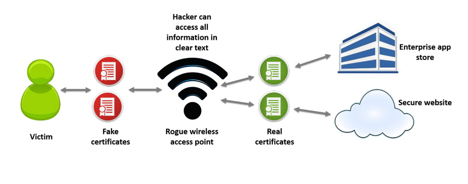
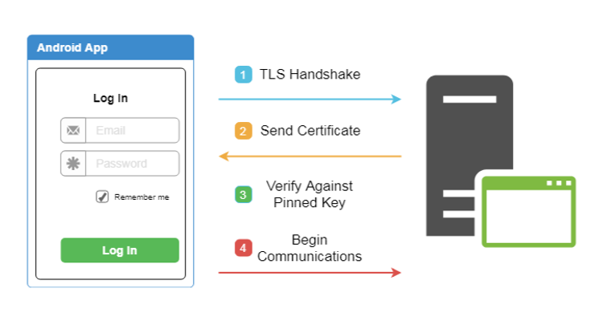

# SSL-Pinning is missing or incorrectly implemented

<table class='noborder'>
    <colgroup>
      <col/>
      <col/>
    </colgroup>
    <tbody>
      <tr>
        <td rowspan="2"></td>
        <td>Severity:<strong> ВЫСОКАЯ</strong></td>
      </tr>
      <tr>
        <td>Detection method:<strong> SAST, APK</strong></td>
      </tr>
    </tbody>
</table>
## Description

Insufficient attention to setting up proper client-server communication can lead to interception of traffic between application and server. The attacker model in this case can be very different. For example, public Wi-Fi networks, compromised network devices, an attacker on the same network as the device, etc.

In absence or improper implementation of protection against traffic interception, a classic MiTM ("Man in the middle") attack can occur.

The process of this attack is shown in the picture below:

<figure markdown>

<figcaption>Рис. 1. Схема атаки Man-In-The-Middle</figcaption>
</figure>
This scheme shows the following:

1. Application accesses its server via an access point controlled by the attacker.

2. A Proxy server is deployed on this access point. All traffic goes through it.

3. When connecting to this access point, the client is prompted to install a root CA certificate in order to use Internet (via the Captive portal functionality).

4. For each request that passes through the Proxy, it generates its own certificate signed by its root certificate. The same certificate is already installed on the client device.

In this configuration, all app traffic will be available to the attacker, as he or she pretends to be the end destination of the mobile device and gives his or her certificate with his or her key when establishing a "secure" connection. A secure connection is established with the Proxy server according to the classic scheme below. The server in this case is the attacker's Proxy:

<figure markdown>

<figcaption>Рис. 2. Процесс SSL-Handshake</figcaption>
</figure>
On the other hand, the Proxy server makes a similar connection to the mobile application backend and sends it data coming from the client. But at that point, the Proxy server can fully read or modify the data that came to it from the mobile app.

This attack is only possible if the application trusts the certificates stored in the user storage and if no SSL-Pinning protection is implemented. Nevertheless, such attacks are quite common.

## Recommendations

The main recommendation in this case is to use SSL-Pinning. The essence of this method is as follows. In the SSL-Handshake phase, after the second step, when the server sends us its public key certificate, the application verifies that certain parameters of this certificate match what the application expects to receive. This is some data that is "hardwired" into the application. And this is the data we expect to get from our server. This is shown schematically in the picture below.

<figure markdown>

<figcaption>Рис. 3. Процесс SSL-Pinning</figcaption>
</figure>
In order to understand more precisely implementation details, it is necessary to understand what exactly and at what stages can be checked, and how it can be implemented.

### What is a certificate

A certificate is an electronic document that allows you to verify the authenticity of its owner (user, service, system). It usually contains owner's public key, summary information about the certificate (owner's name, expiration date, etc.) and information about who issued the certificate.

<figure markdown>

</figure>
All data is cryptographically signed by the issuing organization (usually large trusted companies) and can therefore be verified at any time.

### What kinds of SSL-Pinning exist

#### Certificate Pinning

The first implementation is Certificate Pinning. In this case, the certificate itself is checked, including the metadata (to whom the certificate was issued, expiration date, owner data, etc.). This implementation is the most secure because even a minor change in the certificate will cause a mismatch and will make it impossible to establish a connection.

A certificate has an expiration date. Therefore, every time a new certificate is issued, a new version of the application must be released.

#### Public key Pinning

This is a simplified implementation of certificate check. During this check, only the public key is checked instead of the entire certificate. Since it is possible to update certificate without changing the public key, this way you do not have to update the application every time you change the certificate.

However, companies should have a rotation policy for such keys, so that sooner or later the key will be updated.

### What certificates can be checked

1. Certificate of the destination server to connect.
   1. Guarantees almost 100% that it is your certificate, even if the root certificate authority has been compromised.
   2. If a certificate becomes invalid for any reason (either expired or compromised), it will not be possible to connect to the server until the application is updated.
   3. Allows the use of self-signed certificates. This can be useful during development.
2. Certificate of an intermediate certification authority.
   1. By checking the intermediate certificate, you are trusting the intermediate CA.
   2. As long as you use the same certificate provider, any changes to the destination server certificates will work without updating the application.
3. Certificate authority (CA) certificate (root certificate).
   1. Checking root certificate means that you trust the root certificate authority and any intermediaries using that certificate authority.
   2. If the root certificate is compromised, connection cannot be considered secure and all certificates must be changed immediately.
4. The entire certificate chain.
   1. This is the most reliable check from a security point of view, because all possible changes in any of the certificates are checked.
   2. At the same time, this verification is the most difficult to maintain, because if any of the certificates involved in the chain change, the application must be updated.

How to check

For different libraries implementation will be its own, depending on the specific library and its version. But Android has a built-in mechanism for implementing Pinning at the system level, namely the networking configuration. The network communication configuration is an XML file that configures the network security settings for the Android application. This setting is specified by a special attribute in ***AndroidManifest.xml*** — `android:networkSecurityConfig`.

Connection example:

    <?xml version="1.0" encoding="utf-8"?>
    <manifest ... >
        <application android:networkSecurityConfig="@xml/network_security_config"
                        ... >
            ...
        </application>
    </manifest>

Network Security Config allows you to easily enable the Certificate Pinning mechanism in your application. However, it is worth to take into account certain nuances. Let's look at a configuration that at first glance looks like a properly configured one and see how it can be slightly improved:

    <network-security-config>
        <domain-config>
            <domain includeSubdomains="true">example.com</domain>
            <pin-set>
                <pin digest="SHA-256">7HIpactkIAq2Y49orFOOQKurWxmmSFZhBCoQYcRhJ3Y=</pin>
            </pin-set>
        </domain-config>
    </network-security-config>

This example has two small disadvantages:

1. The certificate fingerprint (pin-set) does not have an expiration date.
2. There is no backup certificate.

If your certificate is about to expire and no expiration date is specified in the settings, the application will stop connecting to the server and generate an error. However, if an expiration date has been set and it expires, the application will switch to the trusted certificate authorities installed in the system. Instead of getting a non-functional application, you will get no SSL Pinning for some time until you update the certificate in the application.

To avoid this, if you know the certificate to be used on your server after the current one expires, you can specify it immediately in the "backup certificates" settings.

Here is an example of the **most** correct use of the Certificate Pinning functionality:

    <network-security-config>
        <domain-config>
            <domain includeSubdomains="true">example.com</domain>
            <pin-set expiration="2021-01-01">
                <pin digest="SHA-256">7HIpactkIAq2Y49orFOOQKurWxmmSFZhBCoQYcRhJ3Y=</pin>
                <!-- backup pin -->
                <pin digest="SHA-256">fwza0LRMXouZHRC8Ei+4PyuldPDcf3UKgO/04cDM1oE=</pin>
            </pin-set>
        </domain-config>
    </network-security-config>

Despite all the conveniences of using the Network Security Config, some checks should be performed internally in the application code. For example, you still need to determine if your application performs hostname validation, because Network Security Config does not protect against this type of issue.

**Also, before implementation, make sure that third-party libraries support Network Security Config. Otherwise, these security measures may cause problems in your application. Besides, Network Security Config is not supported by lower-level network connections, such as web sockets.**

Here are some examples of the most popular networking libraries and how SSL Pinning can be implemented inside each of them.

#### OkHttp

When implementing in OkHttp, you can use the class [CertificatePinner](https://github.com/square/okhttp/wiki/HTTPS#certificate-pinning) class.

    CertificatePinner certPinner = new CertificatePinner.Builder()
            .add("appmattus.com",
                "sha256/4hw5tz+scE+TW+mlai5YipDfFWn1dqvfLG+nU7tq1V8=")
            .build();
    OkHttpClient okHttpClient = new OkHttpClient.Builder()
            .certificatePinner(certPinner)
            .build();

\*\*In OkHttp you can use this functionality starting from version 2.1. But unfortunately, earlier versions are affected by the [vulnerability](https://medium.com/square-corner-blog/vulnerability-in-okhttps-certificate-pinner-2a7326ad073b#.kkns7f3jk), fixed only in versions higher than 2.7.5 and higher than 3.2.0. Make sure that the version of the library you are using is not affected by this vulnerability. \*\*

#### Retrofit

Retrofit is used on top of OkHttp, so its use is similar to operations with `OkHttpClient`, as shown in the example above.

    Retrofit retrofit = new Retrofit.Builder()
            .baseUrl("https://appmattus.com")
            .addConverterFactory(GsonConverterFactory.create())
            .client(okHttpClient)
            .build();

#### Picasso

For Picasso, if you use OkHttp, similar to the example above, you must configure OkHttpClient. Picasso 2 does not currently support OkHttp 3, so an additional library [Picasso 2 OkHttp3](https://github.com/JakeWharton/picasso2-okhttp3-downloader) may be required.

    Picasso picasso = new Picasso.Builder(getApplicationContext())
            .downloader(new OkHttpDownloader(okHttpClient))
            .build();
    Picasso.setSingletonInstance(picasso);

Implementation using `UrlConnectionDownloader` is a bit more complicated. However, it is possible to implement a similar method as in the Volley library (described below) by overloading the `openConnection` method of the downloader and overriding `HostnameVerifier`.

#### HttpUrlConnection

If `HttpUrlConnection` is used, it is recommended to reconsider in favor of OkHttp. The version of `HttpUrlConnection` built into Android is fixed, so updates can be difficult.

In the Android document "[Security with HTTPS and SSL](https://developer.android.com/training/articles/security-ssl.html#Pinning)", the proposed implementation is based on pinning certificates with its own **TrustManager** and **SSLSocketFactory**. However, as with other APIs, this recommendation will include examples using SPKI.

    private void validatePinning(
            X509TrustManagerExtensions trustManagerExt,
            HttpsURLConnection conn, Set<String> validPins)
            throws SSLException {
        String certChainMsg = "";
        try {
            MessageDigest md = MessageDigest.getInstance("SHA-256");
            List<X509Certificate> trustedChain =
                    trustedChain(trustManagerExt, conn);
            for (X509Certificate cert : trustedChain) {
                byte[] publicKey = cert.getPublicKey().getEncoded();
                md.update(publicKey, 0, publicKey.length);
                String pin = Base64.encodeToString(md.digest(),
                        Base64.NO_WRAP);
                certChainMsg += "    sha256/" + pin + " : " +
                        cert.getSubjectDN().toString() + "\n";
                if (validPins.contains(pin)) {
                    return;
                }
            }
        } catch (NoSuchAlgorithmException e) {
            throw new SSLException(e);
        }
        throw new SSLPeerUnverifiedException("Certificate pinning " +
                "failure\n  Peer certificate chain:\n" + certChainMsg);
    }
    private List<X509Certificate> trustedChain(
            X509TrustManagerExtensions trustManagerExt,
            HttpsURLConnection conn) throws SSLException {
        Certificate[] serverCerts = conn.getServerCertificates();
        X509Certificate[] untrustedCerts = Arrays.copyOf(serverCerts,
                serverCerts.length, X509Certificate[].class);
        String host = conn.getURL().getHost();
        try {
            return trustManagerExt.checkServerTrusted(untrustedCerts,
                    "RSA", host);
        } catch (CertificateException e) {
            throw new SSLException(e);
        }
    }

This implementation shall be called like this:

    TrustManagerFactory trustManagerFactory =
            TrustManagerFactory.getInstance(
                    TrustManagerFactory.getDefaultAlgorithm());
    trustManagerFactory.init((KeyStore) null);
    // Find first X509TrustManager in the TrustManagerFactory
    X509TrustManager x509TrustManager = null;
    for (TrustManager trustManager : trustManagerFactory.getTrustManagers()) {
        if (trustManager instanceof X509TrustManager) {
            x509TrustManager = (X509TrustManager) trustManager;
            break;
        }
    }
    X509TrustManagerExtensions trustManagerExt =
            new X509TrustManagerExtensions(x509TrustManager);
    ...
    URL url = new URL("https://www.appmattus.com/");
    HttpsURLConnection urlConnection = 
            (HttpsURLConnection) url.openConnection();
    urlConnection.connect();
    Set<String> validPins = Collections.singleton
            ("4hw5tz+scE+TW+mlai5YipDfFWn1dqvfLG+nU7tq1V8=");
    validatePinning(trustManagerExt, urlConnection, validPins);

In this case, the call of `urlConnection.connect()` performs SSL Handshake, but does not transfer any data until `urlConnection.getInputStream()` is called.

#### Volley

The standard way to use the Volley library is to Pinning certificates, as shown in the article "[Android Security Tip:](https://medium.com/@faruktoptas/android-security-tip-public-key-pinning-with-volley-library-fb85bf761857)[Public Key Pinning with Volley Library](https://medium.com/@faruktoptas/android-security-tip-public-key-pinning-with-volley-library-fb85bf761857)". The GitHub project [Public Key Pinning with Android Volley library](https://github.com/faruktoptas/volley-public-key-pinning) shows how **SSLSocketFactory** can be configured to bind to SPKI.

An alternative method can be used in addition to the approaches listed above. It uses the `HostnameVerifier` class. This class is used to verify that the host name in the URL matches that specified in the certificate.

You can override `HostnameVerifier` as follows:

    RequestQueue requestQueue = Volley.newRequestQueue(appContext,
            new HurlStack() {
        @Override
        protected HttpURLConnection createConnection(URL url) throws IOException {
            HttpURLConnection connection = super.createConnection(url);
            if (connection instanceof HttpsURLConnection) {
                HostnameVerifier delegate =
                        urlConnection.getHostnameVerifier();
                HostnameVerifier pinningVerifier =
                        new PinningHostnameVerifier(delegate);
                urlConnection.setHostnameVerifier(pinningVerifier);
            }
            return connection;
        }
    });
    ...
    public static class PinningHostnameVerifier
            implements HostnameVerifier {
        private final HostnameVerifier delegate;
        private PinningHostnameVerifier(HostnameVerifier delegate) {
            this.delegate = delegate;
        }
        @Override
        public boolean verify(String host, SSLSession sslSession) {
            if (delegate.verify(host, sslSession)) {
                try {
                    validatePinning(sslSession.getPeerCertificates(),
                            host, validPins);
                    return true;
                } catch (SSLException e) {
                    throw new RuntimeException(e);
                }
            }
            return false;
        }
    }

## Links

1. [Network security configuration  \|  Android Developers](https://developer.android.com/training/articles/security-config)

2. [A Security Analyst’s Guide to Network Security Configuration in Android P](https://www.nowsecure.com/blog/2018/08/15/a-security-analysts-guide-to-network-security-configuration-in-android-p/)

3. [GitHub - square/okhttp:](https://github.com/square/okhttp/wiki/HTTPS#certificate-pinning)[Square’s meticulous HTTP client for the JVM, Android, and GraalVM.](https://github.com/square/okhttp/wiki/HTTPS#certificate-pinning)

4. [Vulnerability in OkHttp’s Certificate Pinner](https://medium.com/square-corner-blog/vulnerability-in-okhttps-certificate-pinner-2a7326ad073b#.kkns7f3jk)

5. [GitHub - JakeWharton/picasso2-okhttp3-downloader:](https://github.com/JakeWharton/picasso2-okhttp3-downloader)[A OkHttp 3 downloader implementation for Picasso 2.](https://github.com/JakeWharton/picasso2-okhttp3-downloader)

6. [Security with HTTPS and SSL  \|  Android Developers](https://developer.android.com/training/articles/security-ssl.html#Pinning)

7. [Android Security Tip:](https://medium.com/@faruktoptas/android-security-tip-public-key-pinning-with-volley-library-fb85bf761857)[Public Key Pinning with Volley Library](https://medium.com/@faruktoptas/android-security-tip-public-key-pinning-with-volley-library-fb85bf761857)

8. [GitHub - faruktoptas/volley-public-key-pinning:](https://github.com/faruktoptas/volley-public-key-pinning)[Public key pinning with Android volley networking library](https://github.com/faruktoptas/volley-public-key-pinning)