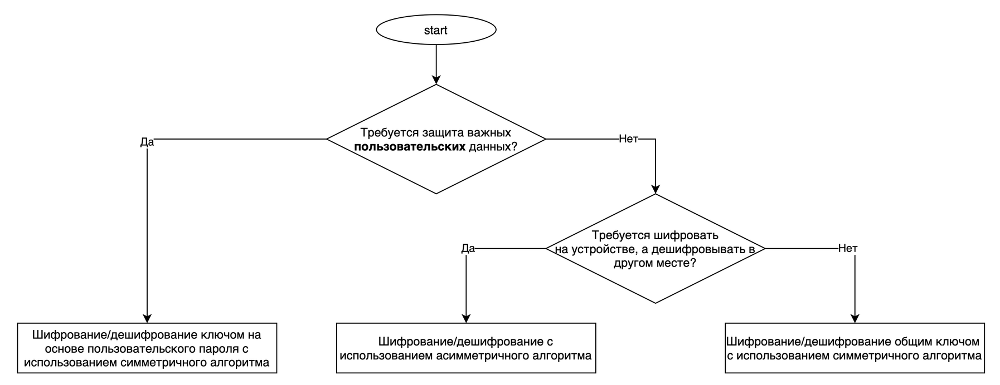
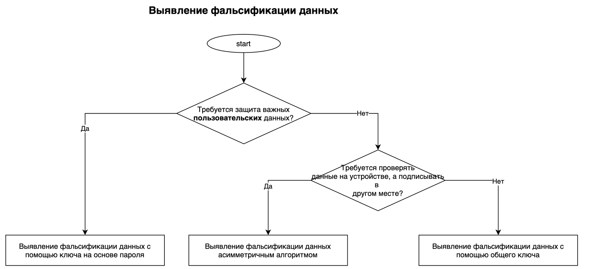

# Storing sensitive information in a public file inside the application's directory

<table class='noborder'>
    <colgroup>
      <col/>
      <col/>
    </colgroup>
    <tbody>
      <tr>
        <td rowspan="2"></td>
        <td>Severity:<strong> CRITICAL</strong></td>
      </tr>
      <tr>
        <td>Detection method:<strong> DAST, FILES</strong></td>
      </tr>
    </tbody>
</table>
## Description

An application stores sensitive information in a public file inside the application's directory.

In order to understand what kind of data needs to be protected, you first need to determine what data the application processes and stores and what part of that information is considered sensitive. In such a situation, it is common to rely on legislation and common sense. There is no point in encrypting absolutely all the information the application stores. This can affect the speed and stability of the application. Instead, you need to clearly define what is considered as confidential data by your application or by your company, and focus your attention on that data.

It is generally assumed that as few confidential information as possible should be stored in a local storage (both internal and external). However, in most cases storing such information cannot be avoided. For example, in terms of usability, you should not force a user to enter a complex password every time an application is launched. Most applications have to cache some authentication token locally. Personally identifiable information (PII) and other types of confidential data could also be retained if a specific scenario calls for it.

An application can store data in several places, for example, on a device or on an external SD-card. The most common ways to store data on a device are:

* Shared Preferences.
* SQLite databases.
* Realm databases.
* Internal memory.
* External storage.

Keep in mind that using any of these methods does not guarantee security of the stored data. If you do not use encryption or hashing beforehand, this data may be available to an attacker.

!!! note "Note!" Very often it is mistakenly thought that the data stored in the internal directory of an application is already protected by the sandbox mechanism and an attacker cannot get to it. There are many ways, ranging from a simple local or cloud-based application backup to physical access to the device and exploitation of various vulnerabilities. **Plain text information put into the application's directory is not protected!**

Placing information on an external storage or in shared directories makes it accessible to everyone. And you should definitely not store sensitive information in such files.

## Recommendations

The way confidential information is stored depends on its type. If there is a need to store encryption keys, the best choice would be the system storage, AndroidKeyStore. Unfortunately, this is not always possible, so you have to choose a method that provides the maximum possible protection taking into account the Android version:

* On Android API\<18 the encryption keys must be stored inside the application's directory in BKS.
* On Android API>=18 RSA keys must be stored in AndroidKeyStore, and AES keys—in BKS.
* On Android API>=23 RSA and AES keys must be stored in AndroidKeyStore.

Also, don't forget that when using the BKS in the internal application's directory, an additional strong password is required to protect the keystore and the keys within it. A good idea would be to check the generated password against a database for most common passwords and ensure that the password meets minimum requirements:

* The password is at least 20 characters in length.
* At least one lower-case letter is required.
* At least one upper-case letter is required.
* At least one numeric character is required.
* At least one special character is required.

Android has many cryptographic functions that help ensure confidentiality and integrity of data. There are methods that enable Android applications to securely encrypt and decrypt data (maintaining confidentiality), to authenticate messages (MAC) and digital signatures (ensuring integrity).

To choose an encryption method and key type suitable for the given conditions, you can use the following schemes:

<figure markdown>

</figure>
<figure markdown>

</figure>
**Password-based encryption/decryption**

Let's take a closer look at encryption/decryption method based on a user password. In this case, there is no need to store the encryption key, as it is generated "on the fly" based on the password entered by the user:

Rules:

1. Explicitly define the encryption mode and block padding.

2. Use crypto-resistant encryption technologies including algorithm, block encryption mode, and block padding mode.

3. Use "salt" when generating a password-based key.

4. Use a sufficient number of hashing iterations while generating the key based on the password.

5. Use a key with a length that ensures cryptographic strength of the encryption.
   
        package com.appsec.android.cryptsymmetricpasswordbasedkey;
       
        import java.security.InvalidAlgorithmParameterException;
        import java.security.InvalidKeyException;
        import java.security.NoSuchAlgorithmException;
        import java.security.SecureRandom;
        import java.security.spec.InvalidKeySpecException;
        import java.util.Arrays;
       
        import javax.crypto.BadPaddingException;
        import javax.crypto.Cipher;
        import javax.crypto.IllegalBlockSizeException;
        import javax.crypto.NoSuchPaddingException;
        import javax.crypto.SecretKey;
        import javax.crypto.SecretKeyFactory;
        import javax.crypto.spec.IvParameterSpec;
        import javax.crypto.spec.PBEKeySpec;
       
        public final class AesCryptoPBEKey {
       
            // *** 1 *** Явно определяйте режим шифрования и дополнения блоков.
            // *** 2 *** Используйте криптостойкие технологии шифрования, включающие алгоритм, режим блочного шифрования и режим дополнения блоков
            // Параметры передаваемые в метод getInstance класса Cipher: алгоритм шифрования, режим блочного шифрования, режим дополнения блоков
            // в этом примере следующие значения: алгоритм шифрования=AES, режим блочного шифрования=CBC, режим дополнения блоков=PKCS7Padding
            private static final String TRANSFORMATION = "AES/CBC/PKCS7Padding";
       
            // Строка, используемая для получения экземпляра класса, который будет генерировать ключ
            private static final String KEY_GENERATOR_MODE = "PBEWITHSHA256AND128BITAES-CBC-BC";
       
            // *** 3 *** В процессе генерации ключа на основе пароля используйте "соль" (salt)
            // Длина строки "соли" в байтах
            public static final int SALT_LENGTH_BYTES = 20;
       
            // *** 4 *** В процессе генерации ключа на основе пароля используйте достаточное количество итераций хеширования
            // Указание числа повторений смешиваний, используемых при генерации ключей с помощью PBE
            private static final int KEY_GEN_ITERATION_COUNT = 1024;
       
            // *** 5 *** Используйте ключ с длиной, которая обеспечит криптостойкость шифрования
            // Длина ключа в битах
            private static final int KEY_LENGTH_BITS = 128;
       
            private byte[] mIV = null;
            private byte[] mSalt = null;
       
            public byte[] getIV() {
                return mIV;
            }
       
            public byte[] getSalt() {
                return mSalt;
            }
       
            AesCryptoPBEKey(final byte[] iv, final byte[] salt) {
                mIV = iv;
                mSalt = salt;
            }
       
            AesCryptoPBEKey() {
                mIV = null;
                initSalt();
            }
       
            private void initSalt() {
                mSalt = new byte[SALT_LENGTH_BYTES];
                SecureRandom sr = new SecureRandom();
                sr.nextBytes(mSalt);
            }
       
            public final byte[] encrypt(final byte[] plain, final char[] password) {
                byte[] encrypted = null;
       
                try {
                    // *** 1 *** Явно определяйте режим шифрования и дополнения блоков.
                    // *** 2 *** Используйте криптостойкие технологии шифрования, включающие алгоритм, режим блочного шифрования и режим дополнения блоков
                    Cipher cipher = Cipher.getInstance(TRANSFORMATION);
       
                    // *** 3 *** В процессе генерации ключа на основе пароля используйте "соль" (salt)
                    SecretKey secretKey = generateKey(password, mSalt);
                    cipher.init(Cipher.ENCRYPT_MODE, secretKey);
                    mIV = cipher.getIV();
       
                    encrypted = cipher.doFinal(plain);
                } catch (NoSuchAlgorithmException e) {
                } catch (NoSuchPaddingException e) {
                } catch (InvalidKeyException e) {
                } catch (IllegalBlockSizeException e) {
                } catch (BadPaddingException e) {
                } finally {
                }
       
                return encrypted;
            }
       
            public final byte[] decrypt(final byte[] encrypted, final char[] password) {
                byte[] plain = null;
       
                try {
                    // *** 1 *** Явно определяйте режим шифрования и дополнения блоков.
                    // *** 2 *** Используйте криптостойкие технологии шифрования, включающие алгоритм, режим блочного шифрования и режим дополнения блоков
                    Cipher cipher = Cipher.getInstance(TRANSFORMATION);
       
                    // *** 3 *** В процессе генерации ключа на основе пароля используйте "соль" (salt)
                    SecretKey secretKey = generateKey(password, mSalt);
                    IvParameterSpec ivParameterSpec = new IvParameterSpec(mIV);
                    cipher.init(Cipher.DECRYPT_MODE, secretKey, ivParameterSpec);
       
                    plain = cipher.doFinal(encrypted);
                } catch (NoSuchAlgorithmException e) {
                } catch (NoSuchPaddingException e) {
                } catch (InvalidKeyException e) {
                } catch (InvalidAlgorithmParameterException e) {
                } catch (IllegalBlockSizeException e) {
                } catch (BadPaddingException e) {
                } finally {
                }
       
                return plain;
            }
       
            private static final SecretKey generateKey(final char[] password, final byte[] salt) {
                SecretKey secretKey = null;
                PBEKeySpec keySpec = null;
       
                try {
                    // *** 2 *** Используйте криптостойкие технологии шифрования, включающие алгоритм, режим блочного шифрования и режим дополнения блоков
                    // Получение экземпляра класса для генерации ключа
                    // В этом примере используется класс KeyFactory, который применяет алгоритм SHA256 для генерации AES-CBC 128-битного ключа
                    SecretKeyFactory secretKeyFactory = SecretKeyFactory.getInstance(KEY_GENERATOR_MODE);
       
                    // *** 3 *** В процессе генерации ключа на основе пароля используйте "соль" (salt)
                    // *** 4 *** В процессе генерации ключа на основе пароля используйте достаточное количество итераций хеширования
                    // *** 5 *** Используйте ключ с длиной, которая обеспечит криптостойкость шифрования
                    keySpec = new PBEKeySpec(password, salt, KEY_GEN_ITERATION_COUNT, KEY_LENGTH_BITS);
                    // Очистка пароля - требуется для усложнения процедуры отладки и невключения пароля в дамп памяти
                    Arrays.fill(password, '?');
                    // Генерация ключа
                    secretKey = secretKeyFactory.generateSecret(keySpec);
                } catch (NoSuchAlgorithmException e) {
                } catch (InvalidKeySpecException e) {
                } finally {
                    keySpec.clearPassword();
                }
       
                return secretKey;
            }
        }

## Links

1. [https://mobile-security.gitbook.io/mobile-security-testing-guide/android-testing-guide/0x05d-testing-data-storage](https://mobile-security.gitbook.io/mobile-security-testing-guide/android-testing-guide/0x05d-testing-data-storage)

2. [https://cwe.mitre.org/data/definitions/200.html](https://cwe.mitre.org/data/definitions/200.html)

3. [https://cwe.mitre.org/data/definitions/311.html](https://cwe.mitre.org/data/definitions/311.html)

4. [https://cwe.mitre.org/data/definitions/312.html](https://cwe.mitre.org/data/definitions/312.html)