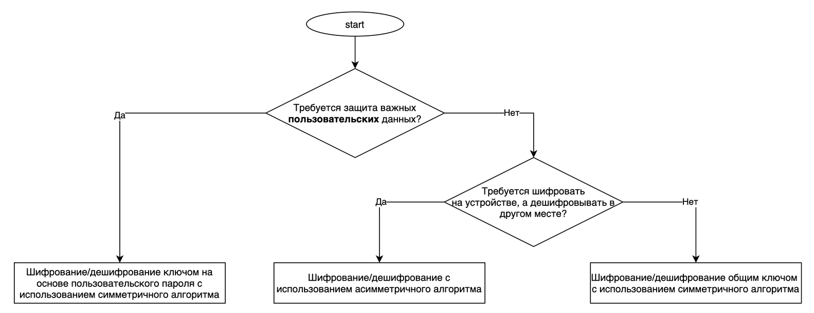

# Storing sensitive information in the application source code

<table class='noborder'>
    <colgroup>
      <col/>
      <col/>
    </colgroup>
    <tbody>
      <tr>
        <td rowspan="2"></td>
        <td>Severity:<strong> CRITICAL</strong></td>
      </tr>
      <tr>
        <td>Detection method:<strong> DATA, FILES</strong></td>
      </tr>
    </tbody>
</table>
## Description

The application stores sensitive information in its source code. It is often wrongly assumed that the data that is embedded in the source code of applications is protected and inaccessible after compilation and obfuscation. However, in a decompiled application, all string resources remain unchanged. Any sensitive information located in the source code of the application will be available to malefactors. It is not recommended to store in the source code any information that could help an attacker. This applies to any tokens, passwords, encryption keys, and data used for testing - test bench addresses, test credentials, etc. Such information reveals the inside structure of test benches and can be used in the future.

## Recommendations

If you need to store confidential information, the source code is not the best place to do it. It is recommended to get such information from the server and store it encrypted on the device, if necessary. Android is equipped with many cryptographic features and methods to ensure data privacy. With these, Android applications can securely perform encryption and decryption (to ensure privacy) as well as message authentication (MAC) and digital signatures (to verify integrity).

To choose an encryption method and key type suitable for the given conditions, you can use the following schemes:

<figure markdown>

</figure>
**Encryption/decryption using the Pinkman library**

Let's consider the example of storing a user's PIN using the Pinkman library. This library demonstrates an example of using the key expansion procedure and the KeyStore mechanism to generate and store an encryption key. The library gets the hash from the user's PIN using the Argon2 hash function and stores it in an encrypted file. The file is encrypted with the AES-256 algorithm in GCM mode, and the keys are stored in AndroidKeystore. This library does not invent its own cryptography, but uses proven algorithms.

Description of the technologies used and their parameters.

**Getting a hash from a PIN**

The Argon2 function with the following parameters is used to obtain the hash:

* **Mode:** Argon2i.
* **Time spent on iterations:** 5\.
* **Memory cost in kilobytes:** 65,536.
* **Parallelism:** 2\.
* **The resulting hash length:** 128 bit.

**Encrypted files**

This library uses the Jetpack security library from the Android Jetpack library set for secure data storage. This library in turn uses another library, Tink.

**Usage example**

Add the library to the Gradle configuration:

    implementation 'com.redmadrobot:pinkman:$pinkman_version'

Create an instance of the Pinkman class and integrate it into your authentication logic.

    val pinkman = Pinkman(application.applicationContext)
    ...
    class CreatePinViewModel(private val pinkman: Pinkman) : ViewModel() {
        val pinIsCreated = MutableLiveData()
        fun createPin(pin: String) {
            pinkman.createPin(pin)
            pinIsCreated.postValue(true)
        }
    }
    ...
    class InputPinViewModel(private val pinkman: Pinkman) : ViewModel() {
        val pinIsValid = MutableLiveData()
        fun validatePin(pin: String) {
            pinIsValid.value = pinkman.isValidPin(pin)
        }
    }

On some devices, the hash obtaining operations can take considerable time. To avoid ANR in your application, you should not run the `createPin()`, `changePin()`, `isValidPin()`methods in the main thread.

This library already has two extensions to run these methods asynchronously. You can choose one of them depending on your specific needs (or technical stack).

You need to add this dependency if you prefer RxJava:

    implementation 'com.redmadrobot:pinkman-rx3:$pinkman_version'

But if you are using the latest technology, you should use a dependency with [Kotlin Coroutines](https://kotlinlang.org/docs/coroutines-overview.html):

    implementation 'com.redmadrobot:pinkman-coroutines:$pinkman_version'

The result is a set of methods specific to RxJava or Coroutines:

    // RxJava3
    fun createPinAsync(...): Completable
    fun changePinAsync(...): Completable
    fun isValidPinAsync(...): Single
    // Coroutines
    suspend fun createPinAsync(...)
    suspend fun changePinAsync(...)
    suspend fun isValidPinAsync(...): Boolean

If, for whatever reason, the storage of such information cannot be removed from the source code of the application, you can use paid tools that allow you to encrypt string resources when compiling the application. Examples of such software are [DexProtector](https://dexprotector.com/) and [DexGuard](https://www.guardsquare.com/en/products/dexguard).

## Links

1. [https://mobile-security.gitbook.io/mobile-security-testing-guide/android-testing-guide/0x05d-testing-data-storage](https://mobile-security.gitbook.io/mobile-security-testing-guide/android-testing-guide/0x05d-testing-data-storage)

2. [https://cwe.mitre.org/data/definitions/200.html](https://cwe.mitre.org/data/definitions/200.html)

3. [https://cwe.mitre.org/data/definitions/311.html](https://cwe.mitre.org/data/definitions/311.html)

4. [https://cwe.mitre.org/data/definitions/312](https://cwe.mitre.org/data/definitions/312)

5. [https://www.guardsquare.com/en/products/dexguard](https://www.guardsquare.com/en/products/dexguard)

6. [https://dexprotector.com/](https://dexprotector.com/)

7. [https://github.com/RedMadRobot/PINkman](https://github.com/RedMadRobot/PINkman)