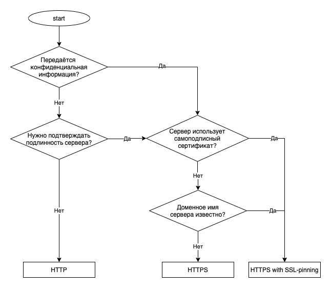
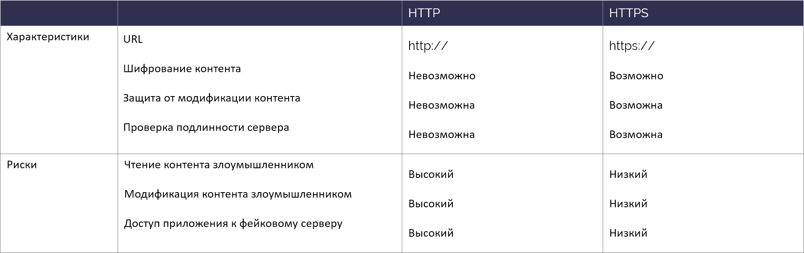

# Sending sensitive information in an HTTP request

<table class='noborder'>
    <colgroup>
      <col/>
      <col/>
    </colgroup>
    <tbody>
      <tr>
        <td rowspan="2"></td>
        <td>Severity:<strong> CRITICAL</strong></td>
      </tr>
      <tr>
        <td>Detection method:<strong> DAST, NETWORKING</strong></td>
      </tr>
    </tbody>
</table>
## Description

Using HTTP instead of HTTPS makes it possible to implement the Man-in-the-Middle attack. This can lead to a complete loss of confidentiality of transmitted data. Note, that all data sent via the HTTP protocol are transferred in plain text with absolutely no protection. Anybody, who shares a network with you, can receive or even forge the data having relevant experience.

Using the HTTPS protocol that is based on HTTP plus SSL / TLS, allows to protect the transferred data from an unauthorized access or modification. It is recommended to use HTTPS for all situations involving exchange of valuable information between a client and a server, particularly for login pages and other pages requiring authentication.

## Recommendations

Ideally, not encrypted traffic should never be used in an application. If this is difficult to implement or there is a need to use third-party services via HTTP, pay special attention to verification and validation of the received data and never transmit confidential information over such protocol.

If you need to choose a data transmission method, the following chart can be helpful:

<figure markdown>

</figure>
Comparison of HTTP and HTTPS:

<figure markdown>

</figure>
Android uses **java.net.HttpURLConnection/javax.net.ssl.HttpsURLConnection** as API for establishing communication channels over HTTP/HTTPS. Apache HttpClient is not supported starting from Android 6.0 (API 23).

!!! note "Note!" To establish a channel via HTTPS, you shouldn't use SSLSocket. Unlike HttpsURLConnection, this class doesn't check by default if there is a match between the server name and the name of the host declared in the certificate. Moreover, when using SSLSocket, developers often make mistakes that lead to security defects in the communication channel.

**Using HTTPS with SSL-Pinning**

An application can be additionally protected from fraudulent certificates with help of a mechanism known as SSL-Pinning. This mechanism prevents a certificate issued by a trusted certificate authority from being compromised in the system storage, which makes security violation of the data transmission channel nearly impossible.

Rules:

* Compare the server certificate with the one stored in the application.
* The URI scheme must be https://.
* Sensitive information may be transmitted.
* You can trust the received data, as they are received from a real server.
* Handle SSL issues properly.

**Example: Correct implementation of SSL-Pinning**

**PrivateCertificateHttpsGet.java**

    package com.appsec.android.https.privatecertificate;
    
    import java.io.BufferedInputStream;
    import java.io.ByteArrayOutputStream;
    import java.io.IOException;
    import java.net.HttpURLConnection;
    import java.net.URL;
    import java.security.KeyStore;
    import java.security.SecureRandom;
    
    import javax.net.ssl.HostnameVerifier;
    import javax.net.ssl.HttpsURLConnection;
    import javax.net.ssl.SSLContext;
    import javax.net.ssl.SSLException;
    import javax.net.ssl.SSLSession;
    import javax.net.ssl.TrustManagerFactory;
    
    import android.content.Context;
    import android.os.AsyncTask;
    
    public abstract class PrivateCertificateHttpsGet extends AsyncTask {
    
        private Context mContext;
    
        public PrivateCertificateHttpsGet(Context context) {
            mContext = context;
        }
    
        @Override
        protected Object doInBackground(String... params) {
            TrustManagerFactory trustManager;
            BufferedInputStream inputStream = null;
            ByteArrayOutputStream responseArray = null;
            byte[] buff = new byte[1024];
            int length;
    
            try {
                URL url = new URL(params[0]);
                // *** 1 *** Сверяйте сертификат сервера с сохранённым в приложении
                // Настраиваем keystore для установки соединений таким образом, чтобы он включал только сертификат из ресурсов приложения
                KeyStore ks = KeyStoreUtil.getEmptyKeyStore();
                KeyStoreUtil.loadX509Certificate(ks,
                        mContext.getResources().getAssets().open("cacert.crt"));
    
                // *** 2 *** Схема URI должна быть https://
                // *** 3 *** В передаваемые данные можно включать чувствительную информацию
                trustManager = TrustManagerFactory.getInstance(TrustManagerFactory.getDefaultAlgorithm());
                trustManager.init(ks);
                SSLContext sslCon = SSLContext.getInstance("TLS");
                sslCon.init(null, trustManager.getTrustManagers(), new SecureRandom());
    
                HttpURLConnection con = (HttpURLConnection)url.openConnection();
                HttpsURLConnection response = (HttpsURLConnection)con;
                response.setDefaultSSLSocketFactory(sslCon.getSocketFactory());
    
                response.setSSLSocketFactory(sslCon.getSocketFactory());
                checkResponse(response);
    
                // *** 4 *** Полученным данным можно доверять, т.к. они получены от подлинного сервера
                inputStream = new BufferedInputStream(response.getInputStream());
                responseArray = new ByteArrayOutputStream();
                while ((length = inputStream.read(buff)) != -1) {
                    if (length > 0) {
                        responseArray.write(buff, 0, length);
                    }
                }
                return responseArray.toByteArray();
            } catch(SSLException e) {
                // *** 5 *** Обрабатывайте ошибки SSL надлежащим образом
                // Пропускаем, т.к. это пример
                return e;
            } catch(Exception e) {
                return e;
            } finally {
                if (inputStream != null) {
                    try {
                        inputStream.close();
                    } catch (Exception e) {
                        // Пропускаем, т.к. это пример
                    }
                }
                if (responseArray != null) {
                    try {
                        responseArray.close();
                    } catch (Exception e) {
                        // Пропускаем, т.к. это пример
                    }
                }
            }
        }
    
        private void checkResponse(HttpURLConnection response) throws IOException {
            int statusCode = response.getResponseCode();
            if (HttpURLConnection.HTTP_OK != statusCode) {
                throw new IOException("HttpStatus: " + statusCode);
            }
        }
    }

**KeyStoreUtil.java**

    package com.appsec.android.https.privatecertificate;
    
    import java.io.IOException;
    import java.io.InputStream;
    import java.security.KeyStore;
    import java.security.KeyStoreException;
    import java.security.NoSuchAlgorithmException;
    import java.security.cert.Certificate;
    import java.security.cert.CertificateException;
    import java.security.cert.CertificateFactory;
    import java.security.cert.X509Certificate;
    import java.util.Enumeration;
    
    public class KeyStoreUtil {
        public static KeyStore getEmptyKeyStore() throws KeyStoreException,
                NoSuchAlgorithmException, CertificateException, IOException {
            KeyStore ks = KeyStore.getInstance("BKS");
            ks.load(null);
            return ks;
        }
    
        public static void loadAndroidCAStore(KeyStore ks)
                throws KeyStoreException, NoSuchAlgorithmException,
                CertificateException, IOException {
            KeyStore aks = KeyStore.getInstance("AndroidCAStore");
            aks.load(null);
            Enumeration aliases = aks.aliases();
            while (aliases.hasMoreElements()) {
                String alias = aliases.nextElement();
                Certificate cert = aks.getCertificate(alias);
                ks.setCertificateEntry(alias, cert);
            }
        }
        
        public static void loadX509Certificate(KeyStore ks, InputStream is)
                throws CertificateException, KeyStoreException {
            try {
                CertificateFactory factory = CertificateFactory.getInstance("X509");
                X509Certificate x509 = (X509Certificate)factory.generateCertificate(is);
                String alias = x509.getSubjectDN().getName();
                ks.setCertificateEntry(alias, x509);
            } finally {
                try { is.close(); } catch (IOException e) { /* Пропускаем, т.к. это пример*/ }
            }
        }
    }

**PrivateCertificateHttpsActivity.java**

    package com.appsec.android.https.privatecertificate;
    
    import android.app.Activity;
    import android.graphics.Bitmap;
    import android.graphics.BitmapFactory;
    import android.os.AsyncTask;
    import android.os.Bundle;
    import android.view.View;
    import android.widget.EditText;
    import android.widget.ImageView;
    import android.widget.TextView;
    
    public class PrivateCertificateHttpsActivity extends Activity {
    
        private EditText mUrlBox;
        private TextView mMsgBox;
        private ImageView mImgBox;
        private AsyncTask mAsyncTask ;
    
        @Override
        public void onCreate(Bundle savedInstanceState) {
            super.onCreate(savedInstanceState);
            setContentView(R.layout.activity_main);
            
            mUrlBox = (EditText)findViewById(R.id.urlbox);
            mMsgBox = (TextView)findViewById(R.id.msgbox);
            mImgBox = (ImageView)findViewById(R.id.imageview);
        }
        
        @Override
        protected void onPause() {
            if (mAsyncTask != null) mAsyncTask.cancel(true);
            super.onPause();
        }
        
        public void onClick(View view) {
            String url = mUrlBox.getText().toString();
            mMsgBox.setText(url);
            mImgBox.setImageBitmap(null);
            
            if (mAsyncTask != null) mAsyncTask.cancel(true);
            
            mAsyncTask = new PrivateCertificateHttpsGet(this) {
                @Override
                protected void onPostExecute(Object result) {
                    if (result instanceof Exception) {
                        Exception e = (Exception)result;
                        mMsgBox.append("\nException occurs\n" + e.toString());
                    } else {
                        byte[] data = (byte[])result;
                        Bitmap bmp = BitmapFactory.decodeByteArray(data, 0, data.length);
                        mImgBox.setImageBitmap(bmp);
                    }
                }
            }.execute(url);
        }
    }

**Using a modern approach — Network Security Configuration **

The Android platform provides a new simple instrument for configuration of a network — Network Security Configuration (NSC).  This instrument is available on Android 7.0. and above. With help of NSC, you can configure network connections (including SSL-Pinning) using XML files. To turn on the configuration, you need to link the configuration file with the application's manifest. To do this, use the `networkSecurityConfig` attribute in the `application` tag.

1. Create the configuration file
   
        res/xml/network_security_config.xml

2. Add the `android:networkSecurityConfig` attribute specifying the file location in ***AndroidManifest.xml***:
   
        <?xml version="1.0" encoding="utf-8"?>
        <manifest
        xmlns:android="http://schemas.android.com/apk/res/android"
        package="co.netguru.demoapp">
        <application
        android:networkSecurityConfig="@xml/network_security_config">
        ...
        </application>
        </manifest>

3. Create the configuration file and add certificate fingerprints:
   
        <?xml version="1.0" encoding="utf-8"?>
        <network-security-config>
        <domain-config>
        <domain includeSubdomains="true">example.com</domain>
        <pin-set>
        <pin digest="SHA-256">ZC3lTYTDBJQVf1P2V7+fibTqbIsWNR/X7CWNVW+CEEA=</pin>
        <pin digest="SHA-256">GUAL5bejH7czkXcAeJ0vCiRxwMnVBsDlBMBsFtfLF8A=</pin>
        </pin-set>
        </domain-config>
        </network-security-config>

As you can see, this method is very easy to implement. However, keep in mind that it is only available for API level 24 or higher.

## Links

1. [http://thedifference.ru/chem-otlichaetsya-http-ot-https/](http://thedifference.ru/chem-otlichaetsya-http-ot-https/)

2. [.](https://habrahabr.ru/post/252507/)

3. [https://www.owasp.org/index.php/Transport\_Layer\_Protection\_Cheat\_Sheet](https://www.owasp.org/index.php/Transport_Layer_Protection_Cheat_Sheet)

4. [http://mashable.com/2011/05/31/https-web-security/](http://mashable.com/2011/05/31/https-web-security/)

5. [https://medium.com/@appmattus/android-security-ssl-pinning-1db8acb6621e](https://medium.com/@appmattus/android-security-ssl-pinning-1db8acb6621e)

6. [https://developer.android.com/training/articles/security-ssl](https://developer.android.com/training/articles/security-ssl)

7. [https://www.netguru.com/codestories/3-ways-how-to-implement-certificate-pinning-on-android](https://www.netguru.com/codestories/3-ways-how-to-implement-certificate-pinning-on-android)

8. [https://developer.android.com/training/articles/security-config](https://developer.android.com/training/articles/security-config)