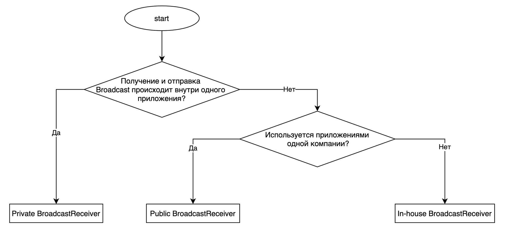

# Transmission of sensitive information in a private BroadcastReceiver

<table class='noborder'>
    <colgroup>
      <col/>
      <col/>
    </colgroup>
    <tbody>
      <tr>
        <td rowspan="2"></td>
        <td>Severity:<strong> INFO</strong></td>
      </tr>
      <tr>
        <td>Detection method:<strong> DAST, SENSITIVE INFO</strong></td>
      </tr>
    </tbody>
</table>
## Description

An application puts sensitive information into an **Intent** to launch a private **BroadcastReceiver**.

Interprocess communication (IPC) in Android is conducted using a special object — **Intent**. Parameters of **Intent** handlers are set in the main file of the application manifest — ***AndroidManifest.xml***, or, in case of dynamic **BroadcastReceivers**, in the application's code. If an implicit **Intent** is used (recipient is not specified explicitly or the broadcasting mechanism **Broadcast** is used), data in such message could be compromised. Moreover, malicious applications could use mechanisms of delegation of process control, such as implicit calls to application components or objects like **PendingIntent**, for interception of control and fishing attacks.

The following object types are dangerous: **Activity**, **Service**, **BroadcastReceiver** and **ContentProvider**, because they are open to communication with other applications and don't belong to system Android calls (such as `android.intent.action.MAIN`). **BroadcastReceiver** is, by default, open to interaction with other applications, so the interception of control or of an **Intent** with confidential information is possible.

## Recommendations

An explicit **Intent**, **Private BroadcastReceiver**, or LocalBroadcastManager should be used when sending a **Broadcast** with sensitive information to an internal **BroadcastReceiver**. Note also that an application **must not** include sensitive information in a **Public Broadcast**.

To receive a **Broadcast** you need to create **BroadcastReceiver**. Risks from using **BroadcastReceiver** and corresponding countermeasures vary depending on the type of a **Broadcast**.

To find out what type of **BroadcastReceiver** you are supposed to create, follow through the table and chart below. An application that receives a **Broadcast** is not able to check the name of the package from which the Broadcast has been sent, so it is not possible to create a **Partner BroadcastReceiver** [like an Activity].

| Type of BroadcastReceiver| Description
|----------|----------
| Private BroadcastReceiver| BroadcastReceiver that can receive a Broadcast only from the same application, and is therefore the safest type
| Public BroadcastReceiver| BroadcastReceiver that can receive a Broadcast from any application
| In-house BroadcastReceiver| BroadcastReceiver that can receive a Broadcast only from other applications of the same developer

<figure markdown>

</figure>
In addition, **BroadcastReceiver** can be static or dynamic depending on the declaration method.

| —| Declaration method| Characteristics
|----------|----------|----------
| Static BroadcastReceiver. By adding the \<receiver> elements into ***AndroidManifest.xml*** – is not able to receive some system Broadcasts (such as `ACTION_BATTERY_CHANGE`);  – will receive Broadcasts from the moment the application is installed until it is uninstalled. Dynamic **BroadcastReceiver**| | 
| By calling the registerReceiver() method| – can receive all Broadcasts, even those not receivable by static **BroadcastReceiver**;  – period of receiving **Broadcasts** is controlled by the program logic;  – **Private BroadcastReceiver** cannot be created| 

**Example of creating a Private BroadcastReceiver**

**Private BroadcastReceiver** is the safest type, because it can receive a **Broadcast** from the same application only. **Private BroadcastReceiver** can be declared as Static only.

Rules (receiving a **Broadcast**):

1. Explicitly specify the `exported="false"` attribute.
2. Verify the received **Intent** and handle it in a secure manner despite the fact that it was sent from the same application.
3. You can put confidential information into the resulting **Intent** because it is sent and received within the same application

**Declaring a component in AndroidManifest.xml**

    <?xml version="1.0" encoding="utf-8"?>
        <manifest xmlns:android="http://schemas.android.com/apk/res/android"
            package="com.appsec.android.broadcast.privatereceiver" >
        <application
                android:icon="@drawable/ic_launcher"
                android:label="@string/app_name"
                android:allowBackup="false" >
                
                <!-- Private Broadcast Receiver -->
                <!-- *** 1 *** Явно указывайте атрибут exported="false" -->
                <receiver
                    android:name=".PrivateReceiver"
                    android:exported="false" />
                
                <activity
                    android:name=".PrivateSenderActivity"
                    android:label="@string/app_name"
                    android:exported="true" >
                    <intent-filter>
                        <action android:name="android.intent.action.MAIN" />
                        <category android:name="android.intent.category.LAUNCHER" />
                    </intent-filter>
                </activity>
            </application>
        </manifest>

**Receiving a Broadcast**

    package com.appsec.android.broadcast.privatereceiver;
    import android.app.Activity;
    import android.content.BroadcastReceiver;
    import android.content.Context;
    import android.content.Intent;
    import android.widget.Toast;
    public class PrivateReceiver extends BroadcastReceiver {     @Override
        public void onReceive(Context context, Intent intent) {
            
            // *** 2 *** Проводите проверку и безопасную обработку полученного Intent, несмотря на то, что он был получен из того же самого приложения         String param = intent.getStringExtra("PARAM");
            Toast.makeText(context,
                    String.format("Received param: \"%s\"", param),
                    Toast.LENGTH_SHORT).show();
            
            // *** 3 *** В Intent результата можно включать конфиденциальную информацию, т.к. его отправка и получение происходит внутри приложения
            setResultCode(Activity.RESULT_OK);
            setResultData("Чувствительная информация");
            abortBroadcast();
        }
    }

**Rules (sending a Broadcast):**

1. Use an explicit **Intent** indicating the name of **BroadcastReceiver** class within the application

2. You can send sensitive information.

3. Verify the received result data and handle it in a secure manner despite the fact that it was sent from **BroadcastReceiver** of the same application.
   
        package com.appsec.android.broadcast.privatereceiver;
            import android.app.Activity;
            import android.content.BroadcastReceiver;
            import android.content.Context;
            import android.content.Intent;
            import android.os.Bundle;
            import android.view.View;
            import android.widget.TextView;
            public class PrivateSenderActivity extends Activity {
            public void onSendNormalClick(View view) {
                    // *** 1 *** Используйте явный Intent с указанием имени класса BroadcastReceiver внутри приложения
                    Intent intent = new Intent(this, PrivateReceiver.class);
                // *** 2 *** Можно отправлять чувствительную информацию
                    intent.putExtra("PARAM", "Чувствительная информация от отправителя");
                    sendBroadcast(intent);
                }
       
                public void onSendOrderedClick(View view) {
                    // *** 1 *** Используйте явный Intent с указанием имени класса BroadcastReceiver внутри приложения
                    Intent intent = new Intent(this, PrivateReceiver.class);
                // *** 2 *** Можно отправлять чувствительную информацию
                    intent.putExtra("PARAM", "Чувствительная информация от отправителя");
                    sendOrderedBroadcast(intent, null, mResultReceiver, null, 0, null, null);
                }
       
                private BroadcastReceiver mResultReceiver = new BroadcastReceiver() {
                    @Override
                    public void onReceive(Context context, Intent intent) {
       
                        // *** 3 *** Проводите проверку и безопасную обработку полученных данных результата, несмотря на то, что они были получены из BroadcastReceiver того же самого приложения
                        // См.п. "Безопасная обработка входных данных"
       
                        String data = getResultData();
                        PrivateSenderActivity.this.logLine(
                                String.format("Received result: \"%s\"", data));
                    }
                };
       
                private TextView mLogView;
       
                @Override
                public void onCreate(Bundle savedInstanceState) {
                    super.onCreate(savedInstanceState);
                    setContentView(R.layout.main);
                    mLogView = (TextView)findViewById(R.id.logview);
                }
       
                private void logLine(String line) {
                    mLogView.append(line);
                    mLogView.append("\n");
                }
            }

## Links

1. [Intents and Intent Filters  \|  Android Developers](https://developer.android.com/guide/components/intents-filters.html)
2. [Interacting with Other Apps  \|  Android Developers](https://developer.android.com/training/basics/intents/index.html)
3. [CWE - CWE-927:](https://cwe.mitre.org/data/definitions/927.html)[Use of Implicit Intent for Sensitive Communication (4.6)](https://cwe.mitre.org/data/definitions/927.html)
4. [owasp-mstg/0x05h-Testing-Platform-Interaction.md at master · OWASP/owasp-mstg](https://github.com/OWASP/owasp-mstg/blob/master/Document/0x05h-Testing-Platform-Interaction.md#testing-for-injection-flaws-mstg-platform-2)