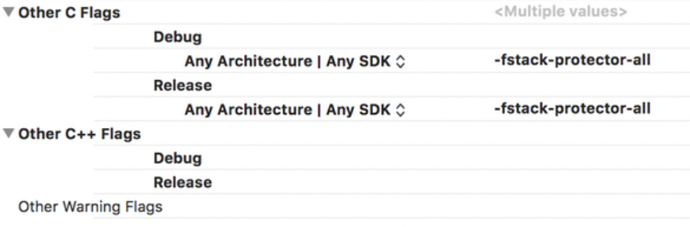
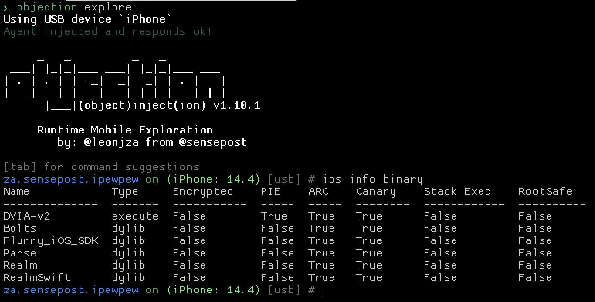
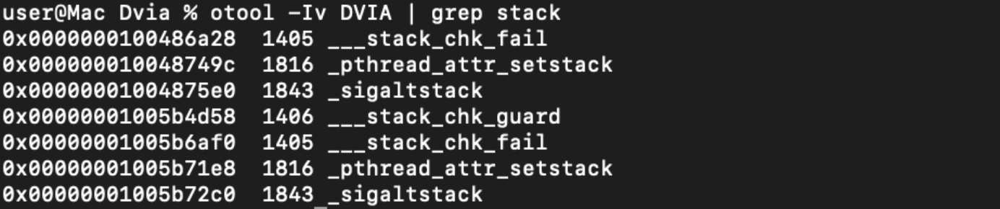
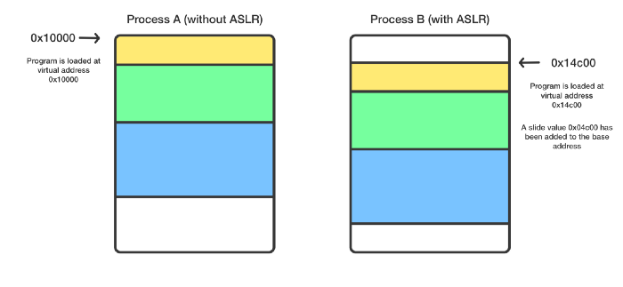

# Application does not use overflow protection features

<table class='noborder'>
    <colgroup>
      <col/>
      <col/>
    </colgroup>
    <tbody>
      <tr>
        <td rowspan="2"></td>
        <td>Severity:<strong> MEDIUM</strong></td>
      </tr>
      <tr>
        <td>Detection method:<strong> SAST, NETWORK</strong></td>
      </tr>
    </tbody>
</table>
## Description

iOS provides several ways to protect against exploiting overflow vulnerabilities. Disabling or not using the suggested protections can lead to opportunities to exploit vulnerabilities in an easier way.

Although all security features are enabled by default in Xcode, it is recommended that you check the compilation options additionally.

The following functions can be used:

* ARC - Automatic Reference Counting (memory management feature), adds save and free messages if necessary;

* Stack Canary - helps to prevent buffer overflow attacks;

* PIE - Position Independent Executable - includes the full ASLR.

## Recommendations

Below is a description of each method of protection and the risks that may arise from disabling them.

### Automatic reference counting

Automatic reference counting - tracking and managing the memory of your application. In most cases this means that memory management "just works" and you don't have to think about managing the memory yourself. ARC automatically frees memory used by class instances when those instances are no longer needed.

    "Targets"  >  "Build Settings“ > "Objective-C Automatic Reference Counting"  = “YES”

Stack smashing protection

The ipa archive of the assembled application contains an executable binary file in the mach-o format. It contains the following sections: static application information (text, constants, etc.), executable code, included static libraries and a list of dynamically loaded resources. Along with the table of partitioning and locations (addresses) of these sections there is data area with the flags of the compilation stage and peculiarities of its operation for the OS loader.

One of these flags is the application protection mode flag against stack overflow and control interception. It is also called a canary-protection and consists of adding bit flags at the stack frame bounds. When trying to go beyond stack bounds and overwrite the return address from the function with an arbitrary value, the signal bit itself will also be overwritten. The operating system will be notified and the application process will stop.

Compilation mode with stack overflow protection is set in the Xcode IDE environment, in the compilation settings menu with the "-fstack-protector-all" directive.

<figure markdown>

</figure>
The `‘OTHER_CFLAGS = "-fstack-protector-all"’` option is mandatory for projects written in languages with manual memory management, such as C / C++ / Objective-C.

#### Manual analysis

You can check the availability of this mode in the compiled application by unpacking the ipa-archive and analyzing the binary file stored in it with the utility "otool" for the existence of this setting. To do this, you can use the following command:

    otool -Iv DVIA | grep stack

<figure markdown>

</figure>
In the picture you can see the presence of signs of stack protection.

You can also use the objection utility to get more information.

<figure markdown>

</figure>
### Features of Swift applications

Swift is a language with a "strong typing" paradigm and object boundary checking at compile time. This minimizes the risk of stack overflows and process control interception due to the language architecture itself and the LLVM compiler checks at compile time. The compiler does not leave information about stack protection directives in the binary file when it is built.

For projects written only in Swift, there will be no flag in the resulting binary! Because it makes no sense for executable files written in pure Swift.

So, to reliably determine if stack overflow protection mode is enabled, it is necessary to analyze the source code of the Xcode project and its compilation settings, see above. If this flag is triggered, you need to determine if Objective-C is being used in development.

### ASLR (Address space layout randomization)

Address space layout randomization is a technology that randomly changes location of important data structures in the process address space, namely, executable file images, loaded libraries, heap and stack.

ASLR is designed to make it harder to exploit several types of vulnerabilities. For example, if with a buffer overflow or other method an attacker is able to transfer control to an arbitrary address, he or she needs to guess which address is the stack, heap or other data structures where the code can be placed.

    "Targets"  >  "Generate Position-Dependent Code“ = "NO"
    
    "Targets"  >  "Don't Create Position Independent Executables “ = "NO"

The picture below clearly shows how the application data is placed in memory with and without randomization:

<figure markdown>

</figure>
## Links

1. [https://ru.bmstu.wiki/PIE\_(Position\_Independent\_Execution)](https://ru.bmstu.wiki/PIE_(Position_Independent_Execution))

2. [https://access.redhat.com/blogs/766093/posts/3548631](https://access.redhat.com/blogs/766093/posts/3548631)

3. [https://ru.bmstu.wiki/ASLR\_(Address\_Space\_Layout\_Randomization)](https://ru.bmstu.wiki/ASLR_(Address_Space_Layout_Randomization))

4. [https://bellis1000.medium.com/aslr-the-ios-kernel-how-virtual-address-spaces-are-randomised-d76d14dc7ebb](https://bellis1000.medium.com/aslr-the-ios-kernel-how-virtual-address-spaces-are-randomised-d76d14dc7ebb)

5. [https://developer.apple.com/forums/thread/86355](https://developer.apple.com/forums/thread/86355)

6. [https://developer.apple.com/forums/thread/106300](https://developer.apple.com/forums/thread/106300)

7. [https://sensepost.com/blog/2021/on-ios-binary-protections/](https://sensepost.com/blog/2021/on-ios-binary-protections/)

8. [https://resources.infosecinstitute.com/topic/penetration-testing-for-iphone-applications-part-5/](https://resources.infosecinstitute.com/topic/penetration-testing-for-iphone-applications-part-5/)