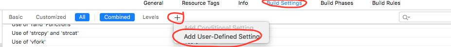

# Presence of Podfile in the built application package

<table class='noborder'>
    <colgroup>
      <col/>
      <col/>
    </colgroup>
    <tbody>
      <tr>
        <td rowspan="2"></td>
        <td>Severity:<strong> INFO</strong></td>
      </tr>
      <tr>
        <td>Detection method:<strong> DAST, SENSITIVE INFO, FILES</strong></td>
      </tr>
    </tbody>
</table>
## Description

The application package contains a file describing the libraries used for the build. The presence of such a file can help in identifying vulnerabilities in the libraries used. It may also disclose information about internal repositories (if internal components are used).

## Recommendations

If files are not needed for operation of the application and are needed only during the build process, it is recommended to exclude them from the final build.

1. If there is no user-defined settings file for the build, you need to create one.
   
    <figure markdown>
    
    </figure>

2. Add the **EXCLUDED\_SOURCE\_FILE\_NAMES** setting key if it is missing.
   
    <figure markdown>
    
    </figure>

3. Add to the setting key value those files and folders that you want to exclude from the final application build.
   
    <figure markdown>
    
    </figure>
