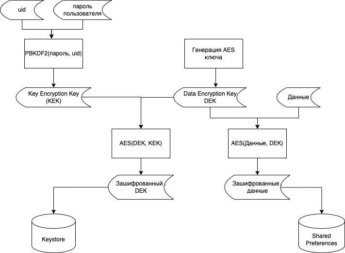

# Storing sensitive information in a private file

<table class='noborder'>
    <colgroup>
      <col/>
      <col/>
    </colgroup>
    <tbody>
      <tr>
        <td rowspan="2"></td>
        <td>Severity:<strong> INFO</strong></td>
      </tr>
      <tr>
        <td>Detection method:<strong> DAST, ФАЙЛЫ ПРИЛОЖЕНИЯ</strong></td>
      </tr>
    </tbody>
</table>
## Description

An application stores sensitive information in a private file inside the application's directory.

To understand exactly what needs to be protected, you have to analyze what kind of data is being handled and stored by the application and what part of that data is confidential. In such a situation, it is common to rely on legislation and common sense. There is no point in encrypting absolutely all the information the application stores. This can affect speed and stability of the application. Instead, you should clearly define what exactly is sensitive data for your application or company, and focus your attention on that data.

It is generally assumed that as few confidential information as possible should be stored in a local storage (both internal and external). However, in most cases storing such information cannot be avoided. For example, in terms of usability, you should not force user to enter a complex password every time the application is launched. Most applications have to cache some authentication token locally. Personally identifiable information (PII) and other types of confidential data could also be retained if a specific scenario calls for it.

Application can store data in different formats, in databases, cached network queries and many more.

A value from an application's internal directory can be obtained through local or cloud backups, or by exploiting various vulnerabilities.

!!! note "Note!" Very often it is mistakenly thought that the data stored in the internal directory of an application is already protected by the sandbox mechanism and an attacker cannot get to it. There are many ways, ranging from a simple local or cloud-based application backup to physical access to the device and exploitation of various vulnerabilities. **Plain text information put into the application's directory is not protected!**

## Recommendations

Any sensitive information that is stored on the device must be encrypted. This can be done in many ways. One such way is encryption based on the keys generated in Security Enclave. Apple has put a lot of effort into making the encryption process easier and more convenient.

### The process of creating keys in Security Enclave:

1. The steps for creating a private key in Secure Enclave (and the corresponding public key) are almost the same as creating a key in a regular situation:
   
        let access =
                SecAccessControlCreateWithFlags(kCFAllocatorDefault,
                                                kSecAttrAccessibleWhenUnlockedThisDeviceOnly,
                                                .privateKeyUsage,
                                                nil)!   // Ignore error

2. Create a dictionary using the access control object:
   
        let attributes: [String: Any] = [
            kSecAttrKeyType as String:            type,
            kSecAttrKeySizeInBits as String:      256,
            kSecAttrTokenID as String:            kSecAttrTokenIDSecureEnclave,
            kSecPrivateKeyAttrs as String: [
                kSecAttrIsPermanent as String:      true,
                kSecAttrApplicationTag as String:   <# a tag #>,
                kSecAttrAccessControl as String:    access
            ]
        ]

3. Now that we have the dictionary, let's create a key pair in the same way as outside of Security Enclave - by calling SecKeyCreateRandomKey():
   
        var error: Unmanaged<CFError>?
            guard let privateKey = SecKeyCreateRandomKey(attributes as CFDictionary, &error) else {
                throw error!.takeRetainedValue() as Error
            }

4. Now you can use the created keys to encrypt or sign data. But only elliptic algorithms can be applied, since Security Enclave only supports elliptic keys:
   
        var error: Unmanaged<CFError>?
            guard let cipherText = SecKeyCreateEncryptedData(publicKey,
                                                            algorithm,
                                                            plainText as CFData,
                                                            &error) as Data? else {
                                                                throw error!.takeRetainedValue() as Error
            }

This order of creation and use is described in the official documentation. You can also use wrappers to simplify all procedures, for example, the [EllipticCurveKeyPair](https://github.com/agens-no/EllipticCurveKeyPair) library.

In addition, you can use algorithms that do not require the key storage at all, but create it "on the fly" from some user data (for example, from a password or pin code). Such algorithms are called the key expansion procedure. They allow you to get a long key for encryption from a small amount of information. For example, this mechanism can be used in the KEK\&DEK (Key Encryption Key \& Data Encryption Key) approach. This approach is easiest to show in a block diagram:

<figure markdown>

<figcaption>Примерная схема с использованием двух ключей</figcaption>
</figure>
In this approach, we first create a key for data encryption (Data Encryption Key), then encrypt the data on it and then encrypt this key with a new key (Key Encryption Key). This KEK can either be saved in the Keystore/Security Enclave or it can be generated each time (for example, based on the user's password). With this mechanism, we get rid of re-encryption of data in case the key is changed/compromised. We only need to re-encrypt DEK and not touch the data (of course, this is not the case if we have compromised DEK, but this is unlikely). In this case, no matter how much data needs to be kept secret, the encryption time will always be the same, since we do not touch the encrypted data itself. By the way, this approach is used in iPhone to encrypt data in the file system. Of course, it is much more complicated there, but the principle is exactly the same.

## Links

1. [https://developer.apple.com/documentation/security/keychain\_services](https://developer.apple.com/documentation/security/keychain_services)
2. [https://developer.apple.com/documentation/security/certificate\_key\_and\_trust\_services/keys/storing\_keys\_in\_the\_secure\_enclave](https://developer.apple.com/documentation/security/certificate_key_and_trust_services/keys/storing_keys_in_the_secure_enclave)
3. [https://developer.apple.com/documentation/security/certificate\_key\_and\_trust\_services/keys/using\_keys\_for\_encryption](https://developer.apple.com/documentation/security/certificate_key_and_trust_services/keys/using_keys_for_encryption)
4. [https://github.com/agens-no/EllipticCurveKeyPair](https://github.com/agens-no/EllipticCurveKeyPair)