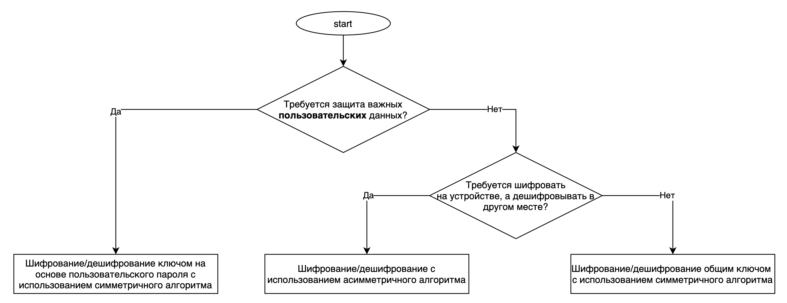

# Storing sensitive information in the application source code

<table class='noborder'>
    <colgroup>
      <col/>
      <col/>
    </colgroup>
    <tbody>
      <tr>
        <td rowspan="2"></td>
        <td>Severity:<strong> CRITICAL</strong></td>
      </tr>
      <tr>
        <td>Detection method:<strong> DAST, FILES</strong></td>
      </tr>
    </tbody>
</table>
## Description

The application stores sensitive information in its source code. It is often wrongly assumed that the data that is embedded in the source code of applications is protected and inaccessible after compilation and obfuscation. However, in a decompiled application, all string resources remain unchanged. Any sensitive information located in the source code of the application will be available to malefactors. It is not recommended to store in the source code any information that could help an attacker. This applies to any tokens, passwords, encryption keys, and data used for testing - test bench addresses, test credentials, etc. Such information reveals the inside structure of test benches and can be used in the future.

## Recommendations

Although it is a time-consuming task in iOS to restore the source code from an application package, static data (strings, constants, numbers) are stored in open form and can easily be read from an executable file.

If you need to store confidential information, the source code is not the best place to do it. It is recommended to get such information from the server and store it encrypted on the device, if necessary. iOS is equipped with many cryptographic features and methods to ensure data privacy. With these, iOS applications can securely perform encryption and decryption (to ensure privacy) as well as message authentication (MAC) and digital signatures (to verify integrity).

To choose an encryption method and key type suitable for the given conditions, you can use the following scheme:

<figure markdown>

</figure>
## Links

1. [Data Storage on iOS](https://mobile-security.gitbook.io/mobile-security-testing-guide/ios-testing-guide/0x06d-testing-data-storage)
2. [CWE - CWE-200:](https://cwe.mitre.org/data/definitions/200.html)[Exposure of Sensitive Information to an Unauthorized Actor (4.5)](https://cwe.mitre.org/data/definitions/200.html)
3. [CWE - CWE-311:](https://cwe.mitre.org/data/definitions/311.html)[Missing Encryption of Sensitive Data (4.5)](https://cwe.mitre.org/data/definitions/311.html)
4. [CWE - CWE-312:](https://cwe.mitre.org/data/definitions/312)[Cleartext Storage of Sensitive Information (4.5)](https://cwe.mitre.org/data/definitions/312)
5. [Xcode secure information](https://faun.pub/secure-coding-how-to-protect-your-secure-information-in-xcode-project-60c75258f576)