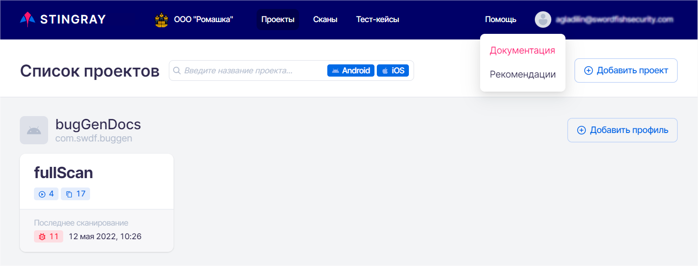

# Documentation and Recommendations

The system contains built-in documentation and recommendations on how to fix vulnerabilities. These are available without Internet if the system is installed on-premises.

Hover over the **Help** main menu item in the upper right corner and select required section from the drop-down menu.

<figure markdown></figure>
