# Profiles

Clicking on the profile name on the **Projects** page or on the **Profiles** tab of the project information page opens the profile page with detailed information about it.

<figure markdown>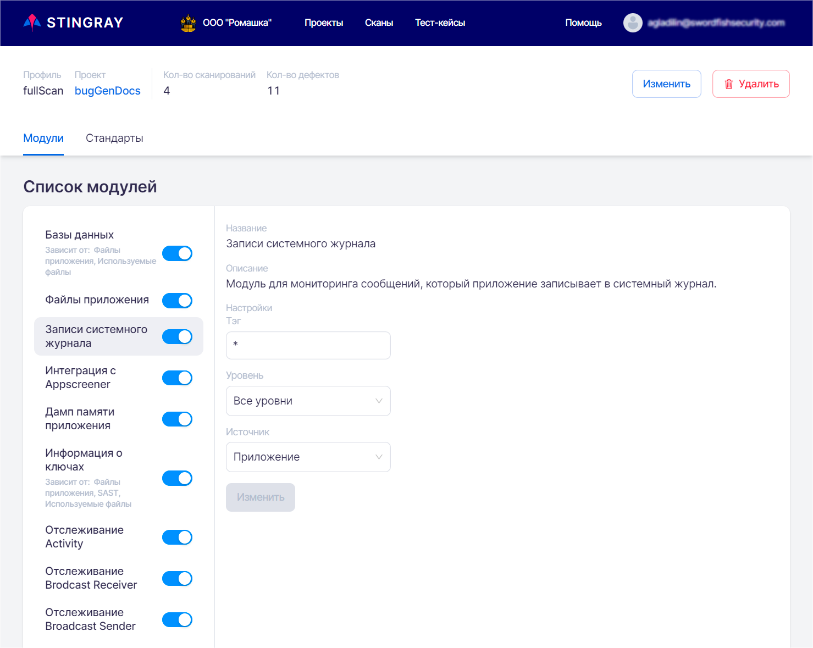</figure>
On the profile page you can get information about settings of scanning modules in this profile, enable, disable or configure them. You can also view and enable or disable security standards that the application analyzed by this profile is checked to comply with. At the top of the page you can find general information about the profile:

* Profile name.
* **Project** that the profile belongs to.
* **Number of scans** performed with the profile.
* **Number of defects** found during the lifetime of the profile.

There are two tabs on this page: **Modules** and **Standards**. Their detailed description is given below in this section.

## Adding / Editing / Deleting a Profile

Scan profiles are related to projects. The **Projects** page shows all existing projects in the system and their scan profiles. Each profile is presented as a card with brief information about it. For each project, a list of its profiles is displayed. On this page you can add a new scan profile for an existing project or view information about existing profiles.

<figure markdown>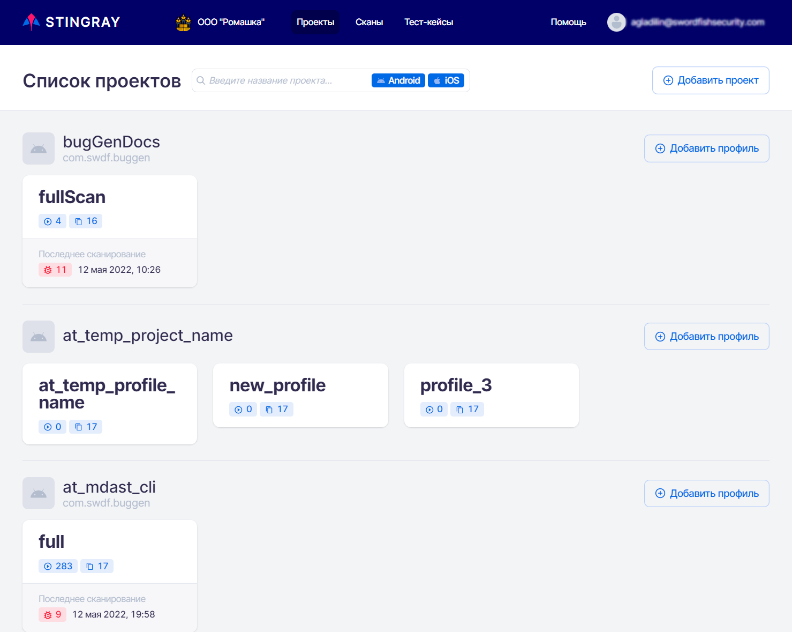</figure>To add a new profile to the project, click the **Add profile** button on the right side of the project field. In the **Add profile** window that appears, enter the name of the profile and a short description, and then click the **Add** button in the lower right corner. The newly created profile will appear in the list of project profiles.
<figure markdown>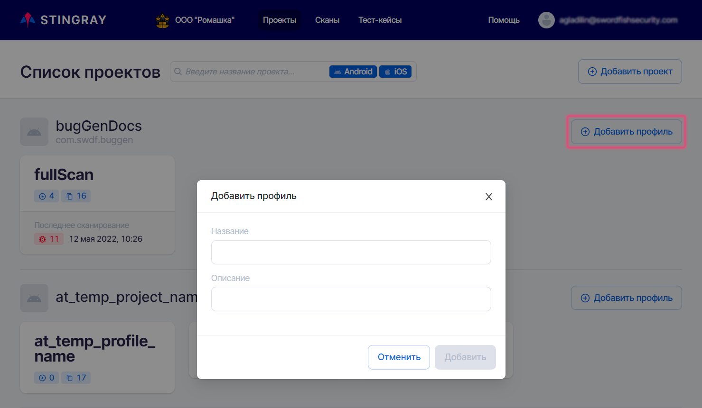</figure>To edit or delete a profile, click its name on the Projects page.
<figure markdown>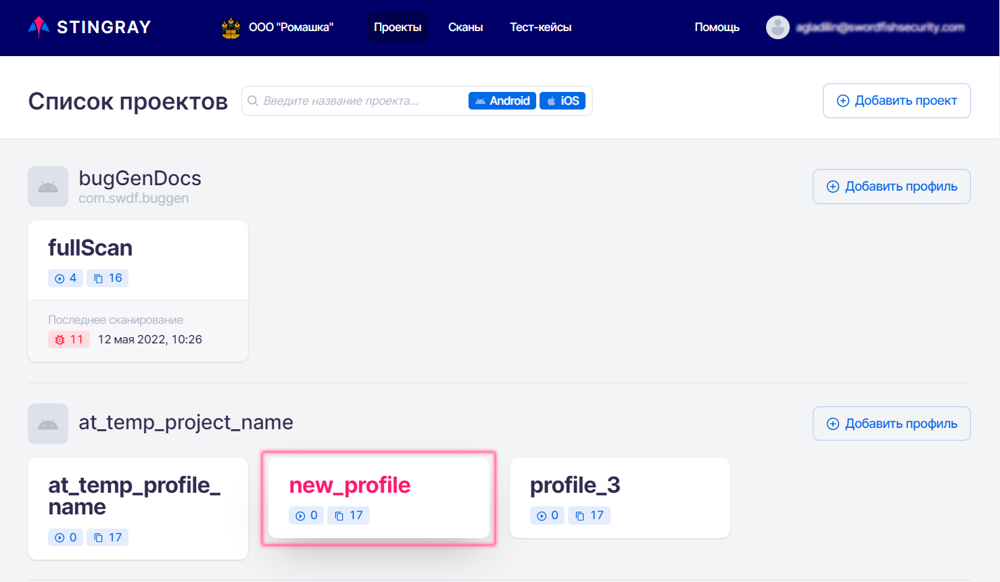</figure>A page with detailed information about the profile will appear.
<figure markdown>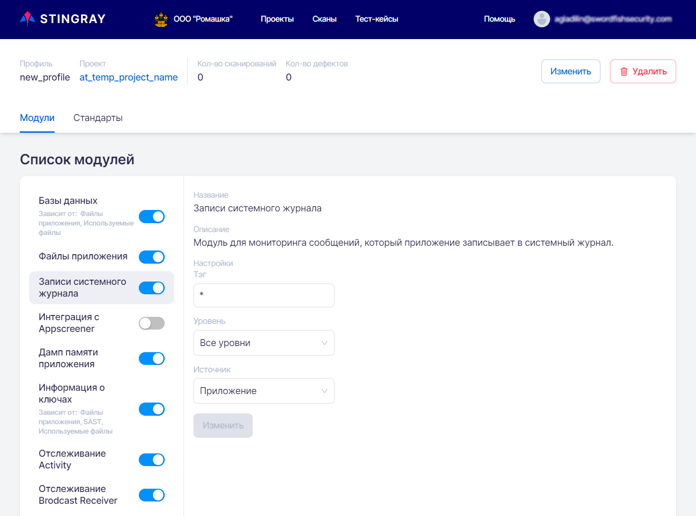</figure>
To edit the profile settings, click the **Change** button at the top right. In the window that appears, you can change profile name and description:

<figure markdown>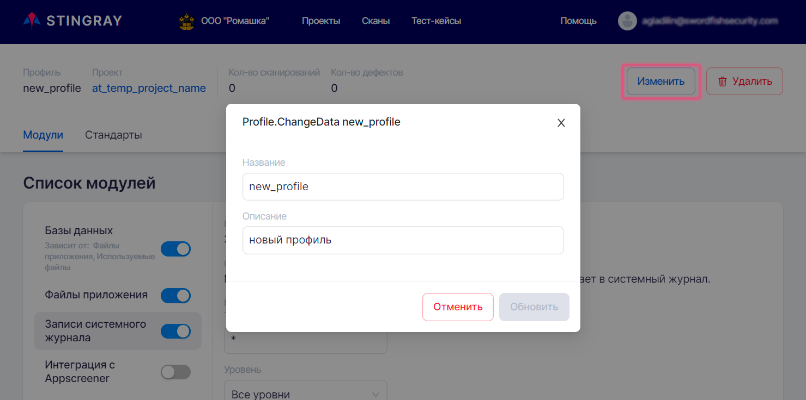</figure>
To delete a profile, click the **Delete** button at the top right and confirm the action by clicking the **Delete** button in the dialog box that appears.

<figure markdown>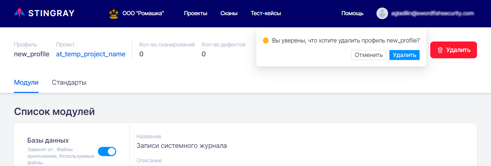</figure>You can add, delete and edit a profile in two ways. Let&apos;s consider the second way.
The **Projects** page displays the project names and the list of profiles for each project. Clicking on the project name opens the **Project** page with the **Profiles**, **Rules**, and **Access** tabs.

<figure markdown>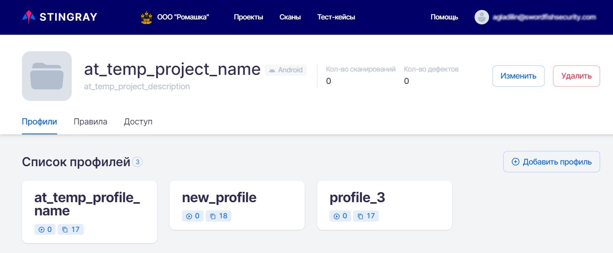</figure>On the **Profiles** tab, you can add a new profile by clicking the **Add profile** button. In the **Add profile** window that appears, enter the name of the profile and a short description and click the **Add** button in the lower right corner of the window. The newly created profile will appear in the list of project profiles.
Click the profile card in the profile list to change profile information or delete a profile. This profile page opens. Editing and deleting a profile on the profile page is described earlier in this section.

## Modules

This tab contains settings for modules that collect information about the application for further analysis. This tab allows you to enable or disable a specific module and make the necessary settings.

<figure markdown>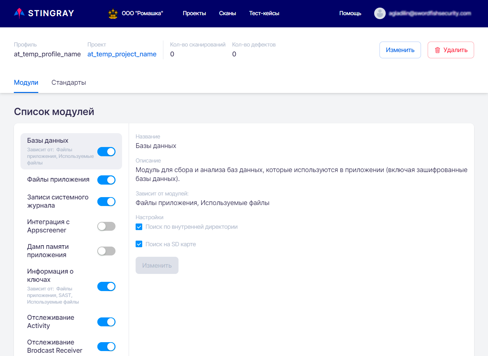</figure>The system includes twenty scanning modules. A list of all modules is presented on the **Modules** tab on the profile page. In this list, you can select and configure the modules to be enabled when scanning an application with this profile. Further analysis and search for application vulnerabilities will be performed based on the data collected during the scan.
To work effectively with the application it is possible to enable or disable each module and make the necessary settings.

You can enable or disable the module using the selector to the right of its name. All enabled modules have selector in the enabled position , all disabled modules have selector in the disabled position . To change the module status from "enabled" to "disabled" and vice versa, just click the module selector.

There are a number of specific settings for each module. When you select a module from the list of modules on the left side of the tab, its settings are displayed on the right side of the tab. You can change and save them by clicking the **Change** button at the bottom of the tab.

<figure markdown>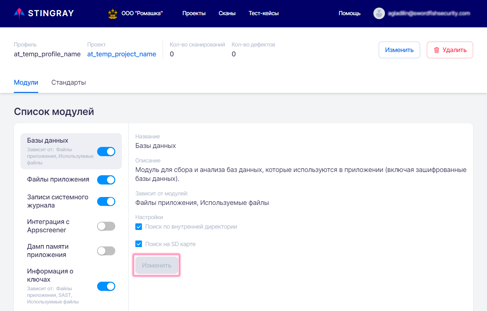</figure>The settings for each module include:
* **Name** of the module.
* **Description** of the module.
* List of modules that affect the operation of this module.
* Module **Settings** that can be configured (if applicable to this module - some modules do not have configurable settings).

Some modules depend on the results of other modules. This is indicated in the list of modules on the left side by the additional information at the bottom of the module name, see figure below. If all "parent" modules are disabled, the module that depends on them will also be automatically disabled.

<figure markdown>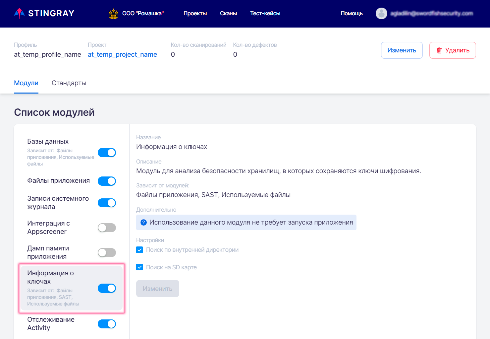</figure>## Standards
This tab is for managing the information security standards used by the profile to check the application.

The **Standards** tab of the company page lists information security standards and their requirements. An application can be checked for compliance with these information security requirements. A list of all standards and requirements is also presented on the **Standards** tab on the profile page. In this list you can select the standards against which the results of testing an application with this profile will be checked. The list of requirements included in the standard is presented on the right.

The system allows to enable or disable information security standard compliance check.

The selector is in the on position  for all standards enabled for checking and in the off position  for all standards disabled. To change the standard status from "enabled" to "disabled" and vice versa, just click the standard selector.

<figure markdown>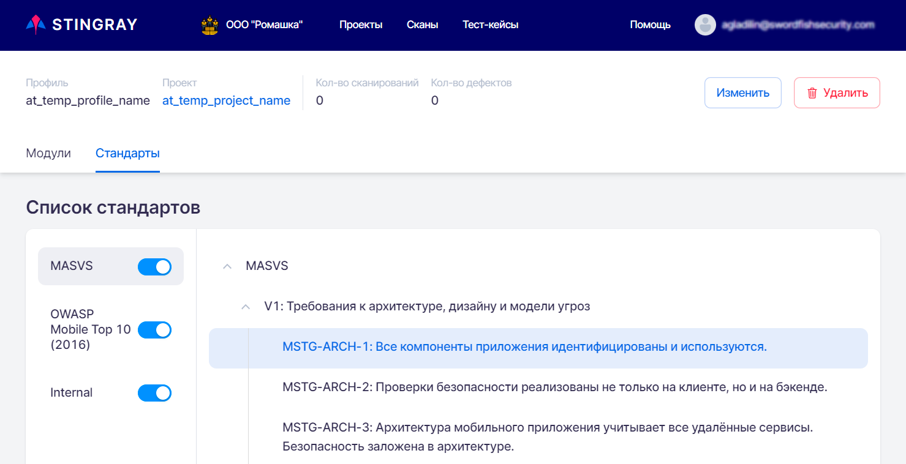</figure>
