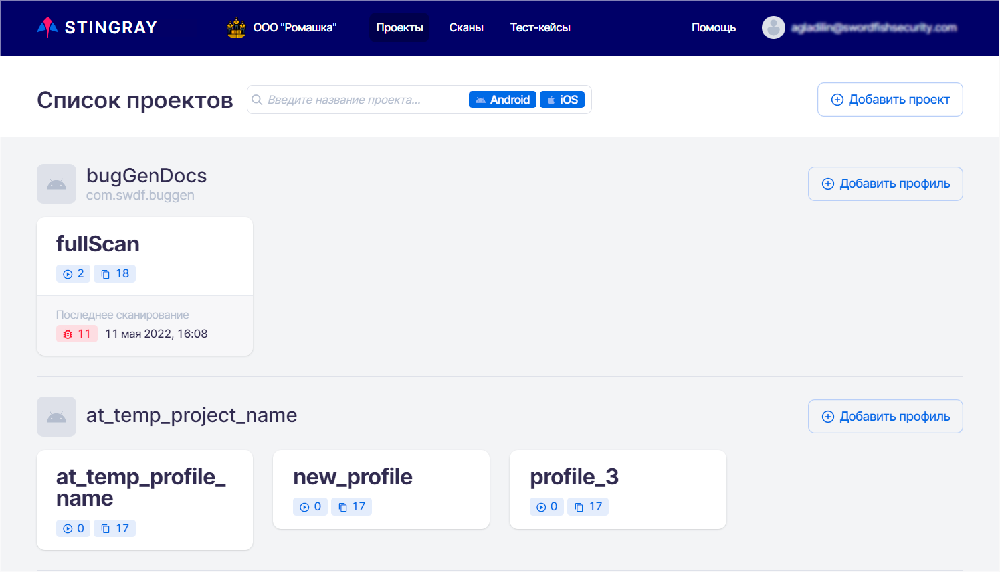
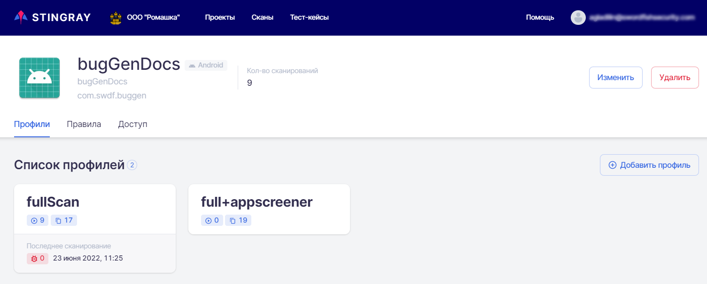
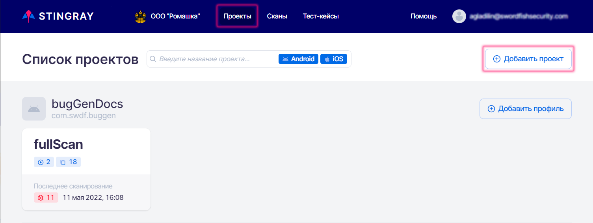
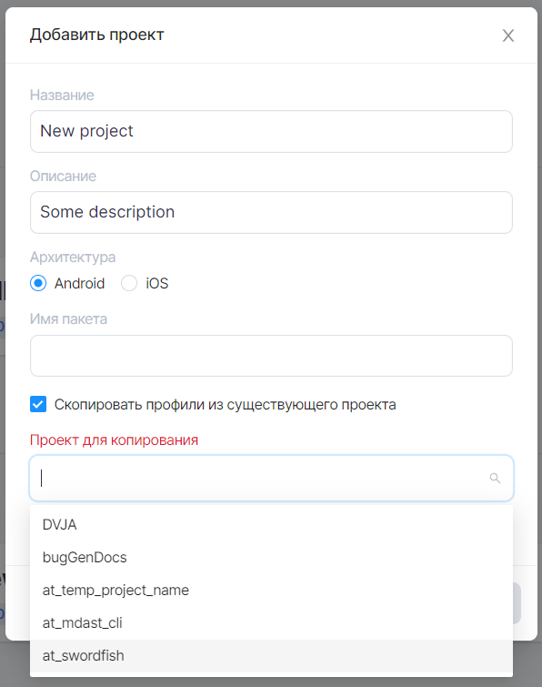
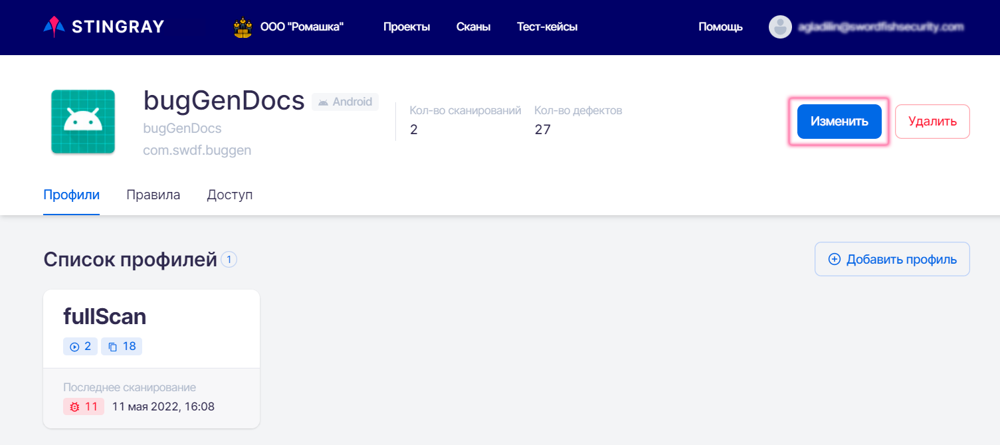
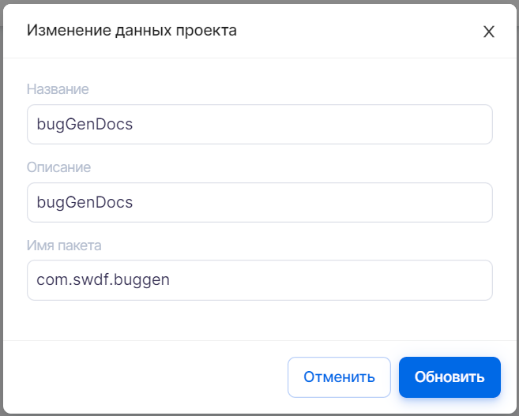
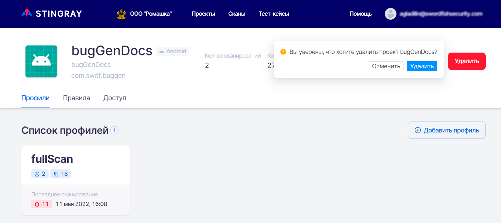
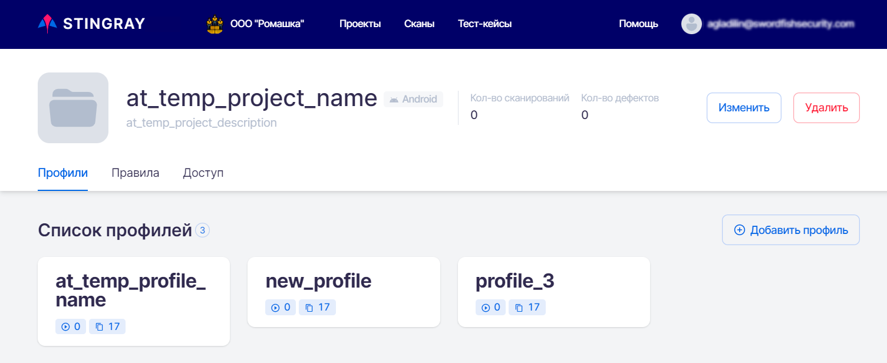
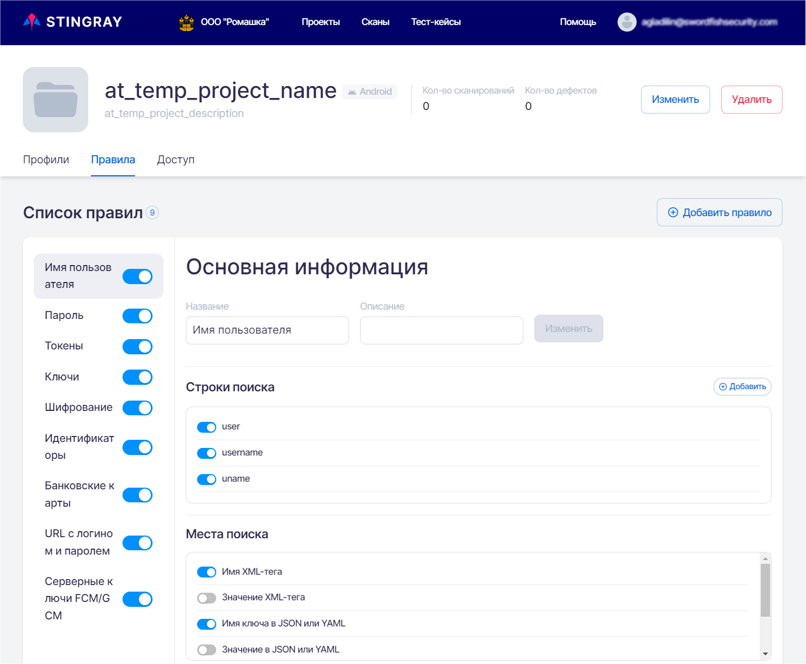
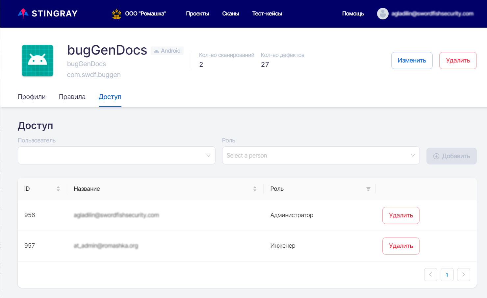

# Projects

## Project List

The **Projects** page lists all existing projects in this company and their scan profiles.

<figure markdown></figure>
For each project, its name, package name and application architecture are shown. On this page you can find brief information about existing project profiles, number of defects found over the lifetime of the project, number of scans performed, date of the last scan, and number of modules enabled.

You can also add a new project or add a new scan profile for an existing project.

Clicking on the project name opens the project page with general information and three tabs: **Profiles**, **Rules**, and **Access**.

## Project Information

The top of the project page provides general project information, including:

* Project avatar.
* Project name.
* Project description.
* Package name.
* Number of scans performed in the project.
* Project architecture type (Android or iOS).

<figure markdown></figure>## Adding / Editing / Deleting a Project
To work with projects, select **Projects** from the main menu at the top.

<figure markdown></figure>To add a new project, click the **Add project** button at the top right of the **Projects** page.
In the ****Add project**** window that appears, enter the project name, a short description, and the project architecture (Android/iOS). You can also specify the name of the application package to be scanned in the corresponding field. If you leave this field empty, it will be filled in automatically after the first scan. If you select Copy profiles from an existing project you can select a project already existing in the company in the field Copy from project. This allows you to create a new project together with the profiles already existing and configured in the project selected for copying and avoid adding and configuring them again in the new project.

Click the **Add** button in the lower right corner. The newly created project appears on the **Projects** page.

<figure markdown></figure>To edit a project, click the project name on the **Projects** page.
On the project page that opens, click the **Change** button:

<figure markdown></figure>The following parameters can be edited in the **Change project data** window that appears:
* In the **Name** field, edit the project name.
* Change the project description in the corresponding field.
* Change the package name in the corresponding field.

<figure markdown></figure>
After editing the project information, click the **Update** button in the lower right corner of the window.

Change the project avatar by clicking on the current avatar and selecting an image file for new avatar.

You can also delete a project on its page. To do this, click the **Delete** button on the right side and confirm this action in the dialog box that appears.

<figure markdown></figure>
## List of Project Profiles

The **Profiles** tab allows you to manage the scan profiles that are included in this project. You can view existing profiles and add a new profile. For more information on working with profiles, see the "[Scan Profiles](./profile.md)" section.

<figure markdown></figure>## Rules
The **Rules** tab allows you to manage vulnerability analysis rules that apply to this project. Please refer to the "[Rules](./pravila.md)" section for more information.

<figure markdown></figure>## Project Access Rights
The **Access** tab is used to assign project permissions to both users and user groups. Refer to the "[Users, groups, and projects](../ag/polzovateli.md)" section for more information about the application role model.

<figure markdown></figure>
