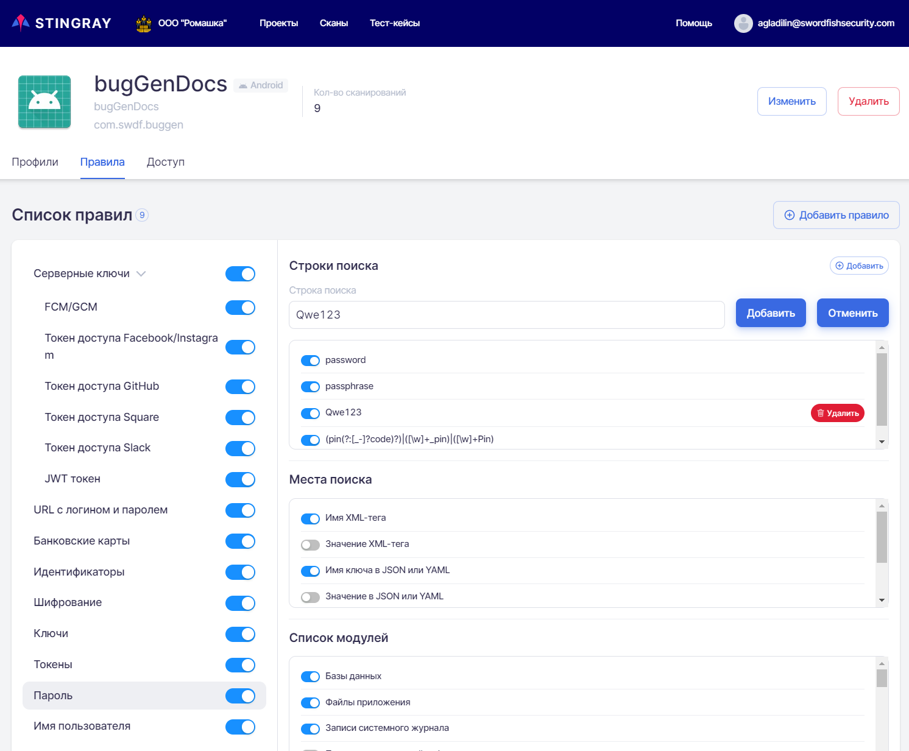

# Rules

This tab shows the vulnerability analysis rules that apply to this particular project. In general, the rules correspond to those defined at the company level (see the "[Company-level Analysis Rules](../ag/pravila_analiza_na_urovne_organizacii.md)" section). However, it is possible to change or add rules at the project level, depending on specifics of an application being scanned. Rules added at the project level will only apply within that project.

<figure markdown></figure>

## Redefinition of Analysis Rules

The **Rules** tab on the project page provides rules for analyzing collected data to find vulnerabilities. Use this tab to add, change, disable or delete an existing analysis rule at the project level. This means that the new or changed analysis rule will be applied only to this project, but not to all projects of this company.

## How Analysis Rules Work

The main goal of using analysis rules is to tune the system to the characteristics of the tested application in order to effectively find vulnerabilities. Each application and its data is unique in format and content. Use of customized analysis rules maximizes the system's coverage of all possible application-specific vulnerability cases.

Analysis rules available to user for modification are used to search for a part of the vulnerabilities. Analysis rules for finding certain vulnerabilities are a set of strings or regular expressions to be searched in the data collected during an application scan. Each rule specifies which string or regular expression to search for, in which modules' data, and where exactly the search should take place. This approach significantly reduces the number of false positives when searching for vulnerabilities.

The system contains two types of analysis rules:

* Internal analysis rules. They are not configurable and cannot be viewed or edited by the user. They are not presented on the **Rules** tab.
* Analysis rules intended to search for sensitive information. They are presented on the Rules tab and described in this section. These rules can be modified by the user.

On the **Rules** tab, each analysis rule is represented as a separate line on the left side of the **List of rules**. The rule string has the following fields:

* Name of the rule.
* Selector of the rule status. If the selector is switched on , the rule is active and will be applied when analyzing collected data to find vulnerabilities. If the selector is switched off , the rule is inactive and will not be applied when analyzing collected data to find vulnerabilities.

<figure markdown></figure>

The selected rule is highlighted and the **main information** about it is displayed on the right:

* **List of injections** — A set of strings and regular expressions to search for confidential information.
* **List of expressions** — Where exactly to look for the necessary information, in what files and data formats.
* **List of modules** — Modules where this rule will be applied.

Mobix supports nesting rules, as in the case of the **Server keys**.

Let's consider how the analysis rules work on the example of one of the rules.

<figure markdown></figure>

This analysis rule is currently active and is called &quot;Password&quot;. It defines that the following patterns:

* Regular expressions of the form `(pin(?:[_-]?code)?)|([\w]+_pin)|([\w]+Pin)`.
* The password string.
* The passphrase string.

will be searched in the data collected by all modules selected in the **List of modules** field in the following locations (these values were selected in the **List of expressions** field):

* XML tag name.
* Key name in JSON or YAML.

If necessary, user can disable or edit this rule.

## Editing Analysis Rules

You can edit the analysis rules on the **Rules** tab. To edit, select the required rule on the left side of the **List of rules**. You can change and save the following parameters in the **General Information** field on the right:

* **Name** — the rule's name. To save the changes you made, click the **Change** button on the right.

* **Description** of the analysis rule To save the changes you made, click the **Change** button on the right.

* You can add a string or regular expression to the **List of injections** field to search for confidential information. To do this, click the **Add** button on the right in the **List of injections** field, in the Injection field that appears, specify the new string or regular expression and click **Add**.
  
<figure markdown></figure>

All previously defined regular expressions for this rule are listed in this field below. Company-level search strings can be disabled using the selector next to each string. Search strings set at project level can be disabled or deleted. To delete the search string, click the **Delete** button on the right.
  
<figure markdown></figure>

* **List of expressions** — for active search locations selector is in position , for inactive — in position . To change, press the selector. Its position will change and a notification of a successful change will be displayed.

* **List of modules** for which this rule will be applied. Any module can be selected and added to the rule. Enabling and disabling of any module can be done similarly to the **List of expressions** field.

## Adding Analysis Rules

To add a new analysis rule, click the **Add rule** button at the top right. In the **Add rule** window that appears, enter a name and description of the rule and click the **Add** button at the bottom right.

<figure markdown></figure>

The added rule will be displayed in the list and can be edited further. For a newly added rule, the **List of injections** field is empty, and in the **List of expressions** and **List of modules** fields all selectors are switched off .

## Deleting Analysis Rule

You can delete the analysis rules on the **Rules** tab. To delete a rule, click the **Delete** button in the upper-right corner of the **General Information** field.

<figure markdown></figure>

In the dialog box that appears, you need to confirm or cancel the deletion.

<figure markdown></figure>

!!! note "Note"
    The system has nine preset rules, defined at the company level. At the project level, they can only be disabled, but cannot be deleted. User can only delete other rules.