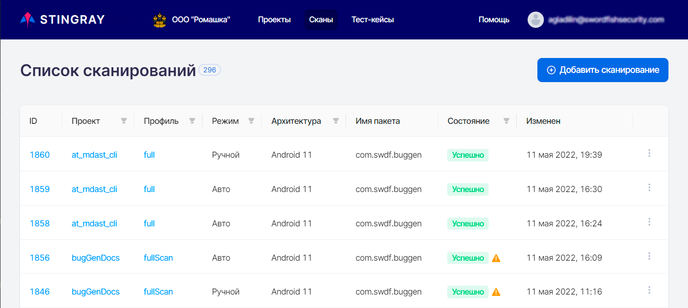
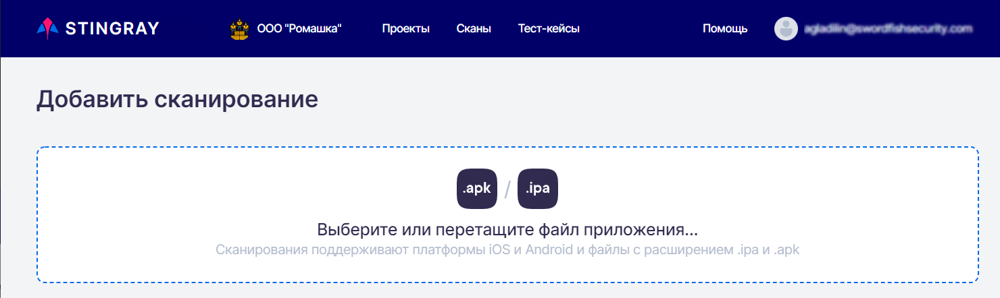
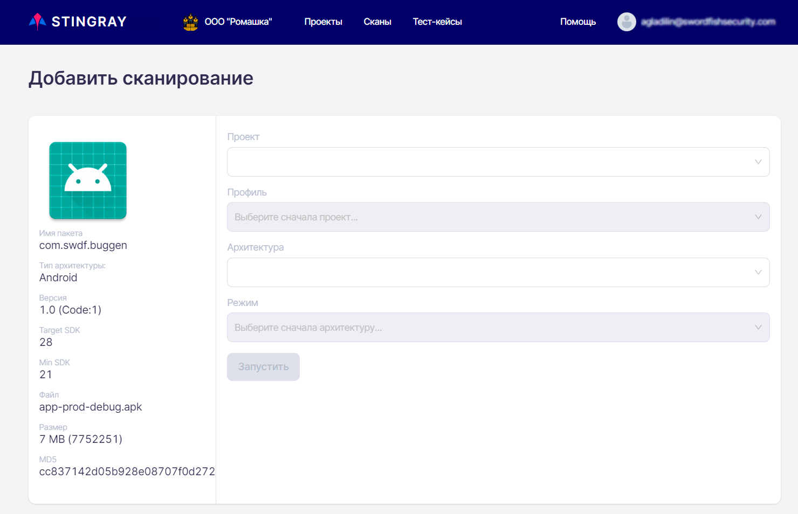
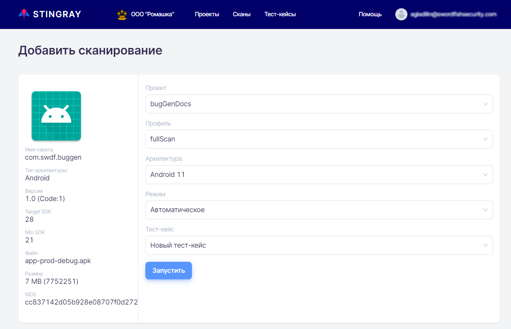
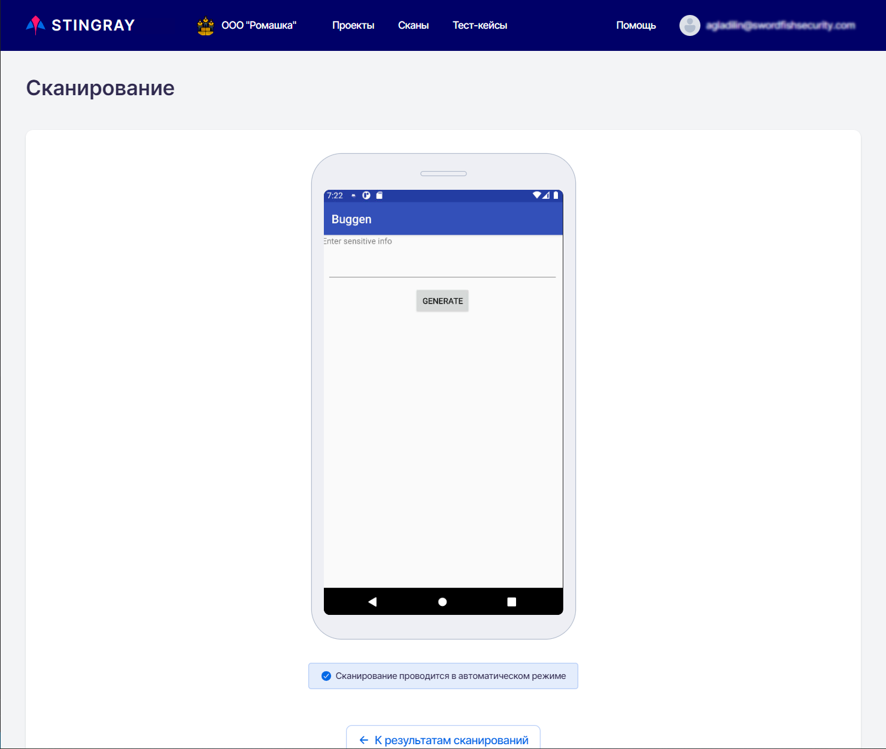
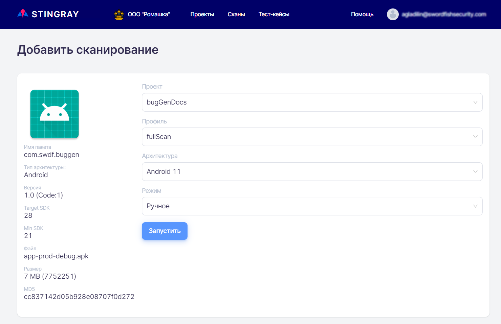
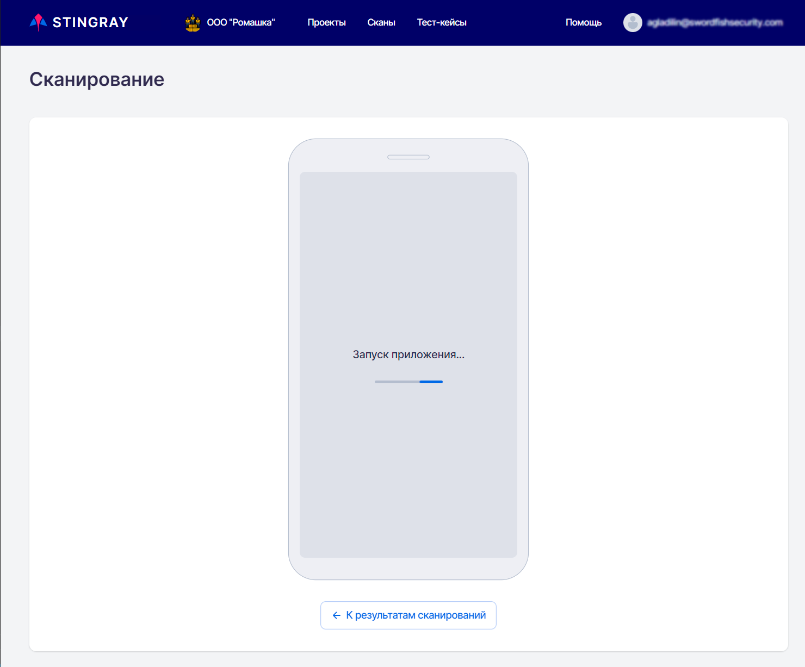
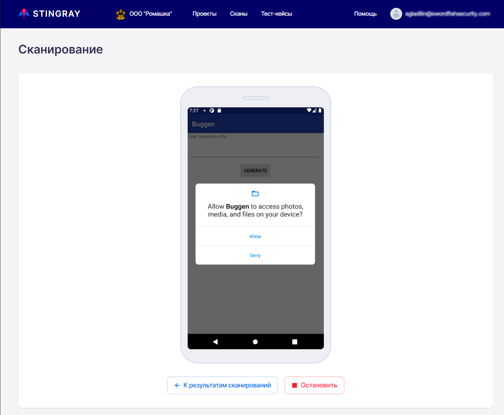
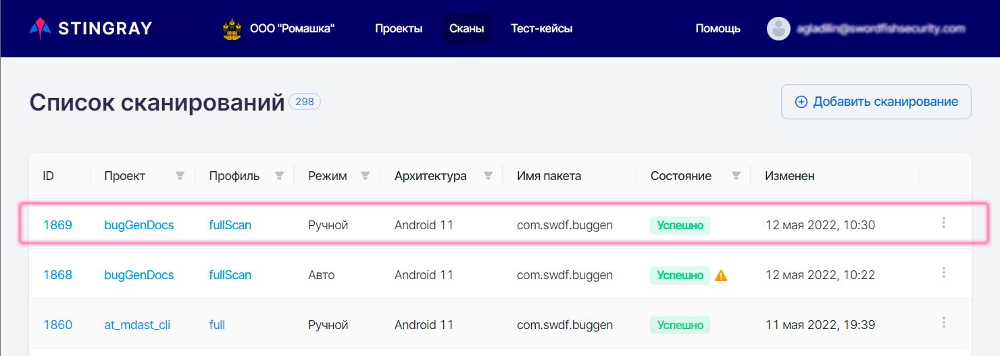

# Scan Launch

The scan launch can be performed in manual or automatic mode. To start a scan, select the **Scans** main menu item and click the **Add scan** button in the upper right corner.

<figure markdown></figure>

Select or drag and drop an APK or IPA file of the app you want to scan to the **Add scan** page that appears:

<figure markdown></figure>

!!! note "Note"
    If a package with the chosen name and hash sum is already uploaded, in order to save resources it is not downloaded again, but the file already present on the server is used.

<figure markdown></figure>

After selecting a file on the **Add scan** page, fields required to start scanning the application will appear:

* Information about the file of application under test: **Package name**, **Version name and code**, **Target SDK**, **Min SDK**, **File name/size/hash**, and **Architecture type**.
* **Project** — Name of the project where the scan is performed.
  
    !!! note "Note"
        You can select either projects with an empty **Package name** field (see the [Projects](./projects.md) section), or projects that have the package selected in the previous step in this field. Thus, it is possible that there will be no items available for selection in this field. In this case, you should create a new project with an empty **Package name** field or by specifying in it the corresponding package.

* **Profile** — Scan profile used to scan the application.

* **Scan type** - manual or auto scanning.

* **Test case** — this field appears if you select auto mode. A test case to be executed should be selected from the drop-down list of available test cases.
  
    !!! note "Note"
        Only test cases of the selected project are displayed.

* **Architecture** — The architecture of the device used to launch and scan the application.
  
    !!!note "Note"
        If there are no devices available for scanning, the **Architecture** field displays the message ****There are no running devices for this architecture.

## Auto Scan

To start scanning in automatic mode, perform the following steps:

* Select and download mobile application file with \*.apk or \*.ipa extension for scanning.
  
    !!! note "Note"
        If a package with the chosen name and hash sum is already uploaded, in order to save resources it is not downloaded again, but the file already present on the server is used.

* Select a project from the drop-down list of existing projects.
  
    !!! note "Note"
        You can select either projects with an empty **Package name** field (see the [Projects](./projects.md) section), or projects that have the package selected in the previous step in this field. Thus, it is possible that there will be no items available for selection in this field. In this case, you should create a new project with an empty **Package name** field or by specifying in it the corresponding package.

* Select a scanning profile from the drop-down list.

* Select the architecture to perform the scan. Note that in this field is available for selection only the architecture active in the system, where the test was recorded.

* In the **Scan type** field, select **Auto** from the drop-down list.

* In the newly appeared field below, select the name of a test case that already exists in the system to start scanning in automatic mode.

<figure markdown></figure>

Clicking the **Run** button starts the scan and takes you to the **Scan page**. A page with the device screen without the ability to interact with it will appear. A dynamic view of the device screen is necessary to analyze the operation of the test case. During the scan, the following statuses are displayed on the screen of the device:
* **Searching for a free device…** — the free scanning engine is searched for.
* **Starting application…** — the application is launching.

<figure markdown></figure>

While an auto scan is in progress, a video is also recorded. After the scan is complete, it is available in the **View video record** tab of the **Scan result** page for this test.
Clicking the **To scan results** button will take you to a page with a list of all scans. If you go to the **List of scans** page, you can see a new line showing the current result of the automatic scan with the Started status. If you click on the test case **ID** when the corresponding scan has the state of **Created**, **Starting** or **Started**, you are returned to the page with the device screen. Once the application scan is complete, its state will change to **Analyzing** while the results are being processed. Then the scan state will change to **Success** or **Failed** depending on the result. If you click on the test case **ID** when the scan has the status **Analyzing**, **Success** or **Failed**, you will be taken to a page with detailed scan results, see the "[Scan Results](./rezultaty_skanirovanij.md)" section.

## Manual Scan

To start scanning in manual mode, select the **Scans** main menu item and click the **Add scan** button in the upper right corner. Select or drag and drop an APK or IPA file of the app you want to scan to the **Add scan** page that appears. When you load a file, the system will detect its architecture and filter out all the necessary values in the next fields.

<figure markdown></figure>

!!! note "Note"
    If a package with the chosen name and hash sum is already uploaded, in order to save resources it is not downloaded again, but the file already present on the server is used.

To start scanning in manual mode, perform the following steps:

* Select a project from the drop-down list of existing projects.
  
    !!! note "Note"
        You can select either projects with an empty **Package name** field (see the [Projects](./projects.md) section), or projects that have the package selected in the previous step in this field. Thus, it is possible that there will be no items available for selection in this field. In this case, you should create a new project with an empty **Package name** field or by specifying in it the corresponding package.

* Select a scanning profile from the drop-down list.

* Select the architecture to perform the scan.

* In the **Scan type** field, select **Manual** from the drop-down list.

<figure markdown></figure>

Clicking the **Run** button starts the scan and takes you to the **Scan** page. The page with the device screen and the running application will be displayed. Manual scanning looks like a normal user's work with the application. All user actions are recorded as a sequence of test case steps.

<figure markdown></figure>

<figure markdown></figure>

After all the necessary steps to scan the application are done, click the **Stop** button at the bottom. Once clicked, scanning will stop and the system will go into data analysis mode. Clicking the **To scan results** button will take you to a page with a list of all scans. You can identify results of the manual scan by the data in the **Modified** at column.

Processing the scan results takes some time. So you have to wait until the results are processed before you can view and analyze them in detail. The scan status in the **State** column can have several values:

* **Created** — the scan was created and placed in the scan queue.
* **Starting** — the scan is already being processed and the necessary technical preparations before the launch are underway (installation of the application, launching the application, etc.)
* **Started** — scanning process is in progress and interaction with the application is performed manually or through test cases, depending on the type of scanning.
* **Analyzing** — interaction with the application is over, analysis of the collected data is in progress.
* **Failed** — the scan was completed with an error.
* **Success** — the scan was completed successfully and without errors.
* **Canceled** — the scan is canceled using the drop-down menu on the right.
* **Waiting for Analyzing** — A re-analysis of scan results has been started and has not yet been completed.

<figure markdown></figure>

## Launching a Scan from the Command Line

The application scan can be launched not only from the user interface, but also from the command line. The process of forming a command line and launching a scan is described in detail in the Integrations section.

## Launching a Scan from Distribution Systems

There exist tools for launching application scans from distribution systems that make this process much easier.

Launching a scan from distribution systems is described in detail in the "[Integrations](../ag/integracii.md)" section.