# Scan Results

## List of Scan Results

Select the **Scans** menu item to see a list of all scans performed. Each scan is represented by one line. Scan results are automatically updated every 10 seconds. This frees the user from having to refresh the page manually.

<figure markdown>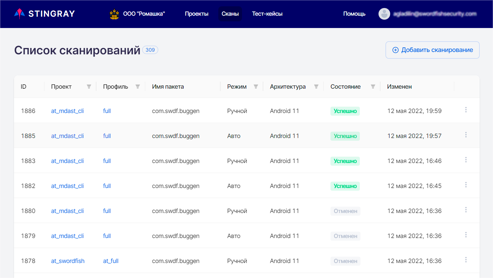</figure>
The list shows scans sorted by the scan **ID**. The list contains the following information:

* **ID** — Internal scan ID. Click on the scan **ID** to go to detailed results of the selected scan.
* **Project** — The name of the project where the scan was performed. This value is a link, by clicking it you can go to the corresponding project.
* **Profile** — Scan profile used for application analysis. This value is a link, by clicking it you can go to the corresponding scan profile.
* **Package name** of the analyzed application.
* **Scan type** — manual test or auto test.
* **Architecture type** where the scan was performed (Android or iOS).
* **Package name** of the analyzed application.
* **State** — Scan status, can have several values:
  * **Success** — The scan was completed successfully and without errors. If the scan as a whole was successful, but there were failures in some modules, the  icon is displayed next to the status. If you hold the mouse cursor over it, more detailed information about the error will be displayed.
  * **Created** — the scan was created and placed in the scan queue.
  * **Starting** — scanning is running, the target application is being installed and launched.
  * **Started** — the scanning process is in progress.
  * **Analyzing** — the scanning is ended, the process of analyzing the collected information is performed.
  * **Canceled** — the scan is canceled using the drop-down menu on the right.
  * **Failed** — The scan was completed with an error. The  icon is displayed next to the status. If you hold the mouse cursor over it, more detailed information about the error will be displayed.
  * **Waiting for Analyzing** - A re-analysis of scan results has been started and has not yet been completed.
* **Modified at** — time of the last scan status change.

To display only the results you want in the columns marked with the  filter icon, you can set a filter. After setting a filter in the column, the icon color changes to blue . When you select multiple filters, they work together. For example, if you select the **Manual scan** type and the **Success** state, all successful manual scans will be found and displayed.

<figure markdown>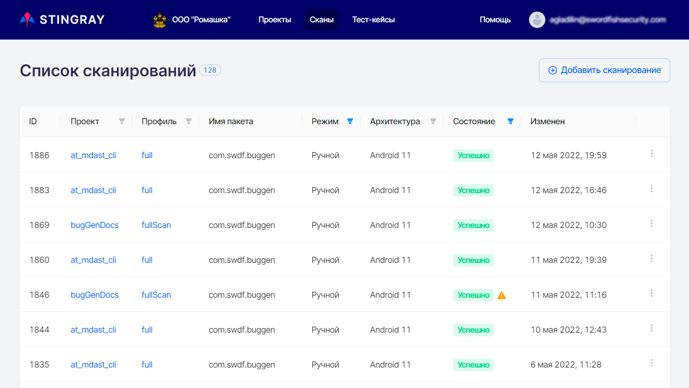</figure>To remove a filter you have set, click the filter icon  and select **Reset** from the drop-down menu:
<figure markdown>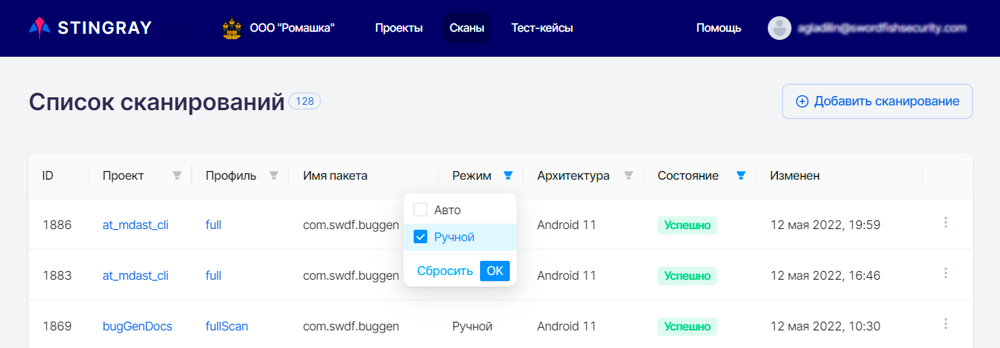</figure>
Besides, when you are on this page, you can:

* Open a page with detailed scan results.
* Download a PDF scan report.
* Initiate re-analysis of the scan results.
* Delete scan results.

Use the corresponding items of the "" drop-down menu on the right side of a scan string to perform these actions:

<figure markdown>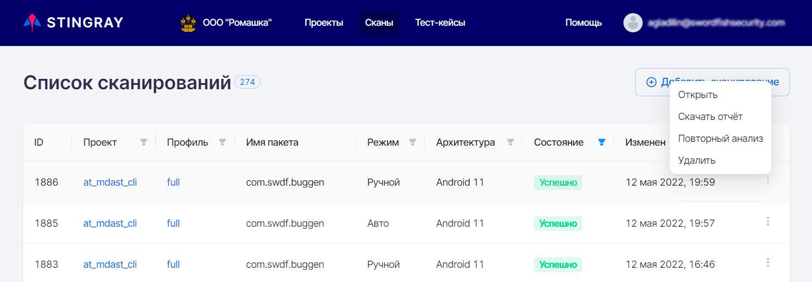</figure>## Scan Result
To go to the detailed scan results page, either click on the required scan string in the **List of scans**, or click on the "" drop-down menu on the right side of the scan string and select **Open**. This page contains all the information about the analysis of the application: general information, vulnerabilities detected, data collected during the application's operation, and compliance with standards and requirements. There are three or four tabs available for selection, depending on the type of scan: **Defects**, **Collected data**, **Standards**, **Record scan**. The last tab is present only for scans performed in auto mode.

### General Information

General information can be found at the top of the detailed scan results page. It contains information about the performed scan and brief information about the scanned application.

<figure markdown>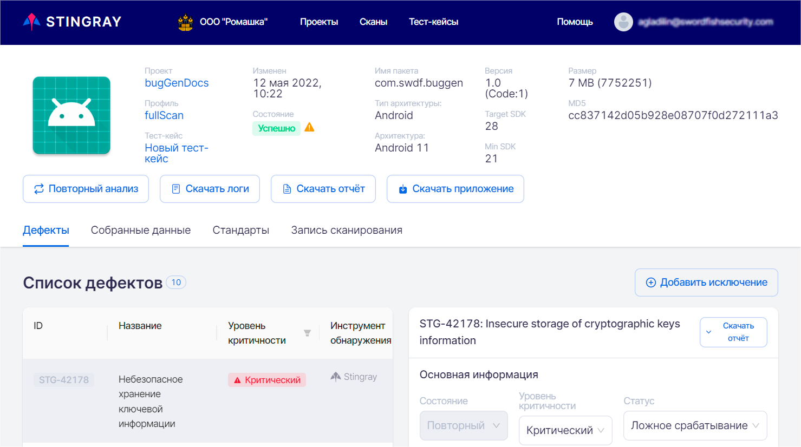</figure>This tab contains general scan information, including the following:
* **Project** where the scan was conducted. This value is a link, by clicking it you can go to the corresponding project.
* **Profile** used for application scan. This value is a link, by clicking it you can go to the corresponding scan profile.
* **Test case** — Name of the test case used. This value is a link, by clicking it you can go to the corresponding test case. This field is present only for scans performed in auto mode.
* **Modified at** — Scan date.
* **State** — Scan status.
* **Package name** — Name of the application package in the system.
* **Architecture type / Architecture** — Architecture of the scanned application (Android or iOS).
* **Version** — Name and version code specified in the application manifest to better identify the analyzed application.
* **Target SDK/Min SDK** — Target and minimum versions of the Android SDK to build the application.
* **File size** of the application file.
* **MD5** — The hash sum of the application file.

The buttons below the general information allow you to perform the following actions:

* **Recalculation** — Re-analyze the scan results using the latest analysis rules for the application.
* **Download logs** — Download the scan log file.
* **Download report** — Get a detailed report on the results of the scan in PDF format.
* **Download app** — Download the file of the application scanned.

### Defects

For each vulnerability detected, the system creates a defect. All defects found during the scan are shown in the **List of defects** in the left half of the **Defects** tab. The right side of this tab provides information about the detected vulnerability with a detailed description of the vulnerability, as well as recommendations on how to fix it.

<figure markdown>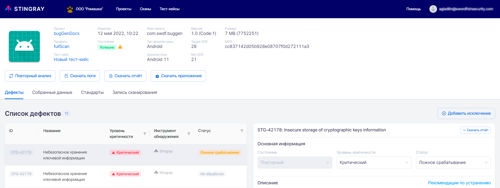</figure>
For convenience of work with defects in the columns marked with the filter icon , it is possible to select and apply a filter to the displayed defects. To do this, click the filter icon  and select one or more values from the drop-down lists to filter by **Severity level** and **Detection tool**. If the **High** severity level and the **Mobix** detection tool are selected, all defects detected by Mobix with a high severity level will be displayed. After setting a filter in the column, the icon color changes to blue . To remove a filter, click on the filter icon  and select **Reset** from the drop-down menu.

The **Defects** tab provides the following information about defects:

* Defect **ID** in the system.
* **Name** of the detected vulnerability.
* **Severity level** of the defect (Critical, High, Medium, Low, Info).
* **Detection tool** - name of the tool that detected this defect (Stingray, Appscreener, Oversecured).
* **Status** of the defect ( Not processed, Confirmed, False positive).

The system automatically fills in the values of the defect fields during the analysis of the results.

Click on a defect in the **List of defects** and you will see detailed information about it on the right side.

<figure markdown>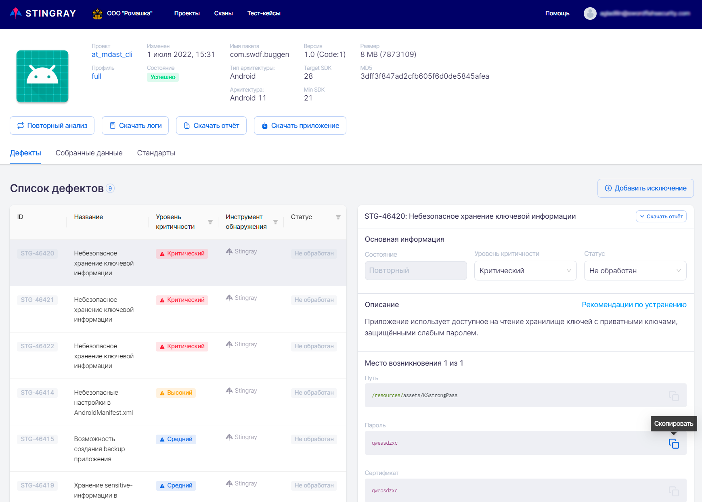</figure>The following information is provided:
1. Defect **ID** in the system.

2. Name of the detected vulnerability. Next to the name is the **Download report** button. Click it to get a vulnerability report in PDF format.

3. **State of the defect**:
   
   1. **New** — If the defect was first found during this scan, or if it had already occurred before, and then the problem was solved and the defect was closed, but reappeared during this scan.
   2. **Recurrent** — If the defect has already been found during previous scans.
   3. **Fixed** — Is the state for those defects that were found in previous scans, but are no longer present in the current scan.

4. **Severity level** of the defect. This field displays the current value of the defect severity. It provides the opportunity to change the severity by selecting a new value from the drop-down list.

5. **Status** of the defect. This field displays the current status of the defect. It is possible to change the status by selecting a new value from the drop-down list.

6. **Description** of the defect briefly describes the vulnerability found.

7. Next to the **Description** there is a link to the **Recommendations** with a detailed description of the vulnerability, recommendations on how to fix it, examples of source code, and links to materials on this vulnerability.
   
   !!! note "Note"
     Special mention should be made of the defects detected by the **Search for previously found sensitive information** module. In the **Description** field of such defects, in addition to the information mentioned above, you can find the **View details** link to the vulnerabilities that caused such a defect.
   
   <figure markdown></figure>

8. **Location** of defect. If several vulnerabilities of the same type are detected, they are grouped into one vulnerability. Arrows  appear to the right of this field. You can use them to navigate between the vulnerabilities. Below is important information about the vulnerability found, such as the sensitive information found, where it was found, etc. For convenient work with the information from these fields, you can use the **Copy** button located on their right side.

9. The **Result** field displays a code fragment or the contents of the file (up to 5000 characters) where the vulnerability was detected. If you want to download the entire file, click the **Download result** button on the right.

If the analysis finds vulnerabilities that we define as false positives, they can be added to both project-level and company-level exceptions (for all projects in the company). To do this, select one or more detected defects, change their **Status** to "False positive" and click the **Add exception** button located in the upper right corner of the **Defects** tab.

<figure markdown>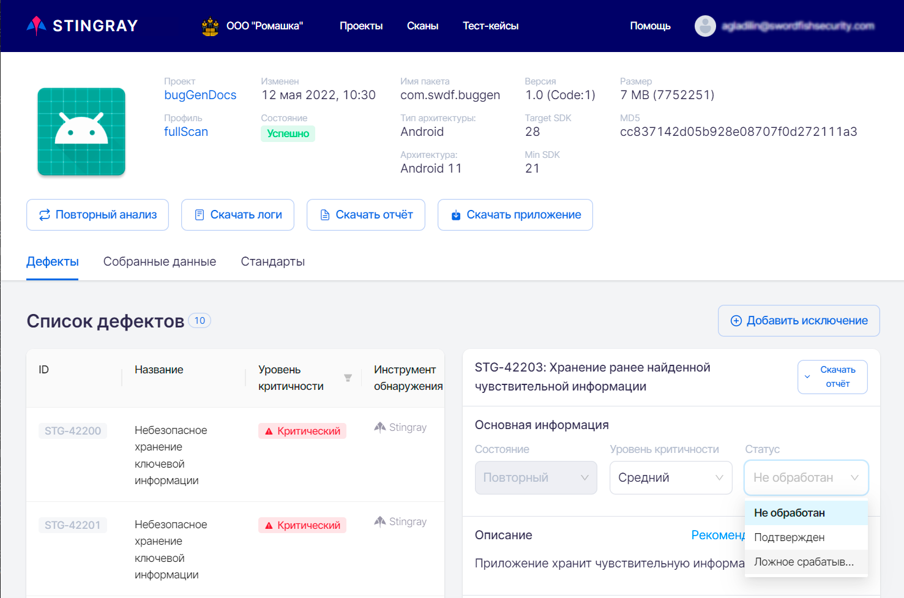</figure>In the **Add exclusions** window that appears, select whether you want to add exceptions at the project or company level, and click the **Add** button.
<figure markdown>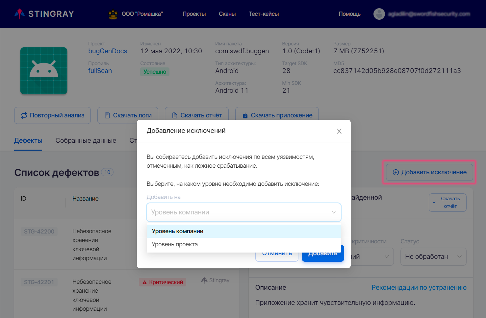</figure>You can also add an exception for a particular vulnerability by clicking the **Add exclusions** button next to the **Found by rule** heading in the vulnerability description.
<figure markdown>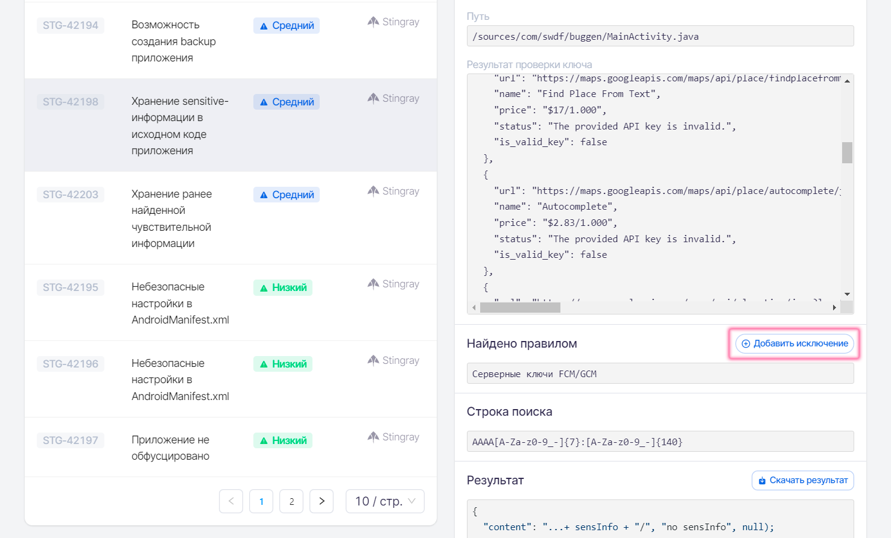</figure>In the **Add exclusions** window that appears, select whether you want to add exceptions at the project or company level, and click the **Add** button.
By adding exceptions, such vulnerabilities will not be considered when re-analyzing the results or the next scan within this project, if the project level is selected, or for all projects of a company, if the company level is selected.

### Collected Data

To work with the data collected during the scan, select the **Collected data** tab on the detailed scan results page.

The **Collected data** tab provides access to all data collected during the application scan. The information is divided into modules that are responsible for collecting various data. For each module it is possible to download the collected data as a zip archive by clicking the **Download module data** button. It is also possible to download all the collected data at once in one archive using the **Download all data** button.

<figure markdown>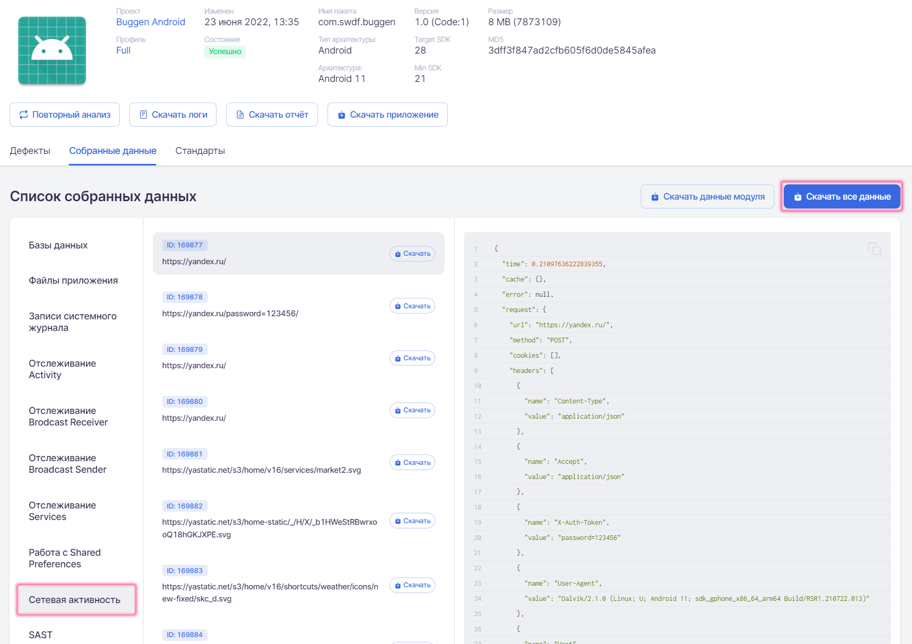</figure>This tab contains the data collected during a scan of the application by all modules included in the profile. A module for viewing the collected data can be selected in the left pane of the **List of collected data** field. Each of the modules collects data specific only to it. Accordingly, the format of data representation on the tab is different for each module.
The figure above shows the data collected by the **Networking module**. In this example, the data transmitted over the network was captured, including address, protocol, time, method, port, and content of the request and response. This kind of additional "raw" information can be useful when working with the results of the analysis.

Another example is shown in the figure below. It illustrates another area of application work, in particular, data collected by the **Monitor Activity** module. The term "activity" here refers to all the various application screens that were run during the scan. For each screen (or "activity") its name and launch parameters are shown.

<figure markdown>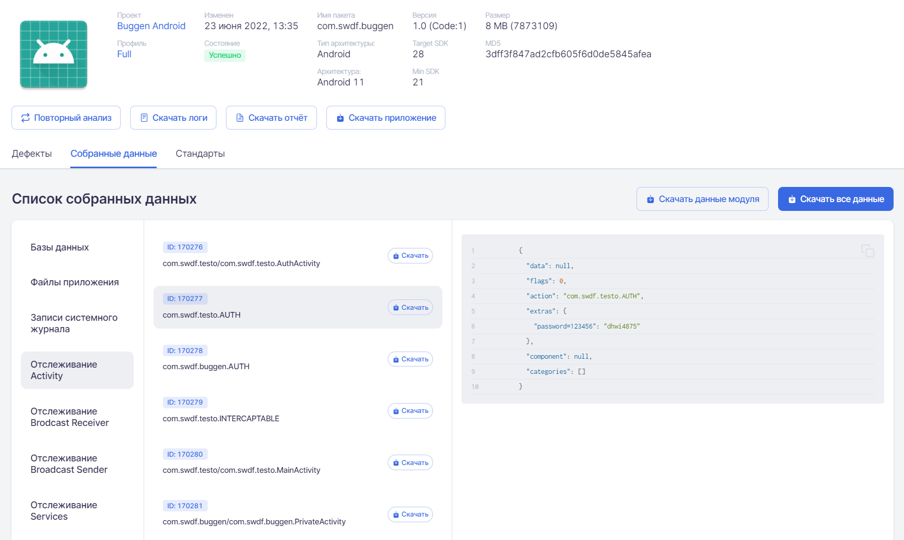</figure>All data from different modules, i.e. from different areas of the application, are collected and available for processing in one system. This greatly simplifies data analysis compared to the usual situation where different types of data are collected by several different utilities in different formats during the scan and it is often impossible to run these utilities in parallel to collect data at once.
The collected data is used to enable the user to work directly with it when analyzing the results. The system also uses it to draw conclusions about application vulnerabilities. The rules for analyzing collected data to find vulnerabilities are described in detail in the "[Rules](./pravila.md)" and "[Company-level Analysis Rules](../ag/pravila_analiza_na_urovne_organizacii.md)" sections.

### Standards

Select the **Standards** tab on the detailed scan results page to work with the standards requirements. This tab displays the results of the requirements compliance check of the scanned application. The **Standards** tab presents compliance with the security standards selected in the scan profile. Requirements, categories of requirements and standards with identified non-compliances are marked in red.

<figure markdown>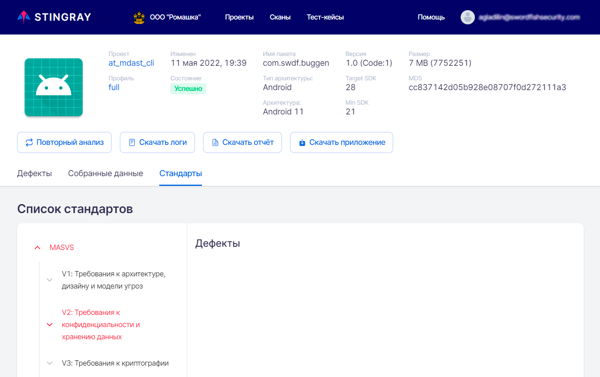</figure>If you click on an unfulfilled requirement on the left side, the Defects tab on the right side will list the types of defects that have been checked for the selected requirement.
<figure markdown>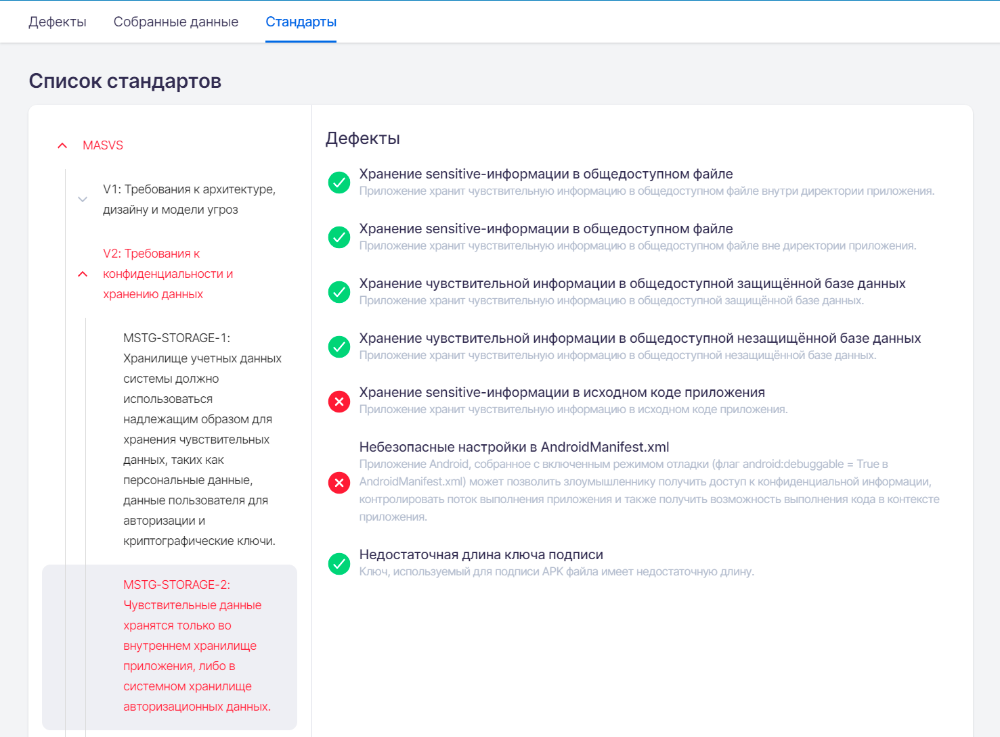</figure>
If at least one defect of a certain type was detected during the application scanning, this type of defects is marked with the  sign, and the requirement itself is considered unfulfilled and is marked in red. If no defects of a certain type were found during the requirement check, this type of defects is marked with the  sign. A requirement is considered fulfilled if its inspection finds no defects among the types of defects relevant to that requirement.

On the right tab **Defects**, click a defect marked with the  sign to get the detailed information about found defects of this type:

<figure markdown>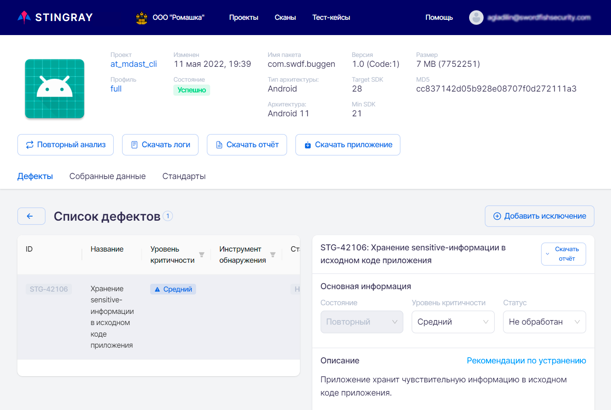</figure>To return to the requirements list, click the 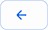 button in the upper left corner.
The **Standards** tab contains data on compliance with the requirements of all standards selected in the scan profile. Suppose one more standard was added to the scan profile. In this case, the results of all scans previously performed with this profile on the **Standards** tab will also show the correspondence between the previously collected scan results and the newly added standard in the profile.

### Record Scan

This tab is only available for the results of auto scan and provides a video recording of the performed scanning.

<figure markdown>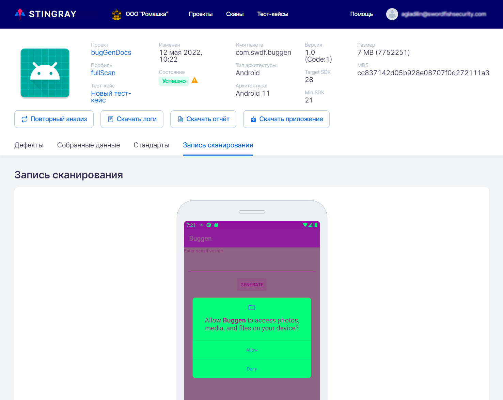</figure>
### Screenshot

For scans with the ****Failed status that were terminated because an application could not start on a device, an additional ****App screenshot tab is available as a result of the scan. It contains a screenshot of the device at the moment of the error.

<figure markdown>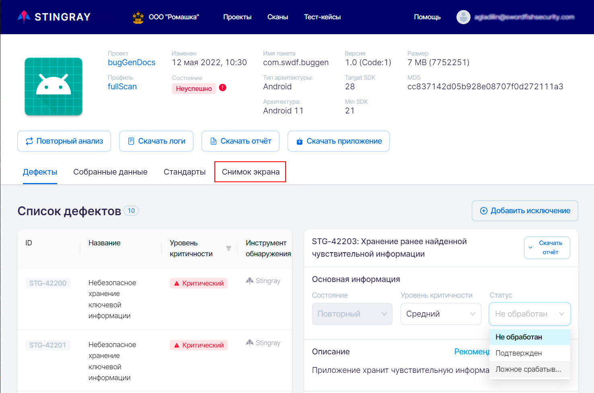</figure>
### Scan Log

An additional ****Log tab allows you to view the scan log. It is available only during analysis of scan results.

<figure markdown>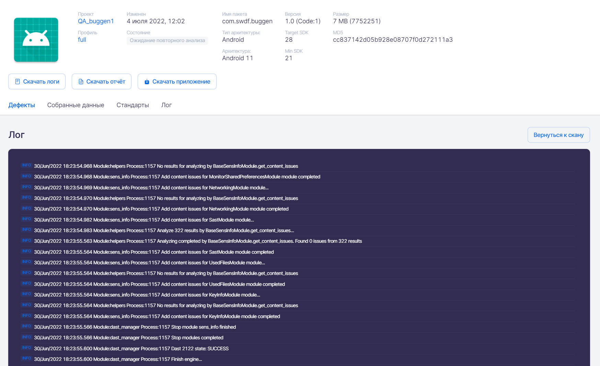</figure>
