# Standards

To go to the **Standards** tab, click the company name in the upper left corner, and then select the appropriate tab on the settings page.

<figure markdown>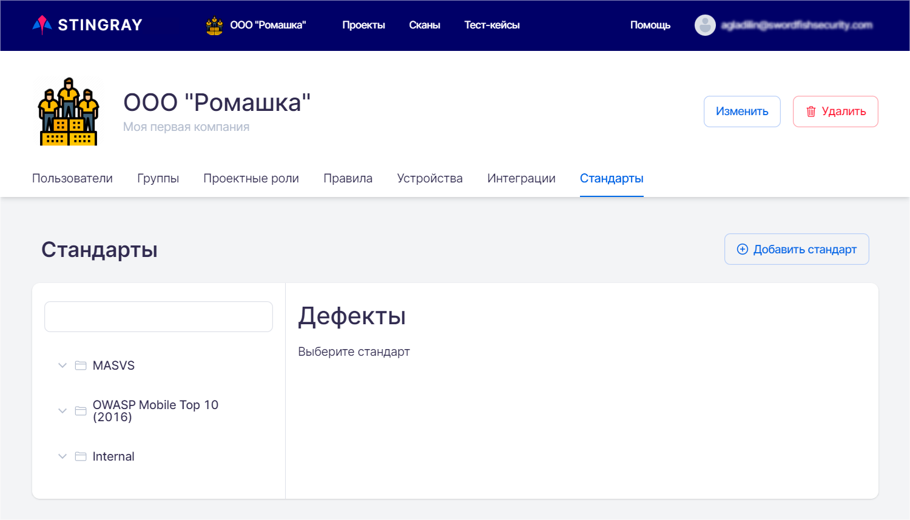</figure>The Standards tab contains information security standards and their requirements. An application can be checked for compliance with these information security requirements. On this tab you can add, change or delete a standard at the company level. Compliance checks for each of these standards can be performed for all projects of this company.
You can use the standards requirements search field for convenience:

<figure markdown>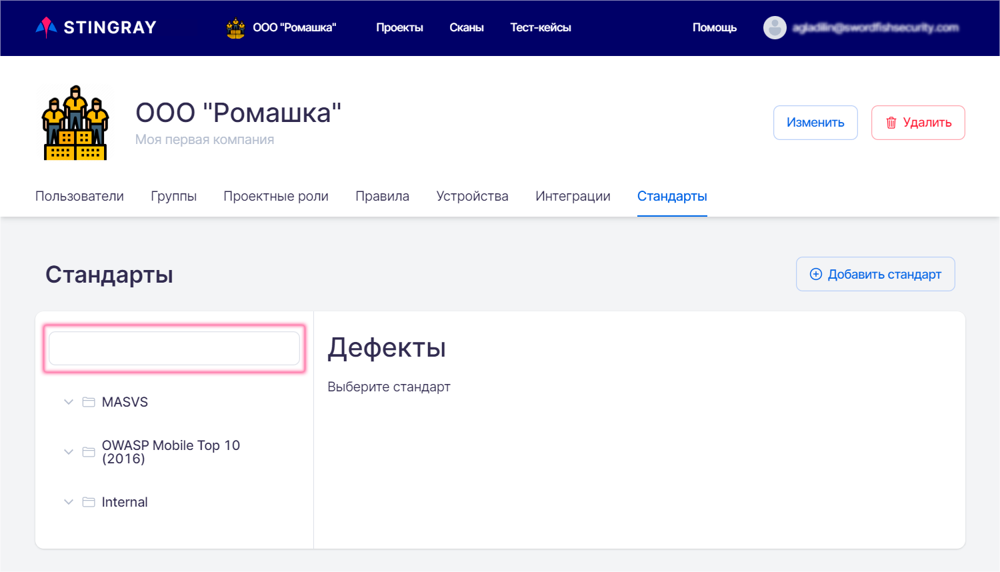</figure>After entering text in the search field, all categories (groups) of requirements, which include requirements containing this text, will be expanded and displayed on the left side of the **Standards** tab:
<figure markdown>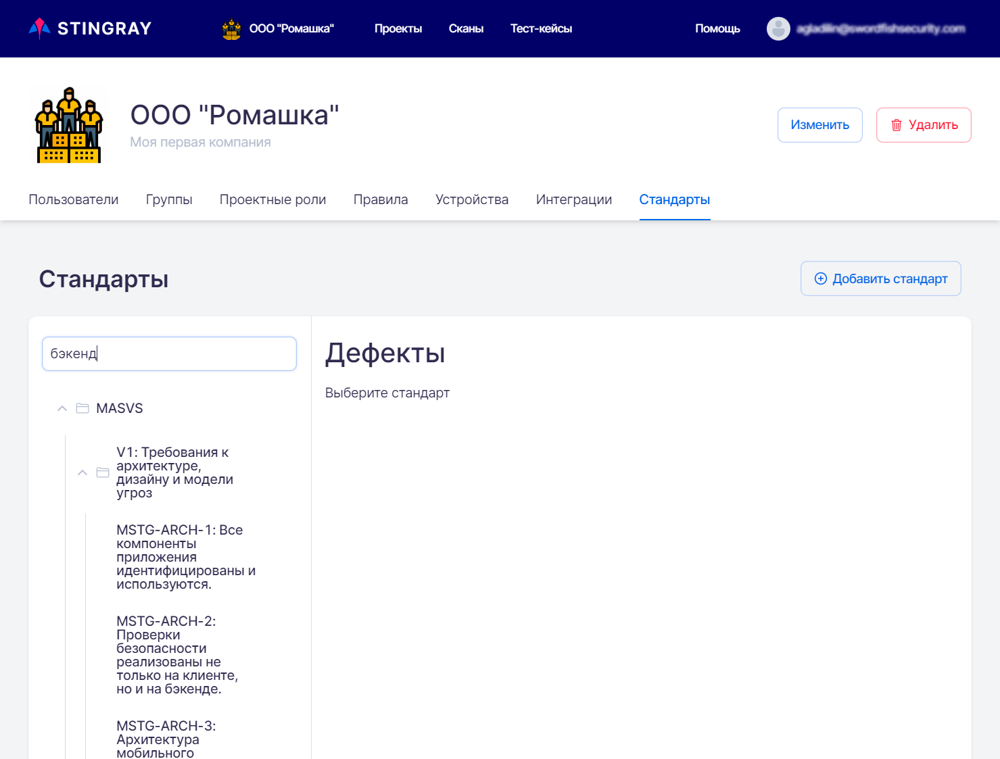</figure>Let&apos;s consider how to manage standards and requirements in the system.
## Editing an Existing Standard

When editing an existing standard, several operations can be performed:

* Change the name of the standard.
* Delete the standard.
* Add a new category (group of requirements).
* Add a new requirement.
* Change the category name.
* Delete the category.
* Change the name of the requirement.
* Delete the requirement.

To change the name or delete an existing standard, move the cursor over the standard name. The  icon appears to the right of the standard name.

<figure markdown>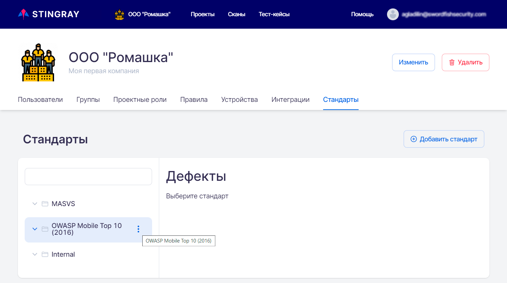</figure>Click the "" icon and select **Change** from the drop-down menu to change the name of the standard or **Delete** to delete it.
<figure markdown>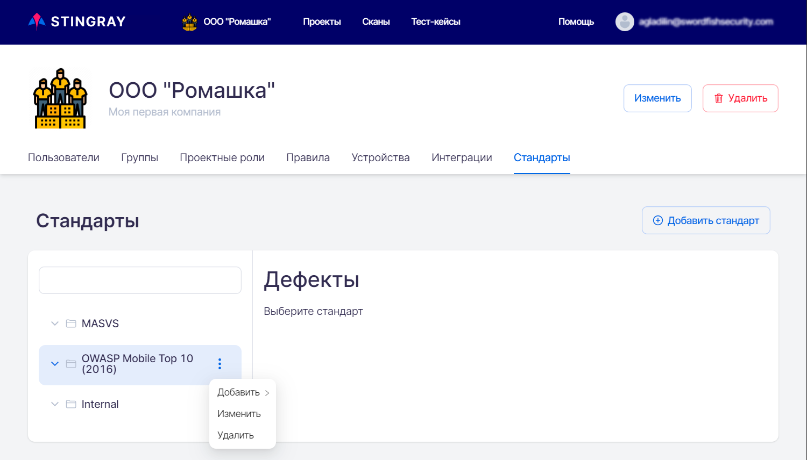</figure>
To edit the standard name, select the **Change** drop-down menu item, correct the standard name in the window that appears, and click the **Update** button.

<figure markdown>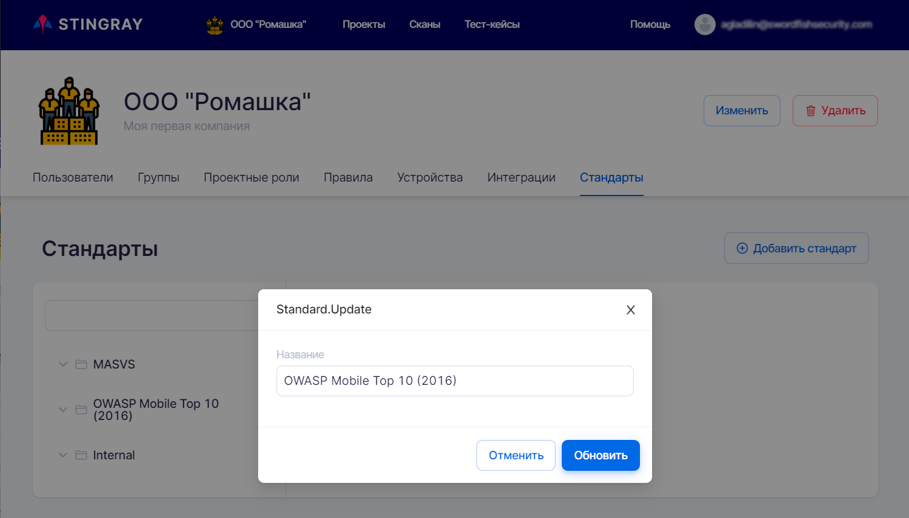</figure>To add a category or requirement, select the **Add** drop-down menu item, then **Category** or **Requirement**, accordingly, type the category or requirement name in the input field and click **Save**.
<figure markdown>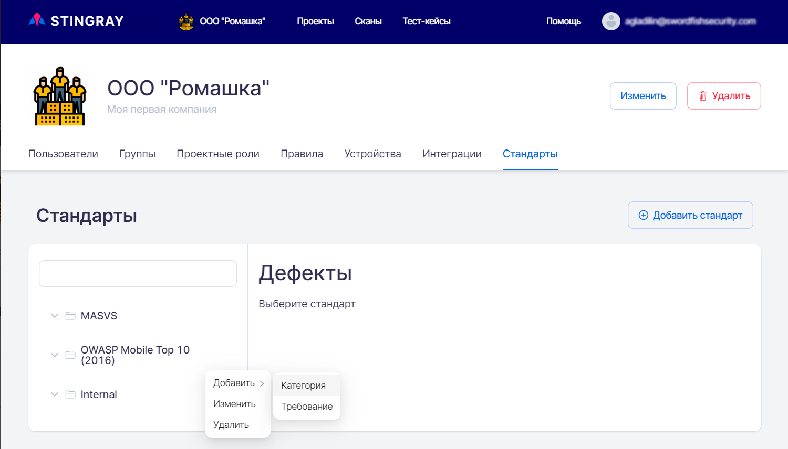</figure>To adjust the name or delete an existing category, move the cursor over its name. The  icon appears to the right of the category name.<nobr></nobr>. Click the &quot;&quot; icon and select **Change** from the drop-down menu to change the name of the category or **Delete** to delete it.
<figure markdown>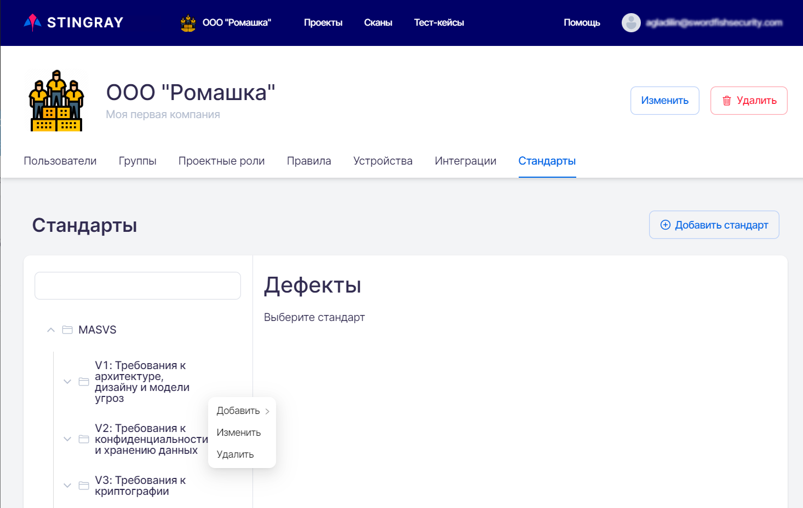</figure>To edit the category name, select the **Change** drop-down menu item, correct the category name in the window that appears, and click the **Update** button.
<figure markdown>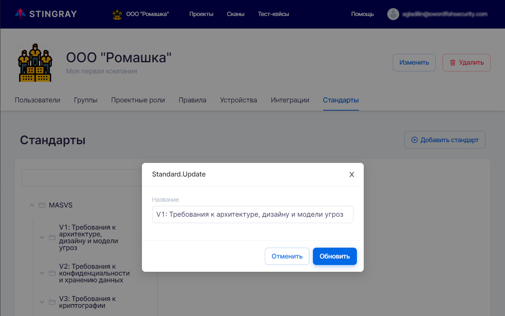</figure>To adjust the name or delete an existing requirement, move the cursor over its name. The "" icon appears to the right of the requirement name. Click the &quot;&quot; icon and select **Change** from the drop-down menu to change the name of the category or **Delete** to delete it.
<figure markdown>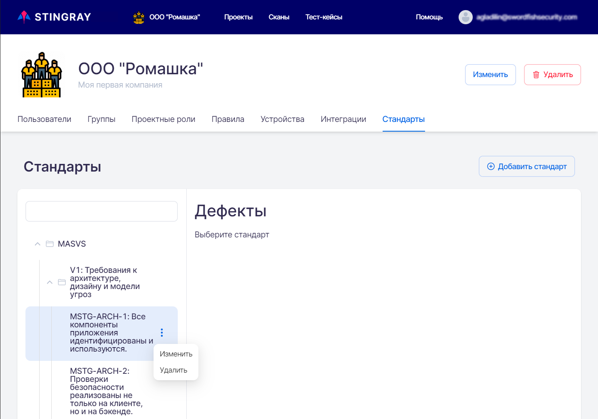</figure>To edit the requirement name, select the **Change** drop-down menu item, correct the requirement name in the window that appears, and click the **Update** button.
<figure markdown>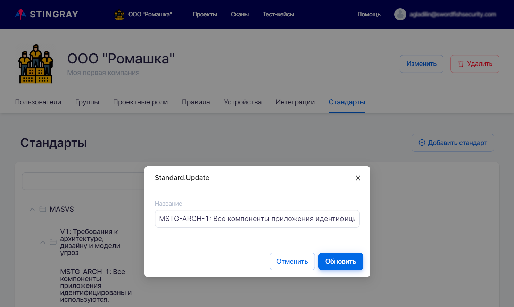</figure>## Adding a New Standard
To add a new standard, click the **Add** standard button at the top right of the **Standards** tab. In the window that appears, specify the name of the new standard and click the **Add** button. The newly created standard will be added to the list of standards in the system.

<figure markdown>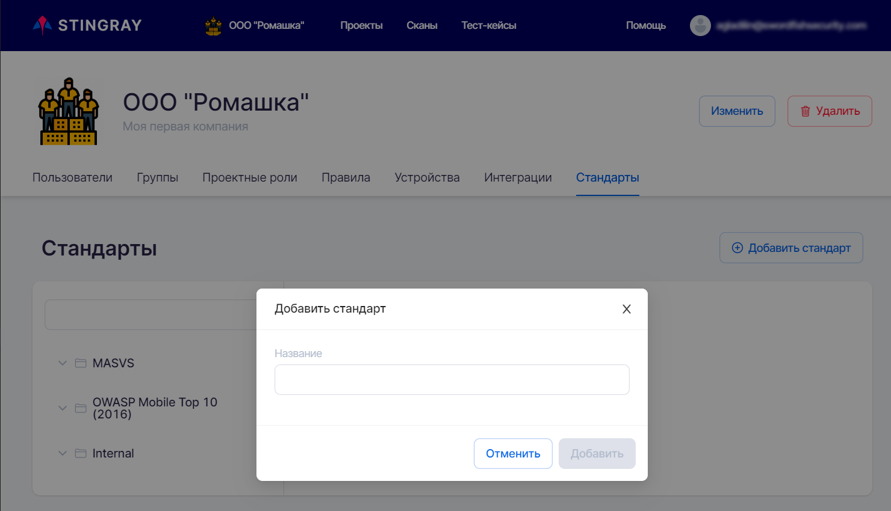</figure>## Mapping Defect Types to Requirements
The system contains a certain set of requirements and a certain set of defect types. As mentioned above, there are certain types of defects associated with each requirement, and if they are found in the application, the requirement will be considered as not met.

To see which defect types are associated with a requirement and/or to associate a new defect type to a requirement, select that requirement. On the right side you will see a list of defects already associated with it and a field for selecting new defect types.

<figure markdown>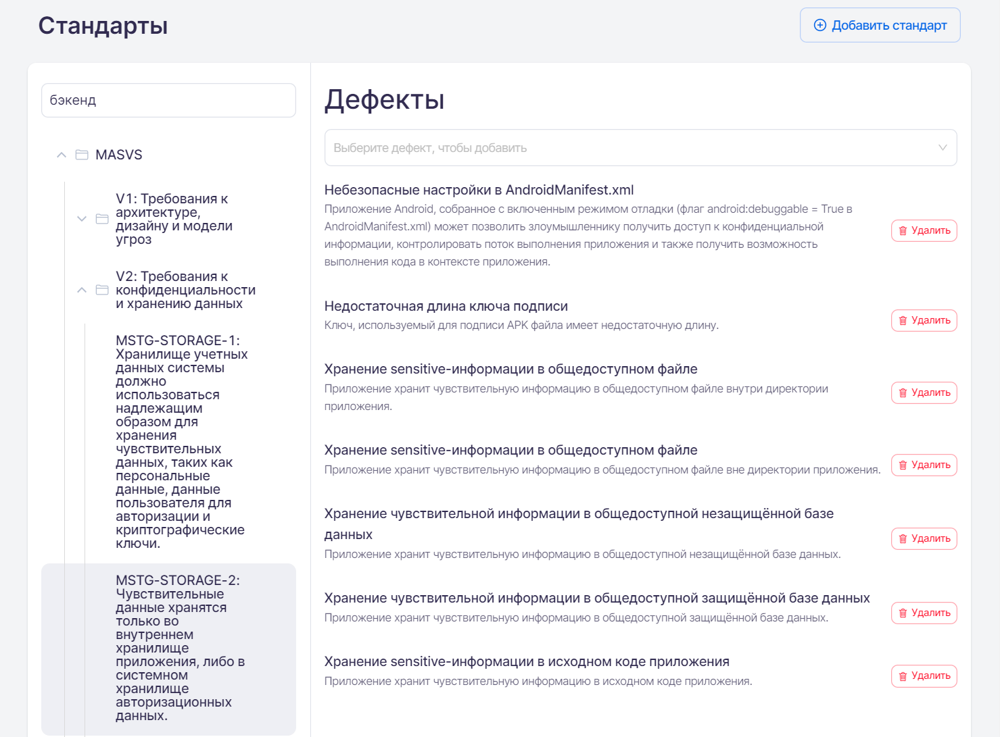</figure>At the top right of the **Defects** area in the **Select a defect to add** field, you can select one of the available defect types in the system from the drop-down list. The newly selected defect type will be added to the list of defects associated with this requirement.
<figure markdown>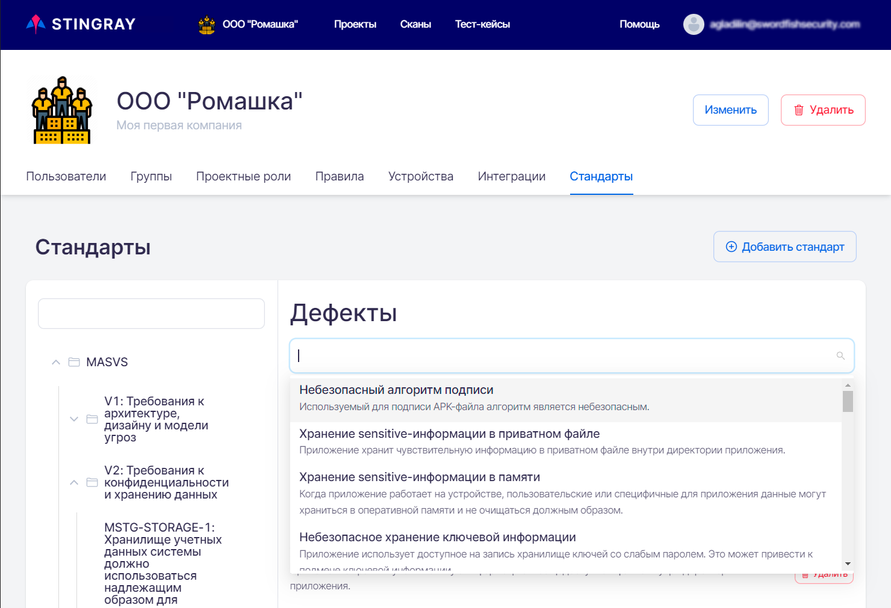</figure>
