# Test Cases

You can work with test cases in the system using the **Test cases** main menu item.

<figure markdown>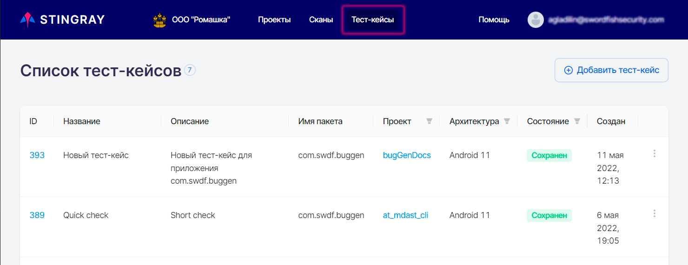</figure>The **Test cases** page shows all previously recorded test cases for different projects and applications. Each test case is presented as a separate string.
The following information is provided for each test case:

* **ID** — The test case identifier in the system.
* **Name** of the recorded test case.
* **Description** of the test case.
* **Package name** — The test case was recorded for this application package.
* **Project** — The test case was recorded for this project.
* **Architecture** type where the scan was performed (Android or iOS).
* **State** — Status of the test case recording.
* **Created at** — Date of creation of the test case.

On this page, you can use the "" drop-down menu located on the right side of each test case string to open a page with detailed information about the test case, delete a test case, or download a log file for it:

<figure markdown>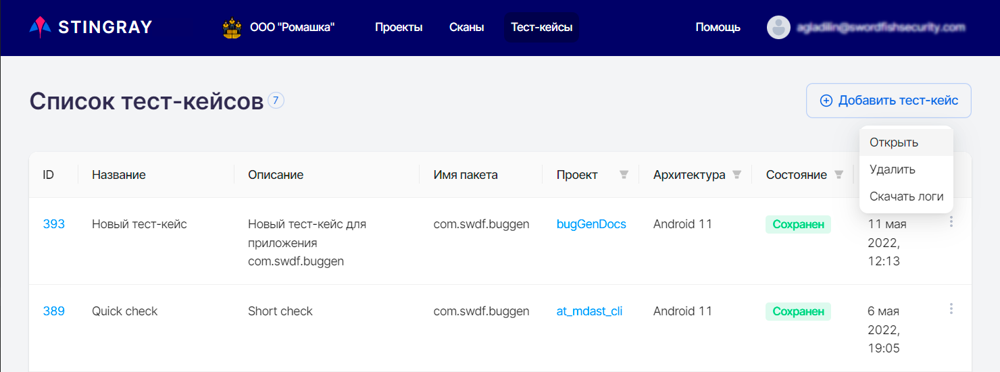</figure>You can also open a test case by clicking on its **ID** in the left column.
In addition, if a test case is currently being recorded, using the "" menu, you can open a test case or end its recording:

<figure markdown>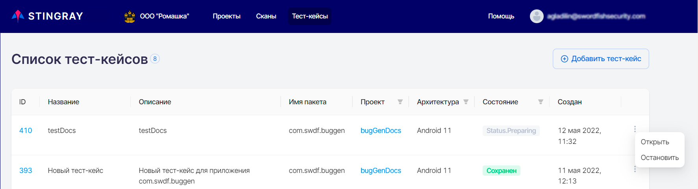</figure>
## Recording a Test Case

!!! note "Note"
     Only Android test case can be recorded and saved.

To record a new test case, click **Add test case** in the upper right corner of the **Test cases** page:

<figure markdown>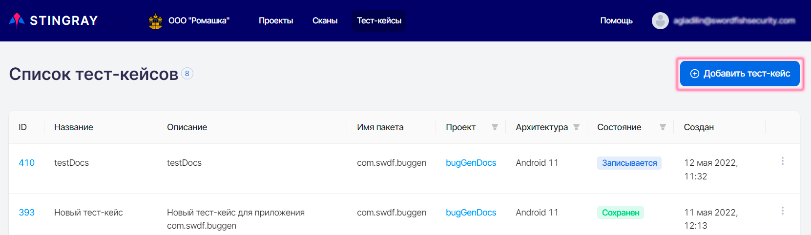</figure>Select or drag and drop an apk file of the application to be scanned to the **Add test case** page that appears:
<figure markdown>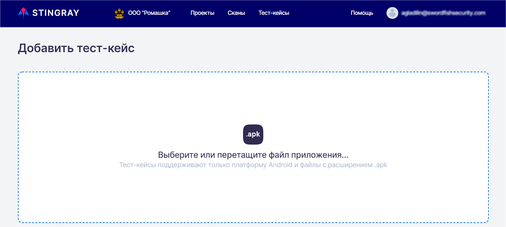</figure>After selecting the apk file, the **Add test case** page will display information about the selected application and fields required to start recording a new test case:
<figure markdown>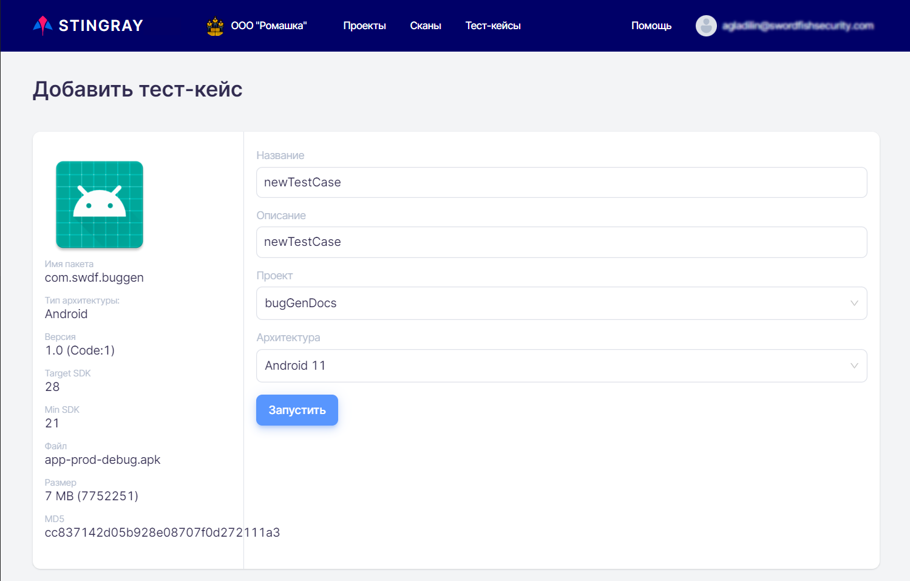</figure>* **Name** of the test case to be created. * **Description** of the test case to be created. * **Project** to which the test case being recorded belongs.
    !!! note "Note"
    
            You can select either projects with an empty **Package name field** (see the "[Projects](./projects.md)" section), or projects that have the package selected in the previous step in this field. Thus, it is possible that there will be no items available for selection in this field. In this case, you should create a new project with an empty **Package name** field or by specifying in it the corresponding package.

* **Architecture** — The architecture of the device used to launch and scan the application. Note that only the architecture corresponding to the uploaded file will be available for selection in this field.

Once you have filled in all the fields and clicked the **Run** button, the page with the device screen will be displayed.

<figure markdown>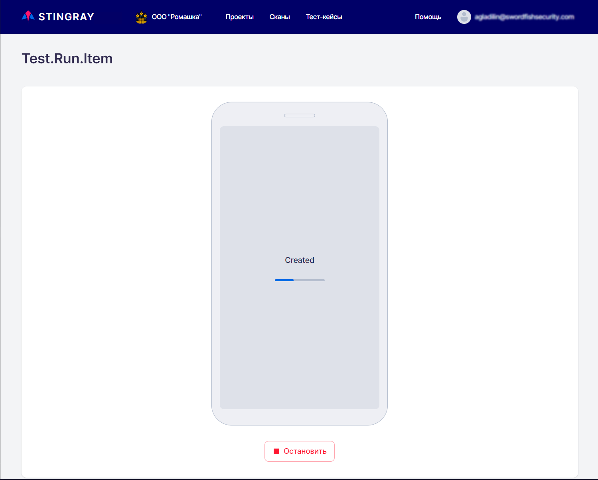</figure>Perform all the necessary test steps manually and press the **Stop record** button at the bottom right. The test case recording is finished and the application scan is stopped. The system starts analyzing the collected data and switches to the **Test case list** page, where a newly recorded test case is displayed.
!!! note "Note"
     Since the application being scanned is affected by external actions during the scan, its operation speed can be slightly reduced. For recording test cases, it is recommended to take a small delay of 2-3 seconds between actions in the application interface.

## Editing / Deleting a Test Case

Now let's look at how test cases can be managed in the system. You can edit and/or delete a test case on the **List of test cases** page.

To edit a test case, either click its **ID** in the list of test cases or click the "" drop-down menu on the right side of the test case string and select **Open**. This will open a page for viewing and editing the test case.

<figure markdown>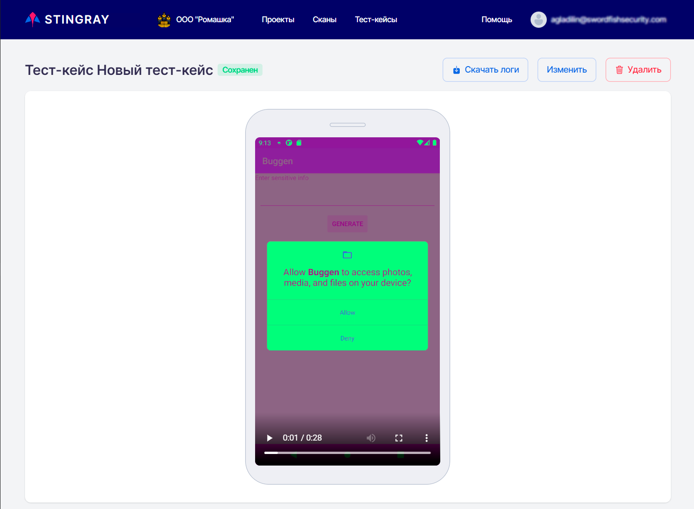</figure>
Click the **Change** button. In the window that appears, you can change both the test case name and description:

<figure markdown>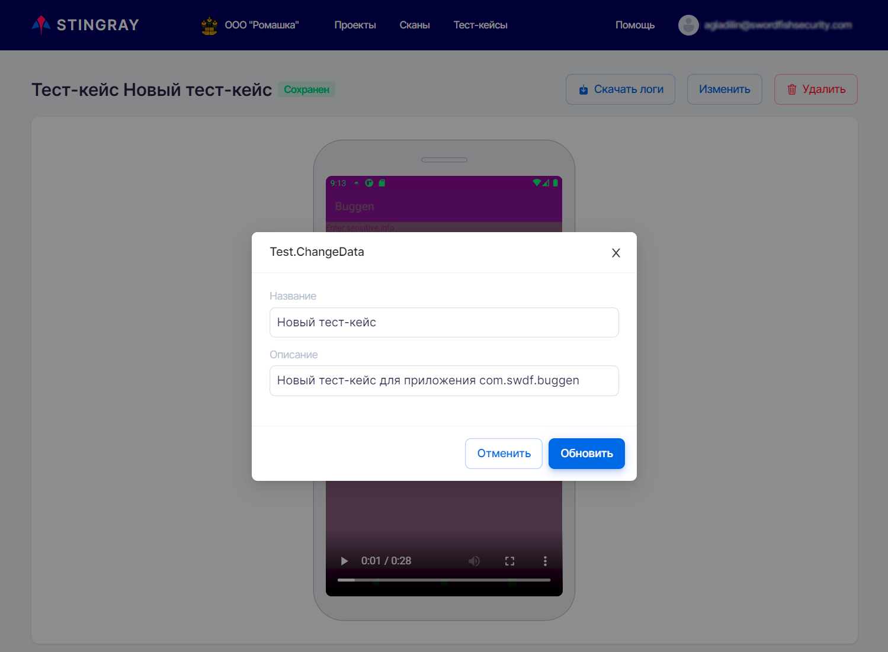</figure>
On this page you can view a recording of the test case and download its log file.

To delete a test case, click the **Delete** button and confirm the test case deletion in the dialog box that appears:

<figure markdown>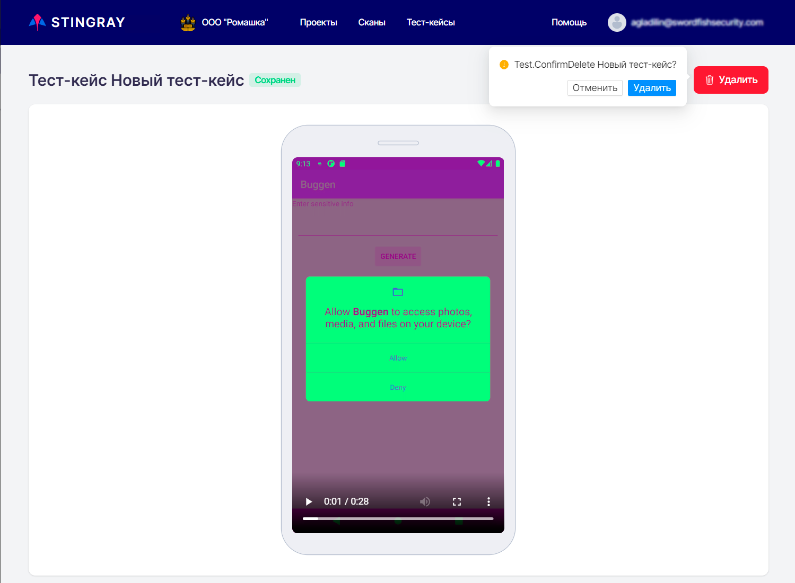</figure>Alternatively, a test case can be deleted directly on the **List of test cases** page using the **Delete** item of the drop-down menu located on the right end of the test case string "":
<figure markdown>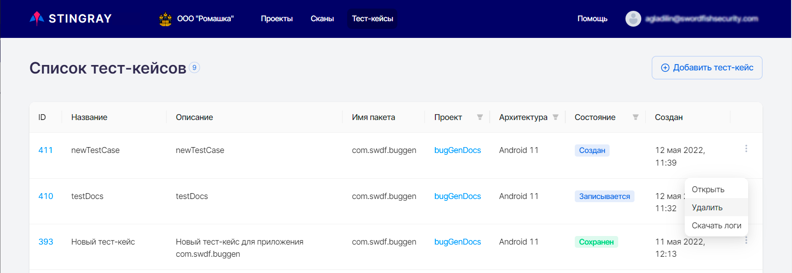</figure>
