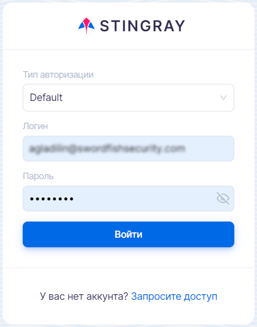
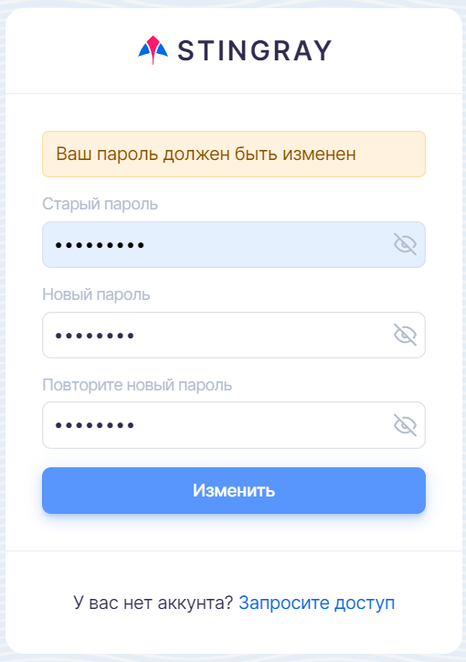
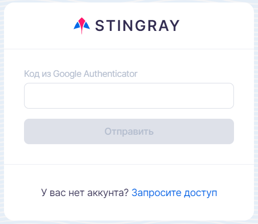

# User Authentication

A link to access the Mobix web interface shall be provided by an administrator. Click the link to open the authentication window.

To sign in, select the authorization method, enter your user name (login) and password, and then click the **Login** button.

<figure markdown></figure>

If the credentials are not entered correctly, a message about an invalid user name or password will be displayed.

!!! note "Note"
    A temporary password is provided along with the access link, which must be changed by the user the first time the user logs in. A newly set password must be at least 8 characters long and contain at least one lowercase letter, one uppercase letter, one number and one special character.

<figure markdown></figure>After changing the temporary password, the user is prompted to accept the user agreement and privacy policy. The user is then redirected to the login page, enters the account and new password, and signs in.
If the password is entered incorrectly five times, further authorization attempts require the entry of a security code (captcha).

If two-factor authentication is enabled in your user profile, see the "[User Profile](profil_polzovatelya.md)" section, an additional window appears after you enter your login. In this window, you should enter the code that appears in the Google Authenticator app (download from [Google Play](https://play.google.com/store/apps/details?id=com.google.android.apps.authenticator2&hl=ru&gl=US) or [App Store](https://apps.apple.com/ru/app/google-authenticator/id388497605)).

<figure markdown></figure>If the two-factor authentication code is entered incorrectly three times, the user is blocked for 5 minutes.
