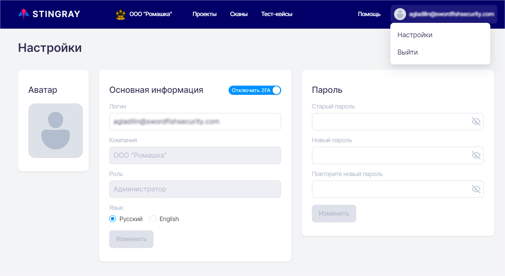
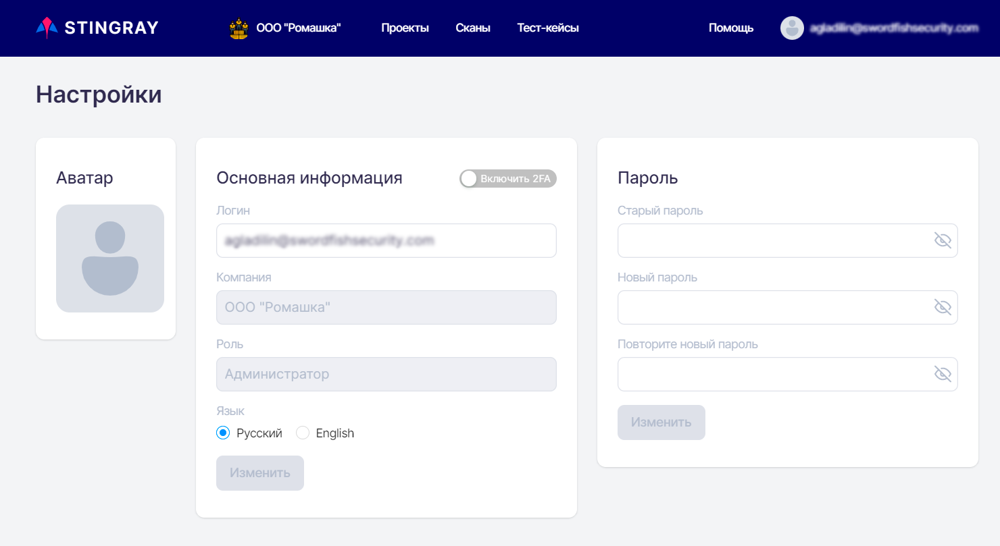
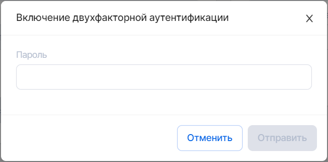
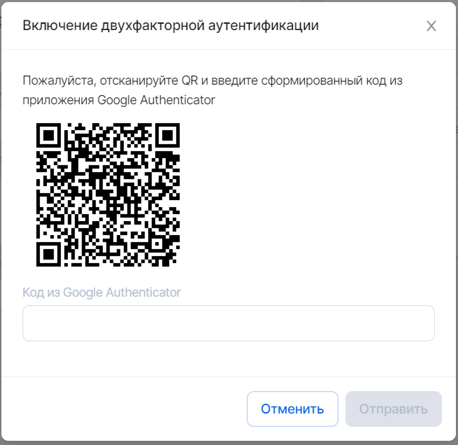
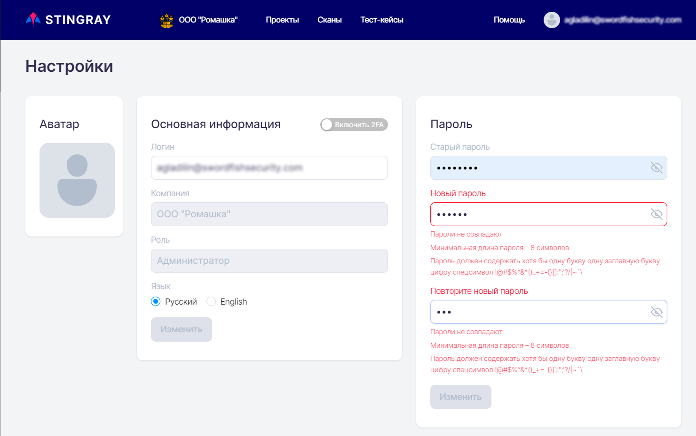

# User Profile

To go to the user profile settings page, click user name in the upper right corner and select **Settings** from the drop-down menu. Besides, using this drop-down menu, you can log out of the system.

<figure markdown></figure>The page that opens contains information about the user:
* **User avatar**.
* **Username** (in e-mail address format).
* **User's company** in the system.
* **Role** — user's role in the system.
* **System language** for this user.

The following settings are available:

* Changing user's avatar.
* Changing username (login).
* Change the system interface language. Change password.
* Enable or disable two-factor authentication.
* Changing password.

<figure markdown></figure>Click the **Change** button to save user information updates.
## Two-Factor Authentication

To switch on two-factor authentication, click the **Enable 2FA** selector. The system then prompts you to enter the current user password.

<figure markdown></figure>After entering the password, scan the QR code that appears using Google Authenticator (download it from [Google Play](https://play.google.com/store/apps/details?id=com.google.android.apps.authenticator2&amp;hl=ru&amp;gl=US) or [App Store](https://apps.apple.com/ru/app/google-authenticator/id388497605)) and enter the code that appears in the app.
<figure markdown></figure>If the code is correct, a confirmation message will appear at the bottom of the system UI.
To switch off two-factor authentication, click the Enable 2FA selector. In the window that appears, enter the code displayed in the Google Authenticator app (you can download it from [Google Play](https://play.google.com/store/apps/details?id=com.google.android.apps.authenticator2&hl=ru&gl=US) or [App Store](https://apps.apple.com/ru/app/google-authenticator/id388497605)). The change of the user profile will also be confirmed by a message at the top of the system UI.

## Changing a User Password

It is possible to change the user's password.

Open the user profile, see "[User Profile](./profil_polzovatelya.md)". In the **Password** field, enter the current password, and then enter the new password twice, and finally click the **Edit** button. If necessary, you can enable displaying of passwords by clicking the icon .

<figure markdown></figure>
